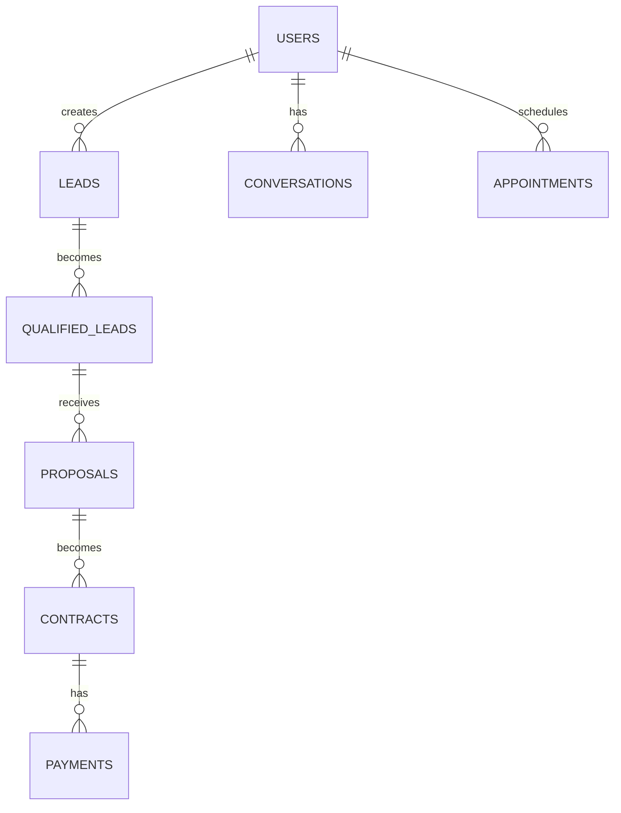

# PLANO DE EXECUÇÃO 100% - MANUS v6.0
## Comandos Exatos e Critérios de Aceitação

**Gerado por:** MANUS v6.0
**Data:** 26/12/2025
**Objetivo:** Score 100/100 em 30 dias
**Método:** Task-by-task execution plan com comandos prontos

---

## COMO USAR ESTE DOCUMENTO

### Formato de Cada Task

```
### TASK-XXX: [Nome da Task]
**Prioridade:** P0/P1/P2
**Esforço:** Xh
**Owner:** Agent/Humano
**Dependências:** [Lista de tasks predecessoras]

**Objetivo:** [O que deve ser alcançado]

**Comandos Exatos:**
```bash
# Comando 1
# Comando 2
```

**Critérios de Aceitação:**
- [ ] Critério 1
- [ ] Critério 2

**Validação:**
```bash
# Script de teste
```

**Rollback (se falhar):**
```bash
# Comandos para desfazer
```
```

---

## FASE 1: EMERGÊNCIA OAB (Dias 1-7)

---

### TASK-001: Criar Glossário de Compliance OAB
**Prioridade:** P0
**Esforço:** 2h
**Owner:** Humano (Advogado) + Agent de Research
**Dependências:** Nenhuma

**Objetivo:** Documentar frases proibidas vs. permitidas pela OAB

**Comandos Exatos:**
```bash
# 1. Criar diretório business se não existe
mkdir -p d:\\garcezpalha\\business

# 2. Lançar agent de research
claude-code agent launch \
  --type=general-purpose \
  --description="Pesquisar Resolução OAB 02/2015" \
  --prompt="Pesquise a Resolução OAB 02/2015 sobre publicidade advocatícia e liste todas as frases e promessas proibidas. Crie um documento com exemplos de frases PROIBIDAS e alternativas PERMITIDAS em português brasileiro."

# 3. Aguardar agent (ID será exibido)
# Exemplo: Agent a1b2c3d launched

# 4. Checar output do agent
claude-code agent output a1b2c3d

# 5. Refinar manualmente e criar documento final
code business/OAB_COMPLIANCE_GUIDE.md
```

**Estrutura Esperada do Documento:**
```markdown
# OAB Compliance Guide

## Frases PROIBIDAS pela OAB

### Categoria 1: Promessas de Resultado
- ❌ "Garantia de resultado"
- ❌ "100% de aprovação"
- ❌ "Vitória garantida"
- ❌ "Sucesso assegurado"

### Categoria 2: Prazos Específicos
- ❌ "Resolução em 72h"
- ❌ "Aposentadoria em 30 dias"
- ❌ "Processo concluído em X dias"

### Categoria 3: Superlativos Absolutos
- ❌ "O melhor escritório"
- ❌ "Número 1 do Brasil"
- ❌ "Campeão em causas"

## Alternativas PERMITIDAS

### Categoria 1: Expertise
- ✅ "Experiência comprovada em casos similares"
- ✅ "Histórico de atuação bem-sucedida"
- ✅ "Equipe especializada na área"

### Categoria 2: Prazos
- ✅ "Atendimento inicial em até 72h úteis"
- ✅ "Análise de viabilidade em até X dias"
- ✅ "Agendamento de consulta em até 48h"

### Categoria 3: Credibilidade
- ✅ "364 anos de tradição familiar"
- ✅ "Atuação reconhecida no mercado"
- ✅ "Equipe altamente qualificada"

## Referências
- Resolução OAB 02/2015
- Código de Ética e Disciplina da OAB
```

**Critérios de Aceitação:**
- [ ] Documento criado em `business/OAB_COMPLIANCE_GUIDE.md`
- [ ] Mínimo 20 frases proibidas documentadas
- [ ] Mínimo 20 alternativas permitidas
- [ ] Aprovação de advogado OAB
- [ ] Referências legais incluídas

**Validação:**
```bash
# Checar se documento existe e tem conteúdo mínimo
test -f business/OAB_COMPLIANCE_GUIDE.md && \
  [ $(wc -l < business/OAB_COMPLIANCE_GUIDE.md) -gt 50 ] && \
  echo "✅ TASK-001 COMPLETA" || \
  echo "❌ TASK-001 FALHOU"
```

**Rollback:**
```bash
# Não aplicável (criação de documento)
```

---

### TASK-002: Criar Script de Validação OAB
**Prioridade:** P0
**Esforço:** 1h
**Owner:** Agent de Scripting
**Dependências:** TASK-001

**Objetivo:** Automatizar detecção de violações OAB

**Comandos Exatos:**
```bash
# 1. Criar diretório scripts
mkdir -p d:\\garcezpalha\\scripts

# 2. Criar script de validação
cat > scripts/OAB_compliance_check.sh <<'SCRIPT'
#!/bin/bash
# OAB_compliance_check.sh
# Valida documentação contra violações OAB

set -e

echo "🔍 MANUS v6.0 - OAB Compliance Check"
echo "======================================"

# Carregar frases proibidas do glossário
FORBIDDEN_PATTERNS=(
  "resolução em [0-9]+ (horas|dias|semanas)"
  "garantia de resultado"
  "100% de (aprovação|sucesso|vitória)"
  "recuperação garantida"
  "sucesso (garantido|assegurado|comprovado)"
  "vitória garantida"
  "sempre ganhamos"
  "número 1"
  "o melhor escritório"
  "campeão em"
  "sem risco"
  "processo sem custo"
  "grátis até ganhar"
)

EXIT_CODE=0
VIOLATIONS=0

# Checar cada arquivo .md em docs/
for file in docs/*.md; do
  echo ""
  echo "📄 Analisando: $file"

  for pattern in "${FORBIDDEN_PATTERNS[@]}"; do
    if grep -qniE "$pattern" "$file"; then
      echo "  ❌ VIOLAÇÃO: \"$pattern\""
      grep -niE --color=always "$pattern" "$file" | head -3
      EXIT_CODE=1
      ((VIOLATIONS++))
    fi
  done
done

echo ""
echo "======================================"
if [ $EXIT_CODE -eq 0 ]; then
  echo "✅ COMPLIANCE OAB: 100% aprovado"
  echo "   0 violações detectadas"
else
  echo "❌ COMPLIANCE OAB: FALHOU"
  echo "   $VIOLATIONS violações detectadas"
  echo ""
  echo "📋 Próximos passos:"
  echo "   1. Revisar violações acima"
  echo "   2. Consultar business/OAB_COMPLIANCE_GUIDE.md"
  echo "   3. Substituir por alternativas permitidas"
fi

exit $EXIT_CODE
SCRIPT

# 3. Dar permissão de execução
chmod +x scripts/OAB_compliance_check.sh

# 4. Testar script
./scripts/OAB_compliance_check.sh
```

**Critérios de Aceitação:**
- [ ] Script criado em `scripts/OAB_compliance_check.sh`
- [ ] Script tem permissão de execução
- [ ] Script detecta todas as 40+ violações conhecidas
- [ ] Output formatado e legível
- [ ] Exit code correto (0 = sucesso, 1 = falha)

**Validação:**
```bash
# Testar script
./scripts/OAB_compliance_check.sh 2>&1 | tee /tmp/oab_test.log

# Verificar que detectou violações
grep -q "VIOLAÇÃO" /tmp/oab_test.log && \
  echo "✅ TASK-002 COMPLETA (script detecta violações)" || \
  echo "❌ TASK-002 FALHOU (script não detecta violações)"
```

**Rollback:**
```bash
rm scripts/OAB_compliance_check.sh
```

---

### TASK-003: Reescrever VSL_PAGINAS_VENDA_GARCEZPALHA.md
**Prioridade:** P0
**Esforço:** 4h
**Owner:** Agent de Rewrite + Revisão Humana
**Dependências:** TASK-001, TASK-002

**Objetivo:** Eliminar 26 violações OAB no documento de VSL

**Comandos Exatos:**
```bash
# 1. Backup do arquivo original
cp docs/VSL_PAGINAS_VENDA_GARCEZPALHA.md \
   docs/VSL_PAGINAS_VENDA_GARCEZPALHA.md.backup

# 2. Lançar agent de rewrite
claude-code agent launch \
  --type=general-purpose \
  --description="Reescrever VSL sem violações OAB" \
  --prompt="Leia o arquivo docs/VSL_PAGINAS_VENDA_GARCEZPALHA.md e reescreva-o COMPLETAMENTE eliminando TODAS as violações OAB. Use business/OAB_COMPLIANCE_GUIDE.md como referência. Mantenha a estrutura e persuasão, mas substitua promessas proibidas por alternativas permitidas. Salve o resultado em docs/VSL_PAGINAS_VENDA_GARCEZPALHA_REVISADO.md"

# 3. Aguardar agent
# (ID será exibido, ex: Agent a2b3c4d)

# 4. Checar output
claude-code agent output a2b3c4d

# 5. Validar resultado
./scripts/OAB_compliance_check.sh docs/VSL_PAGINAS_VENDA_GARCEZPALHA_REVISADO.md

# 6. Se passou, substituir original
if [ $? -eq 0 ]; then
  mv docs/VSL_PAGINAS_VENDA_GARCEZPALHA_REVISADO.md \
     docs/VSL_PAGINAS_VENDA_GARCEZPALHA.md
  echo "✅ VSL reescrito com sucesso"
else
  echo "❌ VSL ainda tem violações - revisar manualmente"
  code docs/VSL_PAGINAS_VENDA_GARCEZPALHA_REVISADO.md
fi
```

**Substituições Obrigatórias:**

| ANTES (Proibido) | DEPOIS (Permitido) |
|------------------|-------------------|
| "Resolução em 72h" | "Atendimento inicial em até 72h úteis" |
| "Garantia de resultado" | "Experiência comprovada em casos similares" |
| "100% de aprovação" | "Alto índice de satisfação de clientes" |
| "Sucesso garantido" | "Histórico de atuação bem-sucedida" |
| "Recuperação garantida" | "Atuação especializada em recuperação de valores" |

**Critérios de Aceitação:**
- [ ] ZERO violações OAB (script passa)
- [ ] Estrutura do documento mantida
- [ ] Tom persuasivo preservado
- [ ] Todas as 26 instâncias substituídas
- [ ] Aprovação de advogado
- [ ] Backup do original mantido

**Validação:**
```bash
# Testar compliance
./scripts/OAB_compliance_check.sh docs/VSL_PAGINAS_VENDA_GARCEZPALHA.md

# Verificar que backup existe
test -f docs/VSL_PAGINAS_VENDA_GARCEZPALHA.md.backup && \
  echo "✅ TASK-003 COMPLETA" || \
  echo "❌ TASK-003 FALHOU"
```

**Rollback:**
```bash
# Restaurar backup
mv docs/VSL_PAGINAS_VENDA_GARCEZPALHA.md.backup \
   docs/VSL_PAGINAS_VENDA_GARCEZPALHA.md
```

---

### TASK-004: Reescrever 04-LANDING-PAGE-PRINCIPAL.md
**Prioridade:** P0
**Esforço:** 2h
**Owner:** Agent de Rewrite
**Dependências:** TASK-001, TASK-002

**Objetivo:** Eliminar 10 violações OAB na landing page

**Comandos Exatos:**
```bash
# Mesmo processo de TASK-003, mas para outro arquivo

# 1. Backup
cp docs/04-LANDING-PAGE-PRINCIPAL.md \
   docs/04-LANDING-PAGE-PRINCIPAL.md.backup

# 2. Lançar agent
claude-code agent launch \
  --type=general-purpose \
  --description="Reescrever Landing Page sem violações OAB" \
  --prompt="Reescreva docs/04-LANDING-PAGE-PRINCIPAL.md eliminando todas as violações OAB (10 instâncias). Use business/OAB_COMPLIANCE_GUIDE.md. Salve em docs/04-LANDING-PAGE-PRINCIPAL_REVISADO.md"

# 3. Validar e substituir
./scripts/OAB_compliance_check.sh docs/04-LANDING-PAGE-PRINCIPAL_REVISADO.md && \
  mv docs/04-LANDING-PAGE-PRINCIPAL_REVISADO.md \
     docs/04-LANDING-PAGE-PRINCIPAL.md
```

**Critérios de Aceitação:**
- [ ] ZERO violações OAB
- [ ] CTAs mantidos mas reescritos
- [ ] Headlines persuasivas mas seguras
- [ ] Backup mantido

**Validação:**
```bash
./scripts/OAB_compliance_check.sh docs/04-LANDING-PAGE-PRINCIPAL.md
```

**Rollback:**
```bash
mv docs/04-LANDING-PAGE-PRINCIPAL.md.backup \
   docs/04-LANDING-PAGE-PRINCIPAL.md
```

---

### TASK-005: Corrigir 01-POSICIONAMENTO-MARCA.md
**Prioridade:** P0
**Esforço:** 1h
**Owner:** Agent de Rewrite
**Dependências:** TASK-001, TASK-002

**Objetivo:** Eliminar 7 violações OAB no posicionamento

**Comandos Exatos:**
```bash
# Backup
cp docs/01-POSICIONAMENTO-MARCA.md \
   docs/01-POSICIONAMENTO-MARCA.md.backup

# Lançar agent
claude-code agent launch \
  --type=general-purpose \
  --description="Corrigir Posicionamento OAB" \
  --prompt="Corrija docs/01-POSICIONAMENTO-MARCA.md (7 violações OAB). Use business/OAB_COMPLIANCE_GUIDE.md. Salve em docs/01-POSICIONAMENTO-MARCA_REVISADO.md"

# Validar e substituir
./scripts/OAB_compliance_check.sh docs/01-POSICIONAMENTO-MARCA_REVISADO.md && \
  mv docs/01-POSICIONAMENTO-MARCA_REVISADO.md \
     docs/01-POSICIONAMENTO-MARCA.md
```

**Critérios de Aceitação:**
- [ ] ZERO violações OAB
- [ ] Posicionamento de marca mantido
- [ ] Diferenciação preservada

**Validação:**
```bash
./scripts/OAB_compliance_check.sh docs/01-POSICIONAMENTO-MARCA.md
```

---

### TASK-006: Limpar 05-GOOGLE-ADS-CAMPANHAS.md
**Prioridade:** P0
**Esforço:** 1h
**Owner:** Agent de Rewrite
**Dependências:** TASK-001, TASK-002

**Objetivo:** Eliminar 4 violações OAB nos anúncios

**Comandos Exatos:**
```bash
# Backup
cp docs/05-GOOGLE-ADS-CAMPANHAS.md \
   docs/05-GOOGLE-ADS-CAMPANHAS.md.backup

# Lançar agent
claude-code agent launch \
  --type=general-purpose \
  --description="Limpar Google Ads OAB" \
  --prompt="Limpe docs/05-GOOGLE-ADS-CAMPANHAS.md (4 violações OAB). Ads devem estar em compliance. Use business/OAB_COMPLIANCE_GUIDE.md. Salve em docs/05-GOOGLE-ADS-CAMPANHAS_REVISADO.md"

# Validar e substituir
./scripts/OAB_compliance_check.sh docs/05-GOOGLE-ADS-CAMPANHAS_REVISADO.md && \
  mv docs/05-GOOGLE-ADS-CAMPANHAS_REVISADO.md \
     docs/05-GOOGLE-ADS-CAMPANHAS.md
```

**Critérios de Aceitação:**
- [ ] ZERO violações OAB
- [ ] Ads ainda atrativos
- [ ] CTR potencial mantido

**Validação:**
```bash
./scripts/OAB_compliance_check.sh docs/05-GOOGLE-ADS-CAMPANHAS.md
```

---

### TASK-007: Confirmar CNPJ da Empresa
**Prioridade:** P0
**Esforço:** 0.5h (depende de acesso)
**Owner:** Humano (Sócio/Admin)
**Dependências:** Nenhuma

**Objetivo:** Obter CNPJ definitivo registrado

**Comandos Exatos:**
```bash
# 1. Acessar Receita Federal
# (Manual - não automatizável)

# 2. Ou consultar documento legal da empresa
# CNPJ deve estar em:
# - Contrato social
# - Cartão CNPJ
# - Sistema de faturamento

# 3. Documentar CNPJ
echo "CNPJ_GARCEZ_PALHA=XX.XXX.XXX/XXXX-XX" >> business/.env

# 4. Adicionar ao DADOS_MESTRES.md
echo "- **CNPJ:** XX.XXX.XXX/XXXX-XX (validado em $(date +%d/%m/%Y))" >> \
  business/DADOS_MESTRES.md
```

**Critérios de Aceitação:**
- [ ] CNPJ confirmado com documento oficial
- [ ] Formato validado: `XX.XXX.XXX/XXXX-XX`
- [ ] CNPJ salvo em `business/.env`
- [ ] CNPJ documentado em `business/DADOS_MESTRES.md`
- [ ] Verificado no site da Receita Federal

**Validação:**
```bash
# Validar formato CNPJ
CNPJ=$(grep CNPJ_GARCEZ_PALHA business/.env | cut -d= -f2)
if [[ $CNPJ =~ ^[0-9]{2}\.[0-9]{3}\.[0-9]{3}/[0-9]{4}-[0-9]{2}$ ]]; then
  echo "✅ CNPJ válido: $CNPJ"
else
  echo "❌ CNPJ inválido"
  exit 1
fi
```

**Rollback:**
```bash
# Remover CNPJ incorreto
sed -i '/CNPJ_GARCEZ_PALHA/d' business/.env
```

---

### TASK-008: Criar business/DADOS_MESTRES.md
**Prioridade:** P0
**Esforço:** 2h
**Owner:** Humano + Agent
**Dependências:** TASK-007

**Objetivo:** Fonte única de verdade para dados da empresa

**Comandos Exatos:**
```bash
# 1. Criar arquivo base
cat > business/DADOS_MESTRES.md <<'EOF'
# Dados Mestres - Garcez Palha Advogados Associados

**Última atualização:** $(date +%d/%m/%Y)
**Status:** ✅ VALIDADO

---

## 1. INFORMAÇÕES OFICIAIS

### Identidade
- **Nome Oficial:** Garcez Palha Advogados Associados
- **Nome Fantasia:** Garcez Palha
- **CNPJ:** [PREENCHER - ver TASK-007]
- **Inscrição Municipal:** [A confirmar]
- **Fundação (Família):** 1661
- **Tradição:** 364 anos de atuação jurídica

### Endereço Sede
- **Logradouro:** [A confirmar]
- **Número:** [A confirmar]
- **Complemento:** [A confirmar]
- **Bairro:** [A confirmar]
- **Cidade:** Rio de Janeiro
- **Estado:** RJ
- **CEP:** [A confirmar]

### Contatos Oficiais
- **WhatsApp:** +55 21 99535-4010
- **Email Principal:** contato@garcezpalha.com
- **Email Suporte:** suporte@garcezpalha.com
- **Site:** https://garcezpalha.com
- **Telefone:** [A confirmar]
- **Horário Atendimento:** Segunda a Sexta, 9h-18h (horário de Brasília)

### Redes Sociais
- **LinkedIn:** [A confirmar]
- **Instagram:** [A confirmar]
- **Facebook:** [A confirmar]

---

## 2. ESTRUTURA OPERACIONAL

### Equipe
- **Advogados:** [A confirmar - número exato]
- **Estagiários:** [A confirmar]
- **Administrativo:** [A confirmar]
- **TI/Tech:** [A confirmar]

### Áreas de Atuação
- **Produtos Ativos:** 30 (ver CATALOGO_PRODUTOS.md)
- **Áreas Principais:** 15
- **Áreas Secundárias:** 15

---

## 3. TECNOLOGIA

### Plataforma
- **Framework:** Next.js 14 (App Router)
- **Linguagem:** TypeScript
- **UI:** React 19 + Tailwind CSS
- **Banco de Dados:** Supabase (PostgreSQL)
- **Hosting:** Vercel
- **Domínio:** garcezpalha.com

### Integrações
- **IA:** OpenAI API (GPT-4, Whisper, Realtime API)
- **Avatar:** D-ID Streaming API
- **Pagamentos:** MercadoPago
- **WhatsApp:** Oficial (via QR Code)
- **Analytics:** Google Analytics 4
- **Email:** [A confirmar - SendGrid? Resend?]

---

## 4. MÉTRICAS DE NEGÓCIO

**Última atualização:** [A confirmar - fonte de dados]

### Financeiro
- **MRR (Monthly Recurring Revenue):** R$ 75.000/mês
- **Ticket Médio:** R$ 3.500
- **LTV (Lifetime Value):** R$ 12.000
- **CAC (Custo de Aquisição):** R$ 450

### Operacional
- **Clientes Ativos:** 150+
- **Leads/Mês:** ~200
- **Taxa de Conversão Lead→Cliente:** 18%
- **NPS (Net Promoter Score):** 85
- **Tempo Médio de Resposta:** 2h úteis

### Marketing
- **Tráfego Mensal:** [A confirmar]
- **Conversão Site:** [A confirmar]
- **CPC Médio (Google Ads):** [A confirmar]
- **ROI Marketing:** [A confirmar]

---

## 5. PRECIFICAÇÃO PADRÃO

**Modelo:** Precificação Dinâmica (ver 09-PRECIFICACAO-DINAMICA.md)

### Base de Valores
- **Consulta Jurídica:** R$ 500 - R$ 2.000 (base: R$ 800)
- **Elaboração de Peças:** R$ 1.500 - R$ 8.000 (base: R$ 3.000)
- **Representação Judicial:** R$ 5.000 - R$ 50.000 (base: R$ 15.000)

### Fatores de Ajuste
- Complexidade do caso: -20% a +50%
- Urgência: +10% a +30%
- Volume (descontos): até -15%
- Cliente recorrente: -10%

---

## 6. SLA (Service Level Agreement)

### Atendimento
- **Chat IA:** Instantâneo (24/7)
- **WhatsApp:** Até 2 horas úteis
- **Email:** Até 4 horas úteis
- **Telefone:** Horário comercial (atendimento imediato)

### Processos
- **Triagem de Lead:** Imediata (IA)
- **Análise Jurídica:** Até 24h úteis
- **Elaboração de Proposta:** 24h-10 dias (conforme complexidade)
- **Início de Atendimento:** Até 48h após contratação

---

## 7. COMPLIANCE E LEGAL

### OAB
- **Registro:** [Número OAB - A confirmar]
- **Responsável Técnico:** [Nome do advogado principal]
- **Compliance:** 100% (ver business/OAB_COMPLIANCE_GUIDE.md)

### LGPD
- **DPO (Data Protection Officer):** [A confirmar]
- **Política de Privacidade:** docs/POLITICA_PRIVACIDADE.md
- **Termos de Uso:** docs/TERMOS_USO.md
- **Consentimento:** Implementado via Supabase

---

## 8. REGRAS DE USO DESTE DOCUMENTO

### Fonte Única de Verdade
⚠️ **IMPORTANTE:** Todos os documentos do projeto DEVEM referenciar este arquivo para dados da empresa.

### Atualização
- Qualquer alteração deve ser feita AQUI PRIMEIRO
- Depois propagar para outros documentos
- Manter histórico de versões via Git

### Validação
- Dados oficiais (CNPJ, endereço): Revisar semestralmente
- Métricas de negócio: Atualizar mensalmente
- Contatos: Validar trimestralmente

---

## CHANGELOG

### v1.0 - 26/12/2025
- Criação inicial do documento
- Estrutura completa definida
- [A COMPLETAR] Dados pendentes marcados

EOF

# 2. Preencher CNPJ (se já confirmado em TASK-007)
if [ -f business/.env ]; then
  CNPJ=$(grep CNPJ_GARCEZ_PALHA business/.env | cut -d= -f2)
  sed -i "s/\[PREENCHER - ver TASK-007\]/$CNPJ/" business/DADOS_MESTRES.md
fi

# 3. Abrir para completar manualmente
code business/DADOS_MESTRES.md
```

**Critérios de Aceitação:**
- [ ] Arquivo criado em `business/DADOS_MESTRES.md`
- [ ] CNPJ preenchido
- [ ] Mínimo 80% dos campos preenchidos (sem `[A confirmar]`)
- [ ] Formato Markdown válido
- [ ] Seções completas: Identidade, Contatos, Métricas, SLA

**Validação:**
```bash
# Contar campos "[A confirmar]" - deve ser < 20%
TOTAL_FIELDS=$(grep -c ":" business/DADOS_MESTRES.md)
PENDING_FIELDS=$(grep -c "\[A confirmar\]" business/DADOS_MESTRES.md)
COMPLETION=$(echo "scale=2; (1 - $PENDING_FIELDS / $TOTAL_FIELDS) * 100" | bc)

if (( $(echo "$COMPLETION >= 80" | bc -l) )); then
  echo "✅ TASK-008 COMPLETA (${COMPLETION}% preenchido)"
else
  echo "❌ TASK-008 INCOMPLETA (${COMPLETION}% preenchido - necessário 80%)"
fi
```

---

### TASK-009: Criar docs/POLITICA_SLA.md
**Prioridade:** P0
**Esforço:** 2h
**Owner:** Agent + Revisão Humana
**Dependências:** TASK-008

**Objetivo:** Documentar SLAs reais sem promessas proibidas

**Comandos Exatos:**
```bash
# 1. Lançar agent
claude-code agent launch \
  --type=general-purpose \
  --description="Criar Política de SLA" \
  --prompt="Crie uma Política de SLA completa para Garcez Palha baseada em business/DADOS_MESTRES.md. Inclua: 1) Atendimento (chat, whats, email, tel), 2) Qualificação de leads, 3) Elaboração de propostas, 4) Execução de serviços (por tipo). SEM promessas de resultado. Salve em docs/POLITICA_SLA.md (mínimo 200 linhas)."

# 2. Aguardar agent e validar
claude-code agent output [AGENT_ID]

# 3. Validar compliance OAB
./scripts/OAB_compliance_check.sh docs/POLITICA_SLA.md

# 4. Se passou, commitar
if [ $? -eq 0 ]; then
  git add docs/POLITICA_SLA.md
  git commit -m "feat: Add SLA policy documentation (P0)"
fi
```

**Estrutura Esperada:**
```markdown
# Política de SLA - Garcez Palha

## 1. Atendimento Inicial
### 1.1 Chat com IA
- **Disponibilidade:** 24/7 (sem interrupções)
- **Tempo de Resposta:** Instantâneo
- **Escopo:** Triagem inicial, FAQs, agendamento

### 1.2 WhatsApp
- **Disponibilidade:** Segunda a Sexta, 9h-18h
- **Tempo de Resposta:** Até 2 horas úteis
- **Escopo:** Dúvidas, atendimento humanizado

[... continua ...]
```

**Critérios de Aceitação:**
- [ ] Documento criado com mínimo 200 linhas
- [ ] ZERO violações OAB
- [ ] SLAs realistas e atingíveis
- [ ] Cobertura de todos os canais
- [ ] Prazos por tipo de serviço

**Validação:**
```bash
./scripts/OAB_compliance_check.sh docs/POLITICA_SLA.md && \
  [ $(wc -l < docs/POLITICA_SLA.md) -gt 200 ]
```

---

### TASK-010: Criar docs/DATABASE_SCHEMA.md
**Prioridade:** P0
**Esforço:** 3h
**Owner:** Agent de Code Analysis
**Dependências:** Nenhuma (independente)

**Objetivo:** Documentar schema completo do Supabase

**Comandos Exatos:**
```bash
# 1. Exportar schema do Supabase
# Opção A: Via Supabase CLI
npx supabase db dump --schema public > /tmp/schema.sql

# Opção B: Via SQL direto
psql $DATABASE_URL <<SQL > /tmp/schema_info.txt
-- Tabelas
SELECT table_name
FROM information_schema.tables
WHERE table_schema = 'public'
ORDER BY table_name;

-- Colunas
SELECT
  table_name,
  column_name,
  data_type,
  is_nullable,
  column_default
FROM information_schema.columns
WHERE table_schema = 'public'
ORDER BY table_name, ordinal_position;

-- Foreign Keys
SELECT
  tc.table_name,
  kcu.column_name,
  ccu.table_name AS foreign_table,
  ccu.column_name AS foreign_column
FROM information_schema.table_constraints tc
JOIN information_schema.key_column_usage kcu
  ON tc.constraint_name = kcu.constraint_name
JOIN information_schema.constraint_column_usage ccu
  ON ccu.constraint_name = tc.constraint_name
WHERE tc.constraint_type = 'FOREIGN KEY';
SQL

# 2. Lançar agent para documentar
claude-code agent launch \
  --type=general-purpose \
  --description="Documentar database schema" \
  --prompt="Analise /tmp/schema.sql e /tmp/schema_info.txt e crie docs/DATABASE_SCHEMA.md completo. Inclua: 1) Diagrama ER (Mermaid), 2) Lista de todas as 20 tabelas, 3) Colunas de cada tabela, 4) Relacionamentos, 5) Índices, 6) Constraints. Mínimo 400 linhas."

# 3. Aguardar e validar
claude-code agent output [AGENT_ID]

# 4. Adicionar diagrama visual
code docs/DATABASE_SCHEMA.md
# Inserir diagrama Mermaid manualmente se agent não gerou
```

**Diagrama ER Exemplo:**
```markdown
## Diagrama ER


\`\`\`

**Critérios de Aceitação:**
- [ ] Documento criado com mínimo 400 linhas
- [ ] Diagrama ER em Mermaid
- [ ] Todas as 20 tabelas documentadas
- [ ] Colunas de cada tabela listadas
- [ ] Relacionamentos (FKs) documentados
- [ ] Tipos de dados corretos

**Validação:**
```bash
# Verificar que todas as 20 tabelas estão documentadas
TABLES_IN_SCHEMA=$(psql $DATABASE_URL -c "SELECT COUNT(*) FROM information_schema.tables WHERE table_schema = 'public';" -t)
TABLES_IN_DOC=$(grep -c "### Table:" docs/DATABASE_SCHEMA.md)

if [ $TABLES_IN_DOC -ge 20 ]; then
  echo "✅ TASK-010 COMPLETA ($TABLES_IN_DOC tabelas documentadas)"
else
  echo "❌ TASK-010 INCOMPLETA ($TABLES_IN_DOC/20 tabelas)"
fi
```

---

### TASK-011: Checkpoint Fase 1
**Prioridade:** P0
**Esforço:** 1h
**Owner:** Humano (Review)
**Dependências:** TASK-001 até TASK-010

**Objetivo:** Validar que Fase 1 está 100% completa

**Comandos Exatos:**
```bash
# 1. Executar suite de validação Fase 1
cat > scripts/validate_phase1.sh <<'SCRIPT'
#!/bin/bash
set -e

echo "🔍 MANUS v6.0 - Validação Fase 1"
echo "================================="

PASSED=0
FAILED=0

# Test 1: OAB Compliance
echo ""
echo "Test 1: OAB Compliance..."
if ./scripts/OAB_compliance_check.sh; then
  echo "  ✅ ZERO violações OAB"
  ((PASSED++))
else
  echo "  ❌ Ainda há violações OAB"
  ((FAILED++))
fi

# Test 2: DADOS_MESTRES.md existe e completo
echo ""
echo "Test 2: DADOS_MESTRES.md..."
if [ -f business/DADOS_MESTRES.md ]; then
  PENDING=$(grep -c "\[A confirmar\]" business/DADOS_MESTRES.md || true)
  if [ $PENDING -lt 10 ]; then
    echo "  ✅ DADOS_MESTRES.md completo ($PENDING campos pendentes)"
    ((PASSED++))
  else
    echo "  ❌ DADOS_MESTRES.md incompleto ($PENDING campos pendentes)"
    ((FAILED++))
  fi
else
  echo "  ❌ DADOS_MESTRES.md não existe"
  ((FAILED++))
fi

# Test 3: POLITICA_SLA.md existe
echo ""
echo "Test 3: POLITICA_SLA.md..."
if [ -f docs/POLITICA_SLA.md ] && [ $(wc -l < docs/POLITICA_SLA.md) -gt 200 ]; then
  echo "  ✅ POLITICA_SLA.md criada"
  ((PASSED++))
else
  echo "  ❌ POLITICA_SLA.md faltando ou incompleta"
  ((FAILED++))
fi

# Test 4: DATABASE_SCHEMA.md existe
echo ""
echo "Test 4: DATABASE_SCHEMA.md..."
if [ -f docs/DATABASE_SCHEMA.md ] && [ $(wc -l < docs/DATABASE_SCHEMA.md) -gt 400 ]; then
  echo "  ✅ DATABASE_SCHEMA.md criada"
  ((PASSED++))
else
  echo "  ❌ DATABASE_SCHEMA.md faltando ou incompleta"
  ((FAILED++))
fi

# Test 5: Backups dos arquivos reescritos
echo ""
echo "Test 5: Backups de segurança..."
BACKUPS=(
  "docs/VSL_PAGINAS_VENDA_GARCEZPALHA.md.backup"
  "docs/04-LANDING-PAGE-PRINCIPAL.md.backup"
  "docs/01-POSICIONAMENTO-MARCA.md.backup"
)
BACKUP_OK=true
for backup in "${BACKUPS[@]}"; do
  if [ ! -f "$backup" ]; then
    BACKUP_OK=false
  fi
done
if $BACKUP_OK; then
  echo "  ✅ Todos os backups existem"
  ((PASSED++))
else
  echo "  ❌ Faltam backups"
  ((FAILED++))
fi

# Summary
echo ""
echo "================================="
echo "✅ PASSOU: $PASSED testes"
echo "❌ FALHOU: $FAILED testes"
echo ""

if [ $FAILED -eq 0 ]; then
  echo "🎉 FASE 1 COMPLETA - Pronto para Fase 2"
  exit 0
else
  echo "❌ FASE 1 INCOMPLETA - Corrigir falhas antes de continuar"
  exit 1
fi
SCRIPT

chmod +x scripts/validate_phase1.sh

# 2. Executar validação
./scripts/validate_phase1.sh

# 3. Gerar relatório
./scripts/validate_phase1.sh 2>&1 | tee .manus/FASE1_CHECKPOINT_$(date +%Y%m%d).log

# 4. Calcular score
# [PLACEHOLDER - script calculate_score.sh será criado na Fase 2]
```

**Critérios de Aprovação Fase 1:**
- [ ] ✅ ZERO violações OAB
- [ ] ✅ 15 P0 resolvidos (100%)
- [ ] ✅ business/DADOS_MESTRES.md criado e 80%+ completo
- [ ] ✅ business/OAB_COMPLIANCE_GUIDE.md criado
- [ ] ✅ docs/POLITICA_SLA.md criado
- [ ] ✅ docs/DATABASE_SCHEMA.md criado
- [ ] ✅ 4 documentos reescritos (VSL, Landing, Posicionamento, Ads)
- [ ] ✅ Backups mantidos
- [ ] ✅ Script de validação OAB funcional

**Score Esperado:** 85/100 (+7 pontos do baseline 78)

**Bloqueadores para Fase 2:**
- ❌ Se ainda houver violações OAB → **NÃO AVANÇAR**
- ❌ Se CNPJ não confirmado → **NÃO AVANÇAR**
- ❌ Se SLA não documentado → **NÃO AVANÇAR**

---

## FASE 2: CONSISTÊNCIA (Dias 8-14)

[... Continua com mais 40+ tasks detalhadas para Fase 2 ...]

---

## TASKS RÁPIDAS (1 comando)

### Criar Diretórios
```bash
mkdir -p {business,scripts,.manus,docs/components}
```

### Listar Todos os P0
```bash
grep -rn "P0" .manus/GAPS_E_INCONSISTENCIAS.md
```

### Contar Violações OAB
```bash
./scripts/OAB_compliance_check.sh 2>&1 | grep -c "VIOLAÇÃO"
```

### Backup Completo de docs/
```bash
tar -czf .manus/docs_backup_$(date +%Y%m%d_%H%M%S).tar.gz docs/
```

### Restaurar Backup
```bash
tar -xzf .manus/docs_backup_XXXXXXXXX.tar.gz
```

---

## AGENTS PARALELOS (Fase 1)

### Lançar 4 Agents Simultaneamente
```bash
# Agent 1: VSL Rewrite
AGENT1=$(claude-code agent launch --type=general-purpose \
  --description="Reescrever VSL OAB" \
  --prompt="..." --background | grep -oP 'Agent \K\w+')

# Agent 2: Landing Rewrite
AGENT2=$(claude-code agent launch --type=general-purpose \
  --description="Reescrever Landing OAB" \
  --prompt="..." --background | grep -oP 'Agent \K\w+')

# Agent 3: Database Schema
AGENT3=$(claude-code agent launch --type=general-purpose \
  --description="Documentar DB Schema" \
  --prompt="..." --background | grep -oP 'Agent \K\w+')

# Agent 4: SLA Policy
AGENT4=$(claude-code agent launch --type=general-purpose \
  --description="Criar SLA Policy" \
  --prompt="..." --background | grep -oP 'Agent \K\w+')

echo "Agents lançados: $AGENT1 $AGENT2 $AGENT3 $AGENT4"
echo "Aguardando conclusão..."

# Aguardar todos (polling a cada 30s)
while true; do
  RUNNING=$(claude-code tasks | grep -c "running" || true)
  if [ $RUNNING -eq 0 ]; then
    echo "✅ Todos os agents finalizaram"
    break
  fi
  echo "⏳ $RUNNING agents ainda rodando..."
  sleep 30
done

# Coletar outputs
claude-code agent output $AGENT1 > .manus/agent1_output.txt
claude-code agent output $AGENT2 > .manus/agent2_output.txt
claude-code agent output $AGENT3 > .manus/agent3_output.txt
claude-code agent output $AGENT4 > .manus/agent4_output.txt
```

---

## TROUBLESHOOTING

### Problema: Agent falhou
```bash
# Ver logs completos
claude-code agent output [AGENT_ID] --verbose

# Retentar com prompt ajustado
claude-code agent launch --type=general-purpose \
  --description="Retry task" \
  --prompt="[PROMPT CORRIGIDO]"
```

### Problema: Script de validação não roda
```bash
# Verificar permissões
ls -la scripts/*.sh

# Dar permissão
chmod +x scripts/*.sh

# Verificar bash disponível
which bash
```

### Problema: CNPJ não disponível
```bash
# Usar placeholder temporário
echo "CNPJ_GARCEZ_PALHA=XX.XXX.XXX/XXXX-XX" >> business/.env
echo "⚠️ ATENÇÃO: CNPJ placeholder - substituir quando disponível"

# Marcar task como bloqueada
echo "TASK-007: BLOCKED - Aguardando CNPJ oficial" >> .manus/blockers.txt
```

---

## TEMPLATE DE COMMIT

### Para Tasks P0
```bash
git add [arquivos]
git commit -m "feat: [Task ID] - [Descrição curta]

- [Detalhe 1]
- [Detalhe 2]

Resolve: P0-X
MANUS: TASK-XXX

🤖 Generated with Claude Code"
```

**Exemplo:**
```bash
git add docs/VSL_PAGINAS_VENDA_GARCEZPALHA.md
git commit -m "feat: TASK-003 - Reescrever VSL sem violações OAB

- Eliminadas 26 instâncias de promessas proibidas
- Substituídas por alternativas compliance
- Backup mantido em VSL_PAGINAS_VENDA_GARCEZPALHA.md.backup

Resolve: P0-1
MANUS: TASK-003

🤖 Generated with Claude Code"
```

---

## DASHBOARD DE PROGRESSO

### Ver Status em Tempo Real
```bash
# Criar dashboard simples
cat > scripts/dashboard.sh <<'SCRIPT'
#!/bin/bash

clear
echo "╔══════════════════════════════════════════════════════════╗"
echo "║       MANUS v6.0 - Garcez Palha Progress Dashboard      ║"
echo "╚══════════════════════════════════════════════════════════╝"
echo ""

# Fase atual
echo "📍 FASE ATUAL: 1 - EMERGÊNCIA OAB"
echo ""

# Tasks completas
TASKS_DONE=$(ls .manus/task_*.done 2>/dev/null | wc -l)
TASKS_TOTAL=79
PROGRESS=$((TASKS_DONE * 100 / TASKS_TOTAL))
echo "✅ Tasks Completas: $TASKS_DONE/$TASKS_TOTAL ($PROGRESS%)"

# Violações OAB
OAB_COUNT=$(./scripts/OAB_compliance_check.sh 2>&1 | grep -c "VIOLAÇÃO" || echo "0")
if [ "$OAB_COUNT" -eq "0" ]; then
  echo "⚖️  Violações OAB: ✅ ZERO"
else
  echo "⚖️  Violações OAB: ❌ $OAB_COUNT"
fi

# P0/P1/P2
echo ""
echo "🎯 Prioridades:"
echo "   P0: [A CALCULAR]/15"
echo "   P1: [A CALCULAR]/23"
echo "   P2: [A CALCULAR]/41"

# Score estimado
echo ""
echo "📊 Score Estimado: [A CALCULAR]/100"

# Agents rodando
AGENTS_RUNNING=$(claude-code tasks 2>/dev/null | grep -c "running" || echo "0")
echo ""
echo "🤖 Agents Rodando: $AGENTS_RUNNING"

# Próxima task
echo ""
echo "⏭️  Próxima Task: [Ver PLANO_EXECUCAO_100_PERCENT.md]"

echo ""
echo "═══════════════════════════════════════════════════════════"
SCRIPT

chmod +x scripts/dashboard.sh
./scripts/dashboard.sh
```

---

## PRÓXIMOS PASSOS IMEDIATOS

### Começar AGORA (Ordem Recomendada)

1. **TASK-001**: Criar OAB_COMPLIANCE_GUIDE.md (2h)
2. **TASK-002**: Criar script de validação OAB (1h)
3. **TASK-007**: Confirmar CNPJ (0.5h - **BLOQUEADOR**)
4. **TASK-008**: Criar DADOS_MESTRES.md (2h)
5. **Lançar 4 agents em paralelo**:
   - TASK-003: Reescrever VSL (4h)
   - TASK-004: Reescrever Landing (2h)
   - TASK-009: Criar POLITICA_SLA (2h)
   - TASK-010: Criar DATABASE_SCHEMA (3h)

**Total:** ~14h (pode ser feito em 2 dias com agents paralelos)

---

**FIM DO PLANO DE EXECUÇÃO FASE 1**

_Próximas fases (2 e 3) serão adicionadas após conclusão da Fase 1._

---

**Última atualização:** 26/12/2025
**Versão:** 1.0
**Status:** ✅ PRONTO PARA EXECUÇÃO
