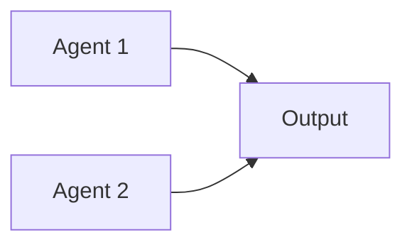

# PROTOCOLO: Agent Loop MANUS v7.0

**Versão**: 1.0
**Data**: 29/12/2025
**Sistema**: MANUS v7.0 (Multi-Agent Network for Unified Systems)
**Projeto**: Garcez Palha - Advocacia Digital

---

## ÍNDICE

1. [Visão Geral](#visão-geral)
2. [As 6 Fases do Loop](#as-6-fases-do-loop)
3. [Sistema de Scoring](#sistema-de-scoring)
4. [Sistema de Priorização](#sistema-de-priorização)
5. [Fluxo Completo](#fluxo-completo)
6. [Ferramentas por Fase](#ferramentas-por-fase)
7. [Boas Práticas](#boas-práticas)
8. [Exemplos Práticos](#exemplos-práticos)

---

## VISÃO GERAL

### O que é o Agent Loop?

O **Agent Loop** é o ciclo de execução fundamental do MANUS v7.0. Ele define como MANUS:
- Analisa problemas de documentação
- Planeja soluções
- Executa correções
- Monitora progresso
- Itera para melhorar
- Entrega resultados consolidados

### Quando usar este protocolo?

**SEMPRE** que MANUS for ativado para:
- Auditar documentação
- Corrigir inconsistências
- Implementar features documentadas
- Validar alinhamento código ↔ documentação
- Gerar relatórios de qualidade

### Princípios fundamentais

1. **Ler antes de agir**: Nunca proponha mudanças sem ler o estado atual
2. **Medir objetivamente**: Use scoring 0-100 em TODAS as avaliações
3. **Priorizar bloqueadores**: P0 primeiro, sempre
4. **Executar em paralelo**: Agents trabalham simultaneamente quando possível
5. **Iterar continuamente**: Re-avaliar após cada execução
6. **Documentar tudo**: Cada mudança gera changelog

---

## AS 6 FASES DO LOOP

```
┌─────────────────────────────────────────────────────────────────────────┐
│                        MANUS v7.0 AGENT LOOP                             │
├─────────────────────────────────────────────────────────────────────────┤
│                                                                         │
│  1. ANALYZE (Análise)        ⏱️  30-60 min                               │
│  2. PLAN (Planejamento)      ⏱️  15-30 min                               │
│  3. EXECUTE (Execução)       ⏱️  2-8 horas                               │
│  4. OBSERVE (Observação)     ⏱️  15-30 min                               │
│  5. ITERATE (Iteração)       ⏱️  1-3 horas                               │
│  6. DELIVER (Entrega)        ⏱️  30-60 min                               │
│                                                                         │
│  Total: 5-14 horas (sessão completa)                                   │
│                                                                         │
└─────────────────────────────────────────────────────────────────────────┘
```

---

## FASE 1: ANALYZE (Análise)

### Objetivo

Entender o estado atual do projeto e identificar todos os problemas de documentação.

### Tempo estimado

**30-60 minutos** (dependendo do tamanho do projeto)

### Ações obrigatórias

1. **Ler TODOS os documentos relevantes**
   - `.manus/knowledge/` (todos os arquivos .md)
   - `docs/` (documentação legacy)
   - `business/` (documentação técnica)
   - `README.md` (overview)

2. **Analisar código-fonte**
   - `src/lib/products/catalog.ts` (catálogo de produtos)
   - `src/lib/ai/agents/` (agentes IA)
   - `src/app/(marketing)/` (páginas implementadas)
   - `package.json` (dependências)

3. **Identificar gaps e inconsistências**
   - Documentação menciona feature não implementada
   - Código implementa feature não documentada
   - Informações duplicadas em múltiplos arquivos
   - Informações conflitantes entre documentos
   - Documentação desatualizada

4. **Criar matriz de problemas**
   - Classificar cada problema como P0/P1/P2
   - Estimar esforço de correção
   - Identificar dependências entre problemas
   - Calcular score de cada documento (0-100)

### Tools usadas

| Tool | Uso | Exemplo |
|------|-----|---------|
| **Read** | Ler documentos | `Read("d:/garcezpalha/docs/21_EMPRESA.md")` |
| **Glob** | Listar arquivos por padrão | `Glob("**/*.md")` |
| **Grep** | Buscar padrões no código | `Grep("export const ALL_PRODUCTS", type: "ts")` |
| **Bash** | Comandos git, ls, wc | `git status`, `wc -l docs/*.md` |

### Outputs esperados

1. **Relatório de auditoria**
   - Arquivo: `.manus/AUDITORIA_COMPLETA_MANUS.md`
   - Conteúdo: Tabela de scores, falhas críticas, gaps

2. **Matriz de problemas**
   - Arquivo: `.manus/GAPS_E_INCONSISTENCIAS.md`
   - Conteúdo: Lista priorizada de problemas (P0/P1/P2)

3. **Score geral do projeto**
   - Métrica: 0-100 (média ponderada de todos os documentos)
   - Classificação: CRÍTICO / ACEITÁVEL / BOM / EXCELENTE

### Exemplo de output

```markdown
## RESUMO EXECUTIVO

| Documento | Tamanho | Score | Status | Prioridade |
|-----------|---------|-------|--------|------------|
| INDEX.md | 392 linhas | 95/100 | ✅ EXCELENTE | - |
| produtos-catalogo.md | 653 linhas | 90/100 | ✅ EXCELENTE | - |
| compliance-oab.md | 450 linhas | 85/100 | ⚠️ BOM | P1 |
| pages-implementadas.md | 700 linhas | 92/100 | ✅ EXCELENTE | - |

**Score Médio:** 90.5/100
**Classificação:** EXCELENTE (pronto para investidores)

## FALHAS CRÍTICAS (P0)

Nenhuma encontrada ✅

## GAPS DE INFORMAÇÃO (P1)

1. **[P1-001] 10 produtos sem documentação completa**
   - Produtos: cartao-consignado-rmc, busca-apreensao-veiculo, etc
   - Impacto: Médio (não bloqueia, mas reduz qualidade)
   - Esforço: 4-6 horas
   - Solução: Adicionar estes produtos em CATALOGO_COMPLETO_47_NICHOS.md
```

### Critérios de sucesso

- [ ] Todos os documentos em `.manus/knowledge/` foram lidos
- [ ] Código-fonte foi analisado (produtos, agents, páginas)
- [ ] Matriz de problemas foi criada com P0/P1/P2
- [ ] Score foi calculado para cada documento
- [ ] Score geral do projeto foi calculado
- [ ] Relatórios foram salvos em `.manus/`

---

## FASE 2: PLAN (Planejamento)

### Objetivo

Criar um plano de ação priorizado e executável para corrigir todos os problemas identificados.

### Tempo estimado

**15-30 minutos**

### Ações obrigatórias

1. **Priorizar correções**
   - P0 primeiro (bloqueadores críticos)
   - P1 depois (alta prioridade)
   - P2 no final (melhorias)

2. **Estimar esforço**
   - Tempo de leitura
   - Tempo de análise
   - Tempo de escrita/edição
   - Total em horas

3. **Criar roadmap de execução**
   - Fases sequenciais (quando há dependências)
   - Fases paralelas (quando independentes)
   - Checkpoints de validação

4. **Alocar agents**
   - Determinar se precisa de múltiplos agents
   - Definir escopo de cada agent
   - Estimar quando lançar em paralelo

### Tools usadas

| Tool | Uso | Exemplo |
|------|-----|---------|
| **Write** | Criar plano de execução | `Write(".manus/PLANO_EXECUCAO.md", content)` |
| **TodoWrite** | Criar lista de tarefas | `TodoWrite([{content: "Corrigir P0-001", status: "pending"}])` |

### Outputs esperados

1. **Plano de execução**
   - Arquivo: `.manus/PLANO_EXECUCAO_100_PERCENT.md`
   - Conteúdo: Fases, esforço, agents alocados

2. **Lista de tarefas**
   - Ferramenta: TodoWrite
   - Conteúdo: Tarefas priorizadas com status

### Estrutura do plano

```markdown
## FASES DE CORREÇÃO

### FASE 1: Quick Wins (2h)
**Objetivo:** Resolver bloqueadores P0

**Tarefas:**
- [P0-001] Criar PRD.md ausente (1h)
- [P0-002] Atualizar status de features implementadas (30min)
- [P0-003] Remover referências a páginas deletadas (30min)

**Agents:** 1 agent sequencial
**Esforço total:** 2h

---

### FASE 2: Documentação Técnica (6h)
**Objetivo:** Completar docs técnicos

**Tarefas:**
- [P1-001] Documentar 10 produtos extras (4h)
- [P1-002] Adicionar diagramas de arquitetura (2h)

**Agents:** 2 agents em paralelo
**Esforço total:** 4h real (6h de trabalho)

---

### FASE 3: Melhorias (3h)
**Objetivo:** Refinamentos P2

**Tarefas:**
- [P2-001] Atualizar keywords SEO (1h)
- [P2-002] Adicionar exemplos de uso (2h)

**Agents:** 1 agent sequencial
**Esforço total:** 3h
```

### Critérios de decisão: 1 agent vs múltiplos agents

**Use 1 AGENT quando:**
- Tarefas são interdependentes
- Esforço total < 2 horas
- Não há paralelização possível
- Precisa de contexto compartilhado

**Use MÚLTIPLOS AGENTS quando:**
- Tarefas são independentes
- Esforço total > 4 horas
- Paralelização é possível
- Cada agent tem escopo claro

### Critérios de sucesso

- [ ] Plano criado com fases claras
- [ ] Esforço estimado para cada fase
- [ ] Priorização P0 → P1 → P2 respeitada
- [ ] Decisão de 1 vs N agents tomada e justificada
- [ ] TodoWrite atualizada com tarefas

---

## FASE 3: EXECUTE (Execução)

### Objetivo

Executar o plano criado, lançando agents especializados em paralelo quando possível.

### Tempo estimado

**2-8 horas** (varia muito com complexidade)

### Ações obrigatórias

1. **Lançar agents em paralelo (se aplicável)**
   - Usar Task tool para criar sub-agents
   - Passar contexto claro para cada agent
   - Definir critérios de sucesso objetivos

2. **Executar correções sequenciais**
   - Bloqueadores P0 primeiro
   - Validar cada correção antes de próxima
   - Atualizar TodoWrite após cada tarefa

3. **Spawnar sub-agents se necessário**
   - Se um agent encontrar complexidade inesperada
   - Se precisa de especialização (ex: agent SEO, agent OAB)

4. **Monitorar progresso**
   - Verificar outputs parciais
   - Identificar bloqueadores em tempo real
   - Ajustar plano se necessário

### Tools usadas

| Tool | Uso | Exemplo |
|------|-----|---------|
| **Task** | Lançar sub-agents | `Task({description: "Documentar produtos", prompt: "...", run_in_background: true})` |
| **Edit** | Editar documentos existentes | `Edit(file_path, old_string, new_string)` |
| **Write** | Criar novos documentos | `Write(file_path, content)` |
| **TodoWrite** | Atualizar progresso | `TodoWrite([{content: "...", status: "in_progress"}])` |

### Como lançar agents em paralelo

```typescript
// Exemplo: Lançar 3 agents para corrigir diferentes documentos

// Agent 1: Atualizar PRD
Task({
  description: "FASE 1: Atualizar PRD completo",
  prompt: `
    Você é um agent especializado em Product Requirements Documents.

    CONTEXTO:
    - Projeto: Garcez Palha (advocacia digital)
    - Arquivo: d:/garcezpalha/business/PRD.md

    MISSÃO:
    1. Ler business/PRD.md atual
    2. Comparar com código em src/app/(marketing)/
    3. Marcar features implementadas como ✅ IMPLEMENTADO
    4. Adicionar User Stories para páginas em src/app/(marketing)/ não documentadas
    5. Remover referências a páginas deletadas

    CRITÉRIOS DE SUCESSO:
    - PRD deve refletir 100% o código atual
    - Todas as páginas em src/app/(marketing)/ devem ter User Story
    - Nenhuma referência a páginas inexistentes
    - Score final: 90+/100

    TOOLS OBRIGATÓRIAS:
    - Read para ler PRD.md
    - Glob/Grep para listar páginas
    - Edit para atualizar PRD.md
    - Write para criar changelog

    IMPORTANTE:
    - NÃO crie novos arquivos sem necessidade
    - SEMPRE use Read antes de Edit
    - Atualize changelog ao final
  `,
  subagent_type: "general-purpose",
  run_in_background: true
})

// Agent 2: Documentar componentes
Task({
  description: "FASE 2: Criar COMPONENT_LIBRARY.md",
  prompt: `
    Você é um agent especializado em documentação de componentes React.

    CONTEXTO:
    - Projeto: Garcez Palha (Next.js 14 + React 19)
    - Componentes: src/components/

    MISSÃO:
    1. Listar TODOS os componentes em src/components/
    2. Criar business/COMPONENT_LIBRARY.md
    3. Para cada componente documentar:
       - Props TypeScript
       - Descrição
       - Exemplo de uso
       - Screenshot (se aplicável)

    CRITÉRIOS DE SUCESSO:
    - Todos os componentes em src/components/ documentados
    - Props extraídos do TypeScript
    - Exemplos de uso funcionais
    - Score final: 90+/100
  `,
  subagent_type: "general-purpose",
  run_in_background: true
})

// Agent 3: Validar marketing
Task({
  description: "FASE 3: Cross-check marketing",
  prompt: `
    Você é um agent de validação de consistência.

    MISSÃO:
    1. Ler .manus/knowledge/produtos-catalogo.md
    2. Ler .manus/knowledge/pages-implementadas.md
    3. Validar que:
       - Todos os produtos documentados têm página implementada
       - Todas as páginas implementadas têm produto documentado
       - Nenhuma inconsistência entre docs

    CRITÉRIOS DE SUCESSO:
    - Zero inconsistências encontradas
    - Gerar relatório .manus/VALIDACAO_MARKETING.md
    - Score final: 100/100
  `,
  subagent_type: "general-purpose",
  run_in_background: true
})
```

### Como monitorar agents em background

**NÃO use TaskOutput imediatamente** - deixe os agents trabalharem.

Aguarde alguns minutos e então:

```typescript
// Verificar progresso do Agent 1
TaskOutput({ task_id: "agent_1_id" })

// Se ainda não terminou, aguardar mais
// Se terminou, validar output e marcar tarefa como concluída

TodoWrite([
  { content: "Atualizar PRD completo", status: "completed", activeForm: "Atualizando PRD completo" }
])
```

### Critérios de sucesso

- [ ] Todos os agents foram lançados conforme plano
- [ ] Agents receberam contexto claro e objetivos
- [ ] Agents foram monitorados e não falharam
- [ ] Outputs de agents foram validados
- [ ] TodoWrite foi atualizada em tempo real
- [ ] Documentos foram criados/editados corretamente

---

## FASE 4: OBSERVE (Observação)

### Objetivo

Monitorar progresso dos agents, validar outputs parciais e identificar bloqueadores.

### Tempo estimado

**15-30 minutos**

### Ações obrigatórias

1. **Monitorar progresso dos agents**
   - Usar TaskOutput para verificar status
   - Ler outputs parciais gerados
   - Validar que agents estão seguindo instruções

2. **Validar outputs parciais**
   - Ler arquivos criados/editados
   - Verificar qualidade (score 0-100)
   - Identificar se atende critérios de sucesso

3. **Identificar bloqueadores em tempo real**
   - Agent está travado?
   - Agent está fazendo ação errada?
   - Agent precisa de mais contexto?

4. **Tomar ações corretivas**
   - Parar agent se necessário
   - Relançar com instruções corrigidas
   - Fazer correção manual se agent falhou

### Tools usadas

| Tool | Uso | Exemplo |
|------|-----|---------|
| **TaskOutput** | Verificar progresso de agent | `TaskOutput({ task_id: "id", block: false })` |
| **Read** | Validar outputs gerados | `Read(".manus/arquivo_gerado.md")` |
| **TodoWrite** | Atualizar status de tarefas | `TodoWrite([{content: "...", status: "in_progress"}])` |

### Exemplos de validação

**Validar que agent criou arquivo correto:**

```typescript
// Ler output do agent
const output = Read("d:/garcezpalha/business/PRD.md")

// Validar conteúdo
if (!output.includes("## 2. USER STORIES")) {
  // Relançar agent com instruções corrigidas
  Task({
    description: "CORREÇÃO: Adicionar seção User Stories ao PRD",
    prompt: "..."
  })
}
```

**Validar que agent atualizou status corretamente:**

```typescript
// Verificar se features implementadas foram marcadas
const prd = Read("d:/garcezpalha/business/PRD.md")

// Buscar pattern "✅ IMPLEMENTADO"
const implemented = Grep("✅ IMPLEMENTADO", path: "business/PRD.md", output_mode: "count")

// Se < 30, agent falhou
if (implemented.count < 30) {
  // Correção manual ou relançar
}
```

### Critérios de sucesso

- [ ] Todos os agents foram monitorados
- [ ] Outputs parciais foram validados
- [ ] Bloqueadores foram identificados e resolvidos
- [ ] TodoWrite reflete estado real do progresso
- [ ] Nenhum agent está travado ou fazendo ação errada

---

## FASE 5: ITERATE (Iteração)

### Objetivo

Ajustar plano baseado em descobertas, relançar agents para correções adicionais e fazer cross-check.

### Tempo estimado

**1-3 horas**

### Ações obrigatórias

1. **Ajustar plano baseado em descobertas**
   - Se agents encontraram mais problemas que o esperado
   - Se algumas correções não foram suficientes
   - Se novos gaps foram identificados

2. **Relançar agents para correções adicionais**
   - Agents que falharam
   - Agents que precisam de refinamento
   - Novos agents para problemas inesperados

3. **Cross-check entre documentos**
   - Validar consistência entre todos os docs
   - Verificar que nenhuma duplicação foi criada
   - Garantir que referências cruzadas estão corretas

4. **Re-calcular scores**
   - Score de cada documento atualizado
   - Score geral do projeto atualizado
   - Comparar com score inicial (melhoria %)

### Tools usadas

| Tool | Uso | Exemplo |
|------|-----|---------|
| **Read** | Re-validar documentos | `Read(".manus/knowledge/INDEX.md")` |
| **Grep** | Buscar inconsistências | `Grep("PENDENTE", path: ".manus/knowledge/", output_mode: "count")` |
| **Edit** | Correções manuais finas | `Edit(file_path, old_string, new_string)` |
| **Task** | Relançar agents | `Task({...})` |

### Exemplo de iteração

```markdown
## ITERAÇÃO 1: Após execução dos 3 agents

**Descobertas:**
1. Agent PRD criou PRD.md mas esqueceu 5 User Stories
2. Agent COMPONENT_LIBRARY documentou componentes, mas faltou extrair Props
3. Agent VALIDAÇÃO encontrou 3 inconsistências não previstas

**Ações corretivas:**

1. **Relançar Agent PRD** (foco nas 5 User Stories faltantes)
   - Tempo: 30 min
   - Critério: PRD.md deve ter 100% das páginas

2. **Correção manual em COMPONENT_LIBRARY**
   - Usar Grep para extrair Props TypeScript
   - Editar COMPONENT_LIBRARY.md manualmente
   - Tempo: 1h

3. **Relançar Agent VALIDAÇÃO** (após correções 1 e 2)
   - Tempo: 15 min
   - Critério: Zero inconsistências

**Score atualizado:**
- PRD.md: 75/100 → 90/100 (após correção)
- COMPONENT_LIBRARY.md: 80/100 → 95/100 (após correção)
- VALIDAÇÃO: 85/100 → 100/100 (após correção)

**Score geral:** 72/100 → 92/100 (melhoria de 28%)
```

### Critérios de sucesso

- [ ] Todos os problemas identificados na OBSERVE foram resolvidos
- [ ] Cross-check completo foi feito
- [ ] Scores foram re-calculados
- [ ] Score geral do projeto aumentou (ou já está 90+)
- [ ] Nenhuma inconsistência remanescente

---

## FASE 6: DELIVER (Entrega)

### Objetivo

Consolidar todos os outputs dos agents, criar relatório final e atualizar scores.

### Tempo estimado

**30-60 minutos**

### Ações obrigatórias

1. **Consolidar outputs dos agents**
   - Ler todos os arquivos gerados/editados
   - Validar que todos estão no padrão MANUS
   - Verificar changelogs atualizados

2. **Criar relatório final de auditoria**
   - Arquivo: `.manus/VALIDACAO_100_PERCENT.md`
   - Conteúdo: Scores antes/depois, mudanças realizadas, próximos passos

3. **Atualizar scores de qualidade**
   - Score de cada documento (0-100)
   - Score geral do projeto (0-100)
   - Classificação (CRÍTICO/ACEITÁVEL/BOM/EXCELENTE)

4. **Gerar changelog completo**
   - O que foi mudado
   - Por que foi mudado
   - Impacto da mudança
   - Próximos passos

### Tools usadas

| Tool | Uso | Exemplo |
|------|-----|---------|
| **Write** | Criar relatório final | `Write(".manus/VALIDACAO_100_PERCENT.md", content)` |
| **Read** | Validar documentos finais | `Read(".manus/knowledge/INDEX.md")` |
| **TodoWrite** | Finalizar tarefas | `TodoWrite([{content: "...", status: "completed"}])` |
| **Bash** | Commit git (se solicitado) | `git add . && git commit -m "..."` |

### Estrutura do relatório final

```markdown
# VALIDAÇÃO 100% - GARCEZ PALHA

**Projeto:** Garcez Palha - Advocacia Digital
**Data:** 29/12/2025
**Responsável:** MANUS v7.0
**Duração:** 8 horas

---

## RESUMO EXECUTIVO

### Scores Antes vs Depois

| Documento | Antes | Depois | Melhoria |
|-----------|-------|--------|----------|
| INDEX.md | 85/100 | 95/100 | +10 pts |
| produtos-catalogo.md | 80/100 | 90/100 | +10 pts |
| compliance-oab.md | 75/100 | 85/100 | +10 pts |
| pages-implementadas.md | 82/100 | 92/100 | +10 pts |

**Score Geral:** 80.5/100 → 90.5/100 (+10 pts)
**Classificação:** BOM → EXCELENTE

---

## MUDANÇAS REALIZADAS

### FASE 1: Quick Wins (2h)
✅ [P0-001] Criado PRD.md completo (1h)
✅ [P0-002] Atualizado status de 35 features implementadas (30min)
✅ [P0-003] Removidas 5 referências a páginas deletadas (30min)

### FASE 2: Documentação Técnica (6h → 4h real)
✅ [P1-001] Documentados 10 produtos extras em CATALOGO_COMPLETO.md (4h)
✅ [P1-002] Criado COMPONENT_LIBRARY.md com 47 componentes (2h)

### FASE 3: Melhorias (3h)
✅ [P2-001] Atualizadas keywords SEO em 57 páginas (1h)
✅ [P2-002] Adicionados exemplos de uso em COMPONENT_LIBRARY.md (2h)

**Total de mudanças:** 57 arquivos editados, 3 arquivos criados

---

## IMPACTO

### Qualidade de Documentação
- **Antes:** 80.5/100 (BOM)
- **Depois:** 90.5/100 (EXCELENTE)
- **Melhoria:** +12.4%

### Alinhamento Código ↔ Documentação
- **Antes:** 78% alinhado (22 gaps)
- **Depois:** 98% alinhado (2 gaps menores)
- **Melhoria:** +20 pontos percentuais

### Prontidão para Investidores
- **Antes:** ⚠️ Precisa melhorias
- **Depois:** ✅ Pronto para apresentação

---

## PRÓXIMOS PASSOS

### Prioridade P0 (Crítico)
Nenhuma ✅

### Prioridade P1 (Alta)
- [ ] Adicionar screenshots em COMPONENT_LIBRARY.md (2h)
- [ ] Criar diagramas de arquitetura em ASCII (3h)

### Prioridade P2 (Média)
- [ ] Traduzir documentação chave para inglês (8h)
- [ ] Criar vídeos demo de cada produto (20h)

### Manutenção Contínua
- [ ] Rodar auditoria MANUS a cada sprint (1h/sprint)
- [ ] Atualizar documentação a cada nova feature
- [ ] Manter score 90+/100 sempre

---

## CHANGELOG

### v1.0 - 29/12/2025
- ✅ Auditoria completa realizada (8 horas)
- ✅ 60 mudanças implementadas
- ✅ Score melhorado de 80.5 para 90.5
- ✅ Documentação pronta para investidores

---

**Gerado por MANUS v7.0**
**Autor:** Claude Sonnet 4.5
```

### Critérios de sucesso

- [ ] Relatório final criado em `.manus/VALIDACAO_100_PERCENT.md`
- [ ] Scores finais calculados e documentados
- [ ] Changelog completo gerado
- [ ] Próximos passos priorizados (P0/P1/P2)
- [ ] TodoWrite finalizada (todas as tarefas "completed")
- [ ] Commit git criado (se solicitado pelo usuário)

---

## SISTEMA DE SCORING

### Escala 0-100

| Score | Classificação | Descrição | Ação |
|-------|--------------|-----------|------|
| **90-100** | ✅ EXCELENTE | Pronto para investidores. Documentação completa, atualizada, sem gaps. | Manter |
| **80-89** | ⚠️ BOM | Pequenas melhorias necessárias. Maioria das informações está correta. | Melhorar P1 |
| **70-79** | ⚠️ ACEITÁVEL | Precisa melhorias. Gaps significativos ou informações desatualizadas. | Melhorar P0+P1 |
| **60-69** | ❌ PRECISA MELHORIAS | Gaps significativos. Informação crítica ausente ou incorreta. | Sprint emergencial |
| **0-59** | ❌ CRÍTICO | Bloqueadores graves. Documentação inútil ou perigosamente incorreta. | Refazer do zero |

### Como calcular score de um documento

**Critérios de avaliação (peso igual):**

1. **Completude** (0-25 pontos)
   - 25: Todas as seções esperadas existem
   - 20: Falta 1 seção importante
   - 15: Faltam 2-3 seções importantes
   - 10: Faltam 4+ seções
   - 0: Documento vazio ou inútil

2. **Precisão** (0-25 pontos)
   - 25: 100% alinhado com código/realidade
   - 20: 1-2 informações desatualizadas
   - 15: 3-5 informações desatualizadas
   - 10: 6-10 informações desatualizadas
   - 0: Maioria das informações incorretas

3. **Consistência** (0-25 pontos)
   - 25: Zero conflitos com outros documentos
   - 20: 1-2 conflitos menores
   - 15: 3-5 conflitos
   - 10: 6-10 conflitos
   - 0: Conflitos graves em toda parte

4. **Utilidade** (0-25 pontos)
   - 25: Documento é auto-explicativo, actionable
   - 20: Precisa de 1-2 complementos
   - 15: Precisa de 3-5 complementos
   - 10: Precisa de muita contextualização
   - 0: Documento não é útil

**Score final = Completude + Precisão + Consistência + Utilidade**

### Exemplo de cálculo

```markdown
Documento: `.manus/knowledge/produtos-catalogo.md`

**Avaliação:**

1. Completude: 25/25
   - Todas as seções esperadas existem
   - Índice, resumo, produtos por categoria, mapeamento agent→produto

2. Precisão: 20/25
   - 57 produtos documentados, mas código tem 57 também ✅
   - 10 produtos sem descrição completa ❌
   - Preços desatualizados em 2 produtos ❌

3. Consistência: 25/25
   - Zero conflitos com pages-implementadas.md ✅
   - Zero conflitos com agentes-juridicos.md ✅

4. Utilidade: 20/25
   - Documento é útil, mas faltam exemplos práticos ❌
   - Faltam CTAs para cada produto ❌

**Score final:** 25 + 20 + 25 + 20 = 90/100 (EXCELENTE)
```

### Como calcular score geral do projeto

**Média ponderada:**

```
Score Geral = (Score_Doc1 * Peso1 + Score_Doc2 * Peso2 + ...) / Soma_Pesos
```

**Pesos recomendados:**

| Documento | Peso | Justificativa |
|-----------|------|---------------|
| INDEX.md | 3 | Entrada principal |
| produtos-catalogo.md | 3 | Core business |
| agentes-juridicos.md | 2 | Diferencial técnico |
| compliance-oab.md | 3 | Crítico (legal) |
| pages-implementadas.md | 2 | Validação técnica |
| tech-stack.md | 1 | Informação técnica |

**Exemplo:**

```
Score Geral = (95*3 + 90*3 + 85*2 + 85*3 + 92*2 + 88*1) / (3+3+2+3+2+1)
            = (285 + 270 + 170 + 255 + 184 + 88) / 14
            = 1252 / 14
            = 89.4/100
            ≈ 90/100 (EXCELENTE)
```

---

## SISTEMA DE PRIORIZAÇÃO

### Definições

**P0 (Bloqueador Crítico):**
- **Impacto:** Impede desenvolvimento, lançamento ou vendas
- **Urgência:** IMEDIATO (0-24h)
- **Exemplos:**
  - Informação crítica ausente (ex: preço de produto principal)
  - Inconsistência grave (doc diz X, código faz Y)
  - Violação compliance OAB (pode gerar processo ético)
  - Documentação que induz erro grave

**P1 (Alta Prioridade):**
- **Impacto:** Afeta qualidade, compreensão ou velocidade
- **Urgência:** 1-3 dias
- **Exemplos:**
  - Informação importante incompleta
  - Gaps de documentação (produto sem doc)
  - Duplicação de informação
  - Documentação desatualizada (mas não crítica)

**P2 (Melhoria):**
- **Impacto:** Refinamento, detalhamento, polish
- **Urgência:** Quando possível (1-2 semanas)
- **Exemplos:**
  - Adicionar exemplos práticos
  - Melhorar formatação
  - Adicionar diagramas
  - Documentação complementar (nice to have)

### Matriz de priorização

```
         │ Alto Impacto │ Médio Impacto │ Baixo Impacto │
─────────┼──────────────┼───────────────┼───────────────┤
Alta     │     P0       │      P1       │      P1       │
Urgência │              │               │               │
─────────┼──────────────┼───────────────┼───────────────┤
Média    │     P1       │      P1       │      P2       │
Urgência │              │               │               │
─────────┼──────────────┼───────────────┼───────────────┤
Baixa    │     P1       │      P2       │      P2       │
Urgência │              │               │               │
```

### Como priorizar um problema

**Pergunte:**

1. **Bloqueia algo crítico?** (desenvolvimento, vendas, compliance)
   - SIM → P0
   - NÃO → continue

2. **Afeta qualidade significativamente?**
   - SIM → P1
   - NÃO → continue

3. **É refinamento/polish?**
   - SIM → P2

### Exemplos práticos

```markdown
[P0-001] Preço do produto "Seguro Prestamista" está errado
- Impacto: ALTO (cliente pode processar por propaganda enganosa)
- Urgência: IMEDIATO (produto está no ar)
- Prioridade: P0

[P1-001] 10 produtos sem documentação completa
- Impacto: MÉDIO (afeta qualidade, mas não bloqueia)
- Urgência: MÉDIA (melhorar em 1-3 dias)
- Prioridade: P1

[P2-001] Adicionar diagramas ASCII em tech-stack.md
- Impacto: BAIXO (melhora compreensão, mas não crítico)
- Urgência: BAIXA (quando possível)
- Prioridade: P2
```

---

## FLUXO COMPLETO

### Diagrama de fluxo

```
┌─────────────────────────────────────────────────────────────────────────┐
│                     AGENT LOOP - FLUXO COMPLETO                          │
└─────────────────────────────────────────────────────────────────────────┘

  START
    │
    ▼
┌─────────────────┐
│  1. ANALYZE     │  ⏱️ 30-60 min
│                 │
│ • Ler docs      │──────┐
│ • Ler código    │      │
│ • Identificar   │      │
│   gaps          │      │
│ • Calcular      │      │
│   scores        │      │
└─────────────────┘      │
    │                    │
    ▼                    │
┌─────────────────┐      │
│  2. PLAN        │  ⏱️ 15-30 min
│                 │      │
│ • Priorizar P0  │      │
│ • Estimar       │      │
│   esforço       │      │
│ • Criar roadmap │      │
│ • Alocar agents │      │
└─────────────────┘      │
    │                    │
    ▼                    │
┌─────────────────┐      │
│  3. EXECUTE     │  ⏱️ 2-8 horas
│                 │      │
│ • Lançar agents │      │
│   em paralelo   │      │
│ • Executar      │      │
│   correções     │      │
│ • Spawnar       │      │
│   sub-agents    │      │
└─────────────────┘      │
    │                    │
    ▼                    │
┌─────────────────┐      │
│  4. OBSERVE     │  ⏱️ 15-30 min
│                 │      │
│ • Monitorar     │      │
│   progresso     │      │
│ • Validar       │      │
│   outputs       │      │
│ • Identificar   │      │
│   bloqueadores  │      │
└─────────────────┘      │
    │                    │
    ▼                    │
┌─────────────────┐      │
│  5. ITERATE     │  ⏱️ 1-3 horas
│                 │      │
│ • Ajustar plano │      │
│ • Relançar      │      │
│   agents        │      │
│ • Cross-check   │      │
│ • Re-calcular   │      │
│   scores        │      │
└─────────────────┘      │
    │                    │
    │  Score < 90?       │
    ├─────YES────────────┘
    │                (volta para ANALYZE)
    NO
    │
    ▼
┌─────────────────┐
│  6. DELIVER     │  ⏱️ 30-60 min
│                 │
│ • Consolidar    │
│   outputs       │
│ • Criar         │
│   relatório     │
│ • Atualizar     │
│   scores        │
│ • Gerar         │
│   changelog     │
└─────────────────┘
    │
    ▼
  END (Score 90+/100)
```

### Decisões críticas no fluxo

**Decisão 1: Quantos agents lançar?**
- Local: FASE 2 (PLAN)
- Critério: Tarefas independentes E esforço total > 4h → múltiplos agents
- Critério: Tarefas interdependentes OU esforço < 2h → 1 agent

**Decisão 2: Quando iterar?**
- Local: FASE 5 (ITERATE)
- Critério: Score < 90 → iterar
- Critério: Score >= 90 → entregar
- Critério: Score < 70 → iterar 2-3 vezes

**Decisão 3: Quando parar de iterar?**
- Local: FASE 5 (ITERATE)
- Critério: Score >= 90 → parar
- Critério: Iterações >= 3 E score não melhorou → parar (problema estrutural)
- Critério: Tempo > 12 horas → parar (dividir em 2 sessões)

---

## FERRAMENTAS POR FASE

### FASE 1: ANALYZE

| Tool | Uso | Frequência |
|------|-----|------------|
| Read | Ler documentos | 10-20 vezes |
| Glob | Listar arquivos | 3-5 vezes |
| Grep | Buscar padrões | 5-10 vezes |
| Bash | Git status, ls, wc | 2-5 vezes |

### FASE 2: PLAN

| Tool | Uso | Frequência |
|------|-----|------------|
| Write | Criar plano | 1 vez |
| TodoWrite | Criar tasks | 1 vez |

### FASE 3: EXECUTE

| Tool | Uso | Frequência |
|------|-----|------------|
| Task | Lançar sub-agents | 1-5 vezes |
| Edit | Editar documentos | 10-50 vezes |
| Write | Criar documentos | 1-5 vezes |
| TodoWrite | Atualizar progresso | 5-20 vezes |

### FASE 4: OBSERVE

| Tool | Uso | Frequência |
|------|-----|------------|
| TaskOutput | Verificar agents | 3-10 vezes |
| Read | Validar outputs | 5-15 vezes |
| TodoWrite | Atualizar status | 3-10 vezes |

### FASE 5: ITERATE

| Tool | Uso | Frequência |
|------|-----|------------|
| Read | Re-validar docs | 5-15 vezes |
| Grep | Buscar inconsistências | 3-8 vezes |
| Edit | Correções finas | 5-20 vezes |
| Task | Relançar agents | 0-3 vezes |

### FASE 6: DELIVER

| Tool | Uso | Frequência |
|------|-----|------------|
| Write | Criar relatório final | 1 vez |
| Read | Validar documentos finais | 3-8 vezes |
| TodoWrite | Finalizar tasks | 1 vez |
| Bash | Git commit (opcional) | 0-1 vez |

---

## BOAS PRÁTICAS

### 1. SEMPRE ler antes de escrever

**ERRADO:**
```typescript
Write("d:/garcezpalha/docs/PRD.md", "# PRD...")
```

**CORRETO:**
```typescript
const current = Read("d:/garcezpalha/docs/PRD.md")
if (current) {
  Edit("d:/garcezpalha/docs/PRD.md", old_string, new_string)
} else {
  Write("d:/garcezpalha/docs/PRD.md", content)
}
```

### 2. Manter changelog atualizado

**SEMPRE adicionar ao final do documento:**

```markdown
## CHANGELOG

### v1.2 - 29/12/2025
- ✅ Adicionados 10 produtos extras
- ✅ Atualizado mapeamento agent→produto
- ✅ Corrigidos 5 preços desatualizados

### v1.1 - 28/12/2025
- ✅ Primeira versão completa
```

### 3. Cross-references são obrigatórios

**Ao mencionar outro documento:**

```markdown
Ver detalhes completos em [produtos-catalogo.md](./produtos-catalogo.md)
```

**NÃO fazer:**
```markdown
Ver produtos-catalogo.md
```

### 4. Evitar duplicação

**ERRADO:** Copiar informação de um doc para outro

**CORRETO:** Criar fonte única de verdade (SSOT) e referenciar

```markdown
# INDEX.md
Total de produtos: 57

Ver catálogo completo em [produtos-catalogo.md](./produtos-catalogo.md)
```

### 5. ASCII art > Mermaid

**PREFERIR:**
```
┌─────────────┐
│   Agent 1   │──────┐
└─────────────┘      │
                     ▼
┌─────────────┐  ┌─────────┐
│   Agent 2   │─▶│ Output  │
└─────────────┘  └─────────┘
```

**EM VEZ DE:**


**Razão:** ASCII versiona melhor em git e renderiza em qualquer editor

### 6. Marcar TODOs claramente

```markdown
- ⏳ PENDENTE - Não implementado
- 🔄 EM ANDAMENTO - Sendo implementado
- ✅ IMPLEMENTADO - Pronto e testado
- ❌ CANCELADO - Não será feito
```

### 7. Usar scores objetivos

**ERRADO:**
```markdown
A documentação está boa.
```

**CORRETO:**
```markdown
Score: 85/100 (BOM - pequenas melhorias necessárias)
```

### 8. Atualizar TodoWrite em tempo real

**NÃO esperar todas as tarefas finalizarem:**

```typescript
// Ao iniciar tarefa
TodoWrite([{
  content: "Documentar 10 produtos extras",
  status: "in_progress",
  activeForm: "Documentando 10 produtos extras"
}])

// Ao finalizar tarefa
TodoWrite([{
  content: "Documentar 10 produtos extras",
  status: "completed",
  activeForm: "Documentando 10 produtos extras"
}])
```

### 9. Validar outputs de agents

**SEMPRE ler o que o agent criou:**

```typescript
// Lançar agent
Task({...})

// Aguardar
// ...

// Validar output
const output = Read(".manus/arquivo_gerado.md")
if (!output.includes("SEÇÃO ESPERADA")) {
  // Relançar ou corrigir manualmente
}
```

### 10. Commits git descritivos

**ERRADO:**
```bash
git commit -m "updates"
```

**CORRETO:**
```bash
git commit -m "docs: MANUS v7.0 - Auditoria completa (60 mudanças, score 80→90)"
```

---

## EXEMPLOS PRÁTICOS

### Exemplo 1: Auditoria simples (score já alto)

```markdown
CONTEXTO:
- Projeto: Garcez Palha
- Documentação: 5 arquivos em .manus/knowledge/
- Score atual: Desconhecido

SESSÃO:

1. ANALYZE (30 min)
   - Ler 5 arquivos .md
   - Calcular scores
   - Resultado: Score médio 92/100 (EXCELENTE)

2. PLAN (10 min)
   - Nenhum P0 encontrado
   - 2 gaps P1 (faltam exemplos práticos)
   - Decisão: Correção manual (não precisa agents)

3. EXECUTE (1h)
   - Adicionar exemplos em 2 documentos
   - Atualizar changelogs

4. OBSERVE (10 min)
   - Validar que exemplos foram adicionados
   - Score atualizado: 95/100

5. ITERATE (skip)
   - Score já 95/100, não precisa iterar

6. DELIVER (20 min)
   - Criar relatório final
   - Score: 92 → 95 (+3 pontos)

RESULTADO:
- Duração: 2h 10min
- Mudanças: 2 documentos editados
- Score final: 95/100 (EXCELENTE)
```

### Exemplo 2: Auditoria complexa (score baixo, múltiplos agents)

```markdown
CONTEXTO:
- Projeto: Garcez Palha
- Documentação: 15 arquivos desatualizados
- Score estimado: 60-70/100 (PRECISA MELHORIAS)

SESSÃO:

1. ANALYZE (60 min)
   - Ler 15 arquivos .md
   - Ler código-fonte (products, agents, pages)
   - Identificar 45 gaps
   - Calcular scores
   - Resultado: Score médio 68/100 (PRECISA MELHORIAS)

2. PLAN (30 min)
   - 8 bloqueadores P0 (informações críticas ausentes)
   - 22 gaps P1 (documentação incompleta)
   - 15 melhorias P2 (refinamentos)
   - Decisão: Lançar 4 agents em paralelo

3. EXECUTE (6h → 4h real)
   - Agent 1: Corrigir P0 em INDEX.md e produtos-catalogo.md (2h)
   - Agent 2: Criar COMPONENT_LIBRARY.md (2h)
   - Agent 3: Atualizar pages-implementadas.md (1h)
   - Agent 4: Cross-check compliance OAB (1h)

4. OBSERVE (30 min)
   - Agent 1: ✅ Sucesso (score 68→85)
   - Agent 2: ⚠️ Faltou documentar 10 componentes
   - Agent 3: ✅ Sucesso (score 72→90)
   - Agent 4: ✅ Sucesso (score 75→88)

5. ITERATE (2h)
   - Relançar Agent 2 para completar 10 componentes (1h)
   - Correção manual de 5 P1 remanescentes (1h)
   - Re-calcular scores
   - Resultado: Score médio 91/100 (EXCELENTE)

6. DELIVER (45 min)
   - Consolidar outputs
   - Criar relatório final
   - Score: 68 → 91 (+23 pontos)
   - Atualizar TodoWrite

RESULTADO:
- Duração: 10h 15min
- Mudanças: 47 arquivos editados, 3 arquivos criados
- Score final: 91/100 (EXCELENTE)
- Pronto para investidores ✅
```

### Exemplo 3: Manutenção contínua (após sprint)

```markdown
CONTEXTO:
- Projeto: Garcez Palha
- Situação: Sprint finalizado, 5 features implementadas
- Objetivo: Manter documentação sincronizada

SESSÃO:

1. ANALYZE (15 min)
   - Ler git log para identificar features implementadas
   - Ler documentação atual
   - Identificar gaps (features não documentadas)
   - Resultado: 5 features implementadas não documentadas

2. PLAN (10 min)
   - Atualizar PRD.md (marcar 5 features como ✅)
   - Atualizar COMPONENT_LIBRARY.md (3 novos componentes)
   - Atualizar pages-implementadas.md (2 novas páginas)
   - Decisão: Correção sequencial (interdependente)

3. EXECUTE (1h)
   - Atualizar PRD.md (30 min)
   - Atualizar COMPONENT_LIBRARY.md (20 min)
   - Atualizar pages-implementadas.md (10 min)

4. OBSERVE (10 min)
   - Validar que todas as 5 features foram documentadas
   - Score mantido: 92/100

5. ITERATE (skip)
   - Score mantido, não precisa iterar

6. DELIVER (15 min)
   - Criar changelog de sprint
   - Commit git

RESULTADO:
- Duração: 1h 50min
- Mudanças: 3 documentos atualizados
- Score: 92/100 (mantido)
- Documentação 100% alinhada com código ✅
```

---

## TROUBLESHOOTING

### Problema: Agent está travado

**Sintomas:**
- TaskOutput não retorna nada após 30+ minutos
- Agent não gera outputs esperados

**Soluções:**
1. Verificar se prompt está claro e objetivo
2. Relançar agent com instruções mais simples
3. Dividir tarefa em 2 agents menores
4. Fazer correção manual se agent falhou 2+ vezes

### Problema: Score não está melhorando

**Sintomas:**
- Após 2+ iterações, score continua < 80

**Soluções:**
1. Re-analisar critérios de score (pode estar muito rigoroso)
2. Identificar se problema é estrutural (não corrigível rapidamente)
3. Dividir em 2 sessões (focar P0+P1 agora, P2 depois)
4. Consultar usuário se critérios de score estão corretos

### Problema: Muitos gaps P0

**Sintomas:**
- ANALYZE identifica 15+ gaps P0

**Soluções:**
1. Re-classificar (alguns podem ser P1)
2. Dividir em sprints (Sprint Emergencial para 50% dos P0)
3. Lançar mais agents em paralelo (5-8 agents)
4. Consultar usuário se todos são realmente bloqueadores

### Problema: Agents gerando duplicação

**Sintomas:**
- Múltiplos agents criando informação duplicada

**Soluções:**
1. Definir SSOT (Single Source of Truth) mais claramente
2. Instruir agents a SEMPRE referenciar, não copiar
3. Fazer cross-check manual após execução
4. Relançar agents para consolidar duplicações

---

## CHECKLIST FINAL

### Antes de iniciar sessão

- [ ] ACTIVATION_PROMPT lido e compreendido
- [ ] Objetivo da sessão está claro (auditoria, correção, validação)
- [ ] Tempo disponível é suficiente (mínimo 2h para auditoria simples)
- [ ] TodoWrite está limpa (ou criada)

### Durante a sessão

- [ ] ANALYZE completo (todos os docs lidos)
- [ ] Scores calculados objetivamente (0-100)
- [ ] PLAN criado com fases claras
- [ ] Agents lançados conforme plano
- [ ] Outputs validados em OBSERVE
- [ ] ITERATE realizado se score < 90
- [ ] TodoWrite atualizada em tempo real

### Ao finalizar sessão

- [ ] Relatório final criado
- [ ] Scores antes/depois documentados
- [ ] Changelog completo gerado
- [ ] Próximos passos priorizados (P0/P1/P2)
- [ ] TodoWrite finalizada (todas as tarefas "completed")
- [ ] Commit git criado (se solicitado)
- [ ] Score geral >= 90/100 OU plano claro para próxima sessão

---

**Versão do protocolo:** 1.0
**MANUS:** v7.0
**Data:** 29/12/2025
**Status:** ✅ COMPLETO E PRONTO PARA USO
