# MANUS v7.0 - FASE 2: PLANO DE EXECUÇÃO

**Data:** 30/12/2025
**Score Atual:** 97/100
**Score Alvo:** 100/100
**Gap Total:** 3 pontos = 6h de trabalho

---

## SUMÁRIO EXECUTIVO

A auditoria FASE 1 identificou **8 gaps** distribuídos em:
- **1 gap P1** (crítico): 2h - Deployment Google APIs
- **7 gaps P2** (alta prioridade): 4h - Atualizações documentação

**Estratégia:** Executar P1 primeiro (bloqueador), depois P2 em paralelo (3 agents simultâneos).

---

## PRIORIZAÇÃO DE TAREFAS

### P1 (CRÍTICO) - BLOQUEADOR
| ID | Tarefa | Tempo | Bloqueio | Arquivos Afetados |
|----|--------|-------|----------|-------------------|
| P1-001 | Validar deployment Google APIs (P1-010, P1-011) | 2h | Sim | tasks.md, vercel.json, .env |

**Justificativa P1:** Código completo mas não deployado = funcionalidade não ativa em produção.

### P2 (ALTA PRIORIDADE) - INDEPENDENTES
| ID | Tarefa | Tempo | Bloqueio | Arquivos Afetados |
|----|--------|-------|----------|-------------------|
| P2-002 | Update agents title "AI-powered legal agents" | 15min | Não | agentes-juridicos.md |
| P2-003 | Validate page count (claimed 48, verify real) | 30min | Não | pages-implementadas.md |
| P2-004 | Confirm pending fields in DADOS_MESTRES.md | 1h | Não | DADOS_MESTRES.md |
| P2-005 | Update README statistics (58 products, 9 crons) | 20min | Não | README.md |
| P2-006 | Validate mapping comment in agent-product-mapping.ts | 15min | Não | agent-product-mapping.ts |
| P2-007 | Update tasks.md with real status from git/code | 1h | Não | tasks.md |
| P2-001 | ✅ ALREADY RESOLVED (ignorado) | 0min | - | - |

---

## ESTRATÉGIA DE EXECUÇÃO

### FASE 3A: EXECUÇÃO SEQUENCIAL - P1 (2h)
**Agent:** `deploy-specialist`
**Modo:** Bloqueante (task crítica)

**Missão:**
1. Ler deployment checklist: `.manus/reports/GOOGLE_APIS_DEPLOYMENT_CHECKLIST.md`
2. Verificar status atual do deployment (git push, Vercel logs)
3. Se não deployado:
   - Configurar env vars no Vercel
   - Fazer git push origin main
   - Monitorar deployment
4. Se deployado:
   - Testar APIs em produção
   - Verificar cron jobs ativos
5. Atualizar tasks.md: P1-010 e P1-011 com status DEPLOYED

**Critério de Sucesso:**
- ✅ Cron jobs ativos no Vercel
- ✅ APIs retornam 200 OK
- ✅ tasks.md atualizado

---

### FASE 3B: EXECUÇÃO PARALELA - P2 (4h)

#### **AGENT GROUP 1: Documentation Updates** (3 agents em paralelo)

**Agent 1: `doc-updater-agents`** (15 min)
- Arquivo: `agentes-juridicos.md`
- Tarefa: P2-002 - Update title to "AI-powered legal agents"
- Critério: Grep confirma mudança

**Agent 2: `doc-updater-stats`** (1h 20min)
- Arquivos: `README.md`, `pages-implementadas.md`
- Tarefas:
  - P2-005: Update README (58 products, 23 agents, 9 crons)
  - P2-003: Validate page count (48 pages claim)
- Critério: Stats match reality

**Agent 3: `doc-updater-dados`** (1h)
- Arquivo: `DADOS_MESTRES.md`
- Tarefa: P2-004 - Confirm pending fields
- Critério: All fields validated

#### **AGENT GROUP 2: Code & Tasks Validation** (2 agents em paralelo)

**Agent 4: `code-validator`** (15 min)
- Arquivo: `agent-product-mapping.ts`
- Tarefa: P2-006 - Validate mapping comment
- Critério: Comment accuracy confirmed

**Agent 5: `tasks-updater`** (1h)
- Arquivo: `tasks.md`
- Tarefa: P2-007 - Update with real status
- Método: Cross-check git status, vercel deployments, build logs
- Critério: tasks.md 100% accurate

---

## ROADMAP DE EXECUÇÃO

```mermaid
gantt
    title MANUS v7.0 - FASE 3 EXECUTION
    dateFormat HH:mm
    section P1 (Sequential)
    Deploy Google APIs (P1-001) :crit, p1, 00:00, 2h
    section P2 (Parallel)
    Update agents title (P2-002) :p2a, after p1, 15m
    Update README stats (P2-005) :p2b, after p1, 20m
    Validate page count (P2-003) :p2c, after p1, 30m
    Confirm pending fields (P2-004) :p2d, after p1, 1h
    Validate mapping comment (P2-006) :p2e, after p1, 15m
    Update tasks.md (P2-007) :p2f, after p1, 1h
```

**Timeline:**
- ⏱️ 00:00-02:00 → P1-001 (deploy specialist)
- ⏱️ 02:00-03:20 → P2 Group 1 & 2 (5 agents em paralelo)
- ⏱️ 03:20-04:00 → FASE 4: OBSERVE (validação)
- ⏱️ 04:00-05:00 → FASE 5: ITERATE (ajustes se necessário)
- ⏱️ 05:00-06:00 → FASE 6: DELIVER (consolidação)

**Total:** 6h estimadas

---

## DECISÕES ARQUITETURAIS

### 1. Usar 1 Agent ou Múltiplos Agents?
**Decisão:** Múltiplos agents (6 total)

**Justificativa:**
- P1 é bloqueante → requer 1 agent dedicado sequencial
- P2 são independentes → 5 agents em paralelo reduz tempo de 4h para ~1h20
- Sem dependências entre P2 tasks → paralelização segura

### 2. Sequencial ou Paralelo?
**Decisão:** Híbrido

**Estratégia:**
1. **Sequencial:** P1-001 primeiro (bloqueador)
2. **Paralelo:** P2-002 a P2-007 depois (independentes)

### 3. Spawnar Sub-Agents?
**Decisão:** Não necessário

**Justificativa:**
- Tasks P2 são simples (updates de texto)
- Não há complexidade que justifique sub-agents
- 6 agents top-level são suficientes

---

## ALOCAÇÃO DE AGENTS

| Agent ID | Type | Tarefa | Tempo | Launch Mode |
|----------|------|--------|-------|-------------|
| deploy-specialist | general-purpose | P1-001 | 2h | Sequencial (bloqueante) |
| doc-updater-agents | general-purpose | P2-002 | 15min | Paralelo (após P1) |
| doc-updater-stats | general-purpose | P2-003, P2-005 | 1h20 | Paralelo (após P1) |
| doc-updater-dados | general-purpose | P2-004 | 1h | Paralelo (após P1) |
| code-validator | general-purpose | P2-006 | 15min | Paralelo (após P1) |
| tasks-updater | general-purpose | P2-007 | 1h | Paralelo (após P1) |

**Total Agents:** 6
**Parallelization:** 5 agents simultâneos na fase P2

---

## CRITÉRIOS DE SUCESSO POR FASE

### FASE 3: EXECUTE
- ✅ P1-001: Google APIs deployado e testado
- ✅ P2-002: Title atualizado
- ✅ P2-003: Page count validado
- ✅ P2-004: Pending fields confirmados
- ✅ P2-005: README stats atualizadas
- ✅ P2-006: Mapping comment validado
- ✅ P2-007: tasks.md com status real

### FASE 4: OBSERVE
- ✅ Build compila sem erros
- ✅ Grep confirma todas as mudanças aplicadas
- ✅ Git diff mostra apenas mudanças planejadas
- ✅ Zero regressões introduzidas

### FASE 5: ITERATE
- ✅ Score recalculado: 100/100
- ✅ Zero gaps pendentes
- ✅ Compliance OAB mantida (100/100)

### FASE 6: DELIVER
- ✅ Relatório final consolidado
- ✅ tasks.md atualizado com conclusão
- ✅ Changelog gerado

---

## RISCOS E MITIGAÇÕES

| Risco | Probabilidade | Impacto | Mitigação |
|-------|---------------|---------|-----------|
| Deployment falha (env vars incorretas) | Média | Alto | Validar env vars antes do push; rollback plan pronto |
| Page count != 48 (requer investigação) | Baixa | Médio | Agent deve contar manualmente via `find` |
| tasks.md desatualizado (muitas tasks) | Alta | Baixo | Agent deve usar git log + vercel logs para validar |
| Build quebra após updates | Baixa | Alto | Run `npm run build` após cada mudança; rollback via git |

---

## OUTPUTS ESPERADOS

### Arquivos Modificados (7)
1. `tasks.md` - Status atualizado (P1-001, P2-007)
2. `agentes-juridicos.md` - Title corrigido (P2-002)
3. `pages-implementadas.md` - Page count validado (P2-003)
4. `business/DADOS_MESTRES.md` - Fields confirmados (P2-004)
5. `README.md` - Stats atualizadas (P2-005)
6. `agent-product-mapping.ts` - Comment validado (P2-006)
7. `.env` / Vercel - Env vars configuradas (P1-001)

### Relatórios Gerados (3)
1. `.manus/reports/FASE3_EXECUTION_LOG.md` - Log detalhado de execução
2. `.manus/reports/FASE4_VALIDATION_REPORT.md` - Relatório de validação
3. `.manus/reports/FASE6_DELIVERY_FINAL.md` - Relatório final consolidado

---

## PRÓXIMOS PASSOS

1. ✅ **AGORA:** Marcar FASE 2: PLAN como completed no TodoWrite
2. ⏳ **PRÓXIMO:** Lançar FASE 3: EXECUTE
   - Iniciar com P1-001 (deploy-specialist)
   - Aguardar conclusão antes de lançar P2 agents
3. ⏳ **DEPOIS:** FASE 4: OBSERVE
   - Validar outputs de todos agents
   - Recalcular score (esperado: 100/100)
4. ⏳ **SE NECESSÁRIO:** FASE 5: ITERATE
   - Ajustar gaps remanescentes
5. ⏳ **FINAL:** FASE 6: DELIVER
   - Consolidar relatório final
   - Atualizar tasks.md
   - Repetir ciclo MANUS v7.0

---

## TIMELINE MACRO

| Fase | Duração | Início | Fim |
|------|---------|--------|-----|
| ✅ FASE 1: ANALYZE | 2h | Completo | Completo |
| ✅ FASE 2: PLAN | 30min | Completo | Completo |
| ⏳ FASE 3: EXECUTE | 3h20 | Próximo | - |
| ⏳ FASE 4: OBSERVE | 30min | Após FASE 3 | - |
| ⏳ FASE 5: ITERATE | 1h (se necessário) | Condicional | - |
| ⏳ FASE 6: DELIVER | 1h | Após FASE 5 | - |

**Total Estimado:** 8h20 (primeiro ciclo completo)

---

**Status:** Plano aprovado, pronto para FASE 3: EXECUTE
**Criado por:** MANUS v7.0 - Claude Sonnet 4.5
**Próxima Ação:** Lançar `deploy-specialist` agent para P1-001
