# USER FLOWS - FLUXOS DE USUARIO

Este documento descreve todos os fluxos de usuario da plataforma Garcez Palha.

**Versao**: 3.0
**Data**: 2024-12-31

---

## 1. FLUXO DO CHATBOT (PRINCIPAL)

```mermaid
flowchart TD
    A[Usuario acessa site] --> B{Canal de entrada}
    B -->|Website| C[Widget de Chat]
    B -->|WhatsApp| D[WhatsApp Cloud API]
    B -->|Telegram| E[@garcezpalha_bot]

    C --> F[API /api/chat]
    D --> F
    E --> F

    F --> G{AI Configurada?}
    G -->|Nao| H[Modo Demo]
    H --> I[Respostas Pre-definidas]

    G -->|Sim| J[AgentOrchestrator]
    J --> K{Analisa Keywords}

    K -->|Imovel| L[RealEstateAgent]
    K -->|Assinatura| M[ForensicsAgent]
    K -->|Valor| N[ValuationAgent]
    K -->|Medico| O[MedicalAgent]
    K -->|Criminal| P[CriminalAgent]
    K -->|Outros| Q[GeneralAgent]

    L --> R[OpenRouter GPT-4]
    M --> R
    N --> R
    O --> R
    P --> R
    Q --> R

    R --> S[Resposta + Disclaimer OAB]
    S --> T[Salva no Supabase]
    T --> U[Lead Qualification]
    U --> V[Retorna ao Usuario]
```

---

## 2. FLUXO DE QUALIFICACAO AUTOMATICA (NOVO)

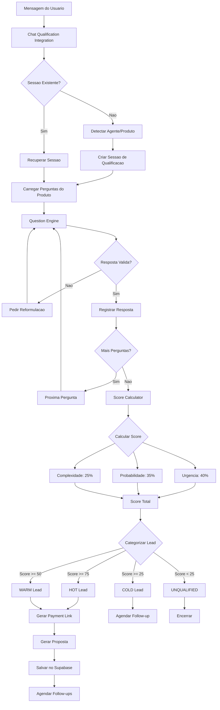

---

## 3. FLUXO DE GERACAO DE DOCUMENTOS (NOVO)

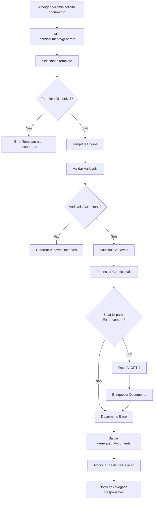

---

## 4. FLUXO DE REVISAO DE DOCUMENTOS (NOVO)

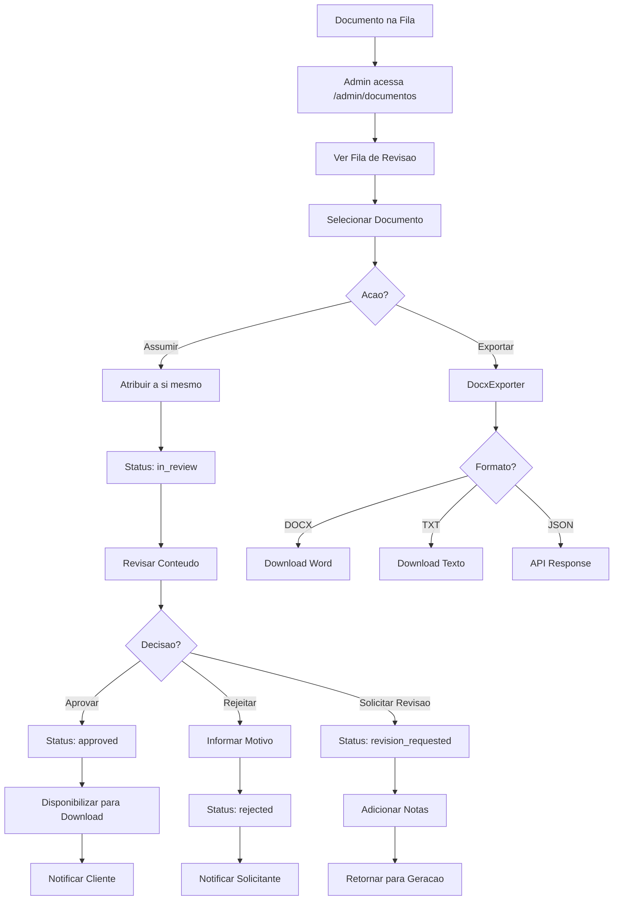

---

## 5. FLUXO DE FOLLOW-UP AUTOMATICO (NOVO)

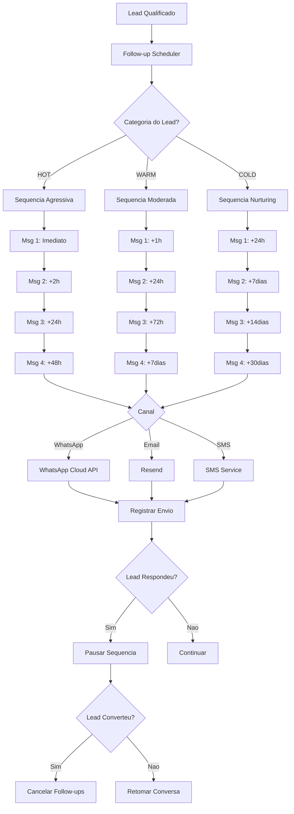

---

## 6. FLUXO DE CLASSIFICACAO DE URGENCIA (NOVO)

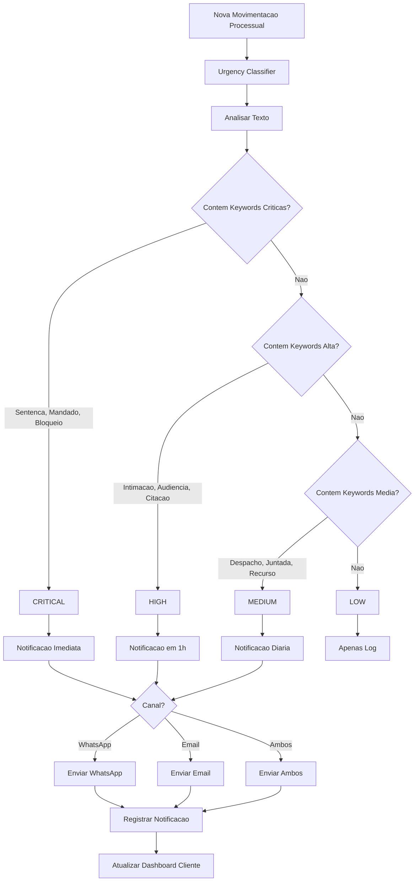

---

## 7. FLUXO DO DASHBOARD EXECUTIVO (NOVO)

```mermaid
flowchart TD
    A[Admin acessa /admin] --> B[Dashboard Executivo]
    B --> C[Carregar Dados]

    C --> D[API /api/admin/leads/stats]
    D --> E{Dados Disponiveis?}

    E -->|Sim| F[Calcular Metricas]
    E -->|Nao| G[Valores Default]

    F --> H[MRR: Soma contratos ativos]
    F --> I[CAC: Marketing / Leads convertidos]
    F --> J[LTV: Ticket medio x Tempo retencao]
    F --> K[Conversao: Convertidos / Total]

    H --> L[Renderizar Cards]
    I --> L
    J --> L
    K --> L

    L --> M[Exibir Leads por Categoria]
    M --> N[Hot / Warm / Cold]

    N --> O[Feed de Atividade]
    O --> P[Ultimas interacoes]

    P --> Q{Acao Rapida?}
    Q -->|Ver Leads| R[/admin/leads]
    Q -->|Ver Documentos| S[/admin/documentos]
    Q -->|Ver Analytics| T[/admin/analytics]
    Q -->|Ver Agenda| U[/admin/agendamentos]
```

---

## 8. FLUXO DE CHECKOUT/PAGAMENTO

```mermaid
flowchart TD
    A[Usuario inicia checkout] --> B[Seleciona Servico]

    B --> C{Servico disponivel}
    C -->|Consultoria Imobiliaria| D[R$ 1.500]
    C -->|Pericia Documental| E[R$ 2.000]
    C -->|Avaliacao Imovel| F[R$ 1.200]
    C -->|Pericia Medica| G[R$ 2.500]
    C -->|Secretaria Remota| H[R$ 800/mes]
    C -->|Consultoria Criminal| I[R$ 1.800]

    D --> J[Formulario de Dados]
    E --> J
    F --> J
    G --> J
    H --> J
    I --> J

    J --> K[Validacao]
    K -->|Erro| L[Mostra erros]
    L --> J

    K -->|OK| M{Metodo de Pagamento}
    M -->|Cartao| N[Stripe Checkout]
    M -->|PIX| O[MercadoPago]

    N --> P[Processamento]
    O --> P

    P -->|Sucesso| Q[/checkout/success]
    P -->|Erro| R[/checkout/cancel]

    Q --> S[Webhook atualiza DB]
    S --> T[Email de confirmacao]
    T --> U[Cria invoice]
```

---

## 9. FLUXO DE AUTENTICACAO

```mermaid
flowchart TD
    A[Usuario] --> B{Autenticado?}

    B -->|Nao| C[/login]
    C --> D[Formulario Login]
    D --> E{Credenciais validas?}

    E -->|Nao| F[Erro: credenciais invalidas]
    F --> D

    E -->|Sim| G[NextAuth Session]
    G --> H{Role do usuario?}

    H -->|Admin| I[/admin]
    H -->|Lawyer| J[/admin acesso parcial]
    H -->|Partner| K[/portal-parceiro]
    H -->|Client| L[/dashboard]

    B -->|Sim| M[Middleware verifica]
    M --> N{Rota permitida?}

    N -->|Sim| O[Acessa pagina]
    N -->|Nao| P[Redirect /unauthorized]
```

---

## 10. FLUXO DO DASHBOARD CLIENTE

```mermaid
flowchart TD
    A[Cliente logado] --> B[/dashboard]

    B --> C{Acao desejada}

    C -->|Ver Processos| D[/dashboard/processos]
    D --> E[Lista de processos]
    E --> F[Clique em processo]
    F --> G[/dashboard/processos/[id]]
    G --> H[Detalhes + Timeline]

    C -->|Ver Documentos| I[/dashboard/documentos]
    I --> J[Lista de documentos]
    J --> K{Acao}
    K -->|Upload| L[Upload arquivo]
    K -->|Download| M[Download PDF]
    K -->|Visualizar| N[Preview inline]

    C -->|Ver Prazos| O[/dashboard/prazos]
    O --> P[Calendario de prazos]
    P --> Q[Filtros por status]

    C -->|Ver Pagamentos| R[/dashboard/pagamentos]
    R --> S[Historico financeiro]
    S --> T[Download comprovantes]

    C -->|Configuracoes| U[/dashboard/configuracoes]
    U --> V[Editar perfil]
    U --> W[Notificacoes]
```

---

## 11. FLUXO DO PORTAL PARCEIRO

```mermaid
flowchart TD
    A[Parceiro logado] --> B[/portal-parceiro]

    B --> C[Dashboard com KPIs]
    C --> D{Acao}

    D -->|Ver Indicacoes| E[/portal-parceiro/indicacoes]
    E --> F[Lista de referrals]
    F --> G[Status de cada indicacao]

    D -->|Ver Comissoes| H[/portal-parceiro/comissoes]
    H --> I[Historico de comissoes]
    I --> J{Status}
    J -->|Pendente| K[Aguardando pagamento]
    J -->|Paga| L[Comissao creditada]

    D -->|Solicitar Saque| M[Formulario de saque]
    M --> N{Validacao OAB/CNPJ}
    N -->|OK| O[Processa saque]
    N -->|Falha| P[Requer verificacao]

    D -->|Material Marketing| Q[Downloads]
    Q --> R[Banners, PDFs, etc]

    D -->|Configuracoes| S[Perfil e dados bancarios]
```

---

## 12. FLUXO DE AGENDAMENTO

```mermaid
flowchart TD
    A[Lead qualificado] --> B{Via}
    B -->|Chatbot| C[Sugere horario]
    B -->|Formulario| D[/contato]
    B -->|Admin| E[/admin/agendamentos]

    C --> F[Seleciona data/hora]
    D --> F
    E --> F

    F --> G[Cria appointment]
    G --> H[Sync Google Calendar]
    H --> I[Email confirmacao]

    I --> J[Lembretes automaticos]
    J -->|24h antes| K[Email]
    J -->|2h antes| L[WhatsApp]

    L --> M{Consulta realizada?}
    M -->|Sim| N[Follow-up pos-consulta]
    M -->|Nao| O[Remarcar]

    N --> P[+3 dias: Como foi?]
    P --> Q[+7 dias: NPS]
    Q --> R[+30 dias: Upsell]
```

---

## 13. FLUXO DE EMAIL SEQUENCE (NURTURING)

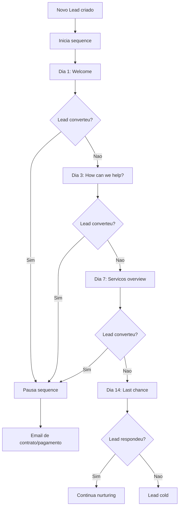

---

## 14. FLUXO DE ASSINATURA DIGITAL (CLICKSIGN)

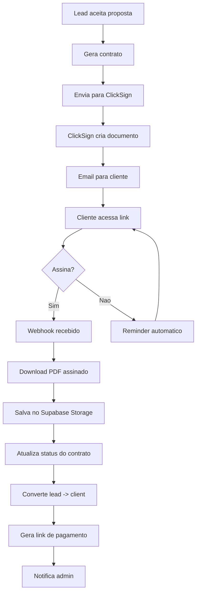

---

## 15. FLUXO DE MONITORAMENTO DE EMAILS (TRIBUNAIS)

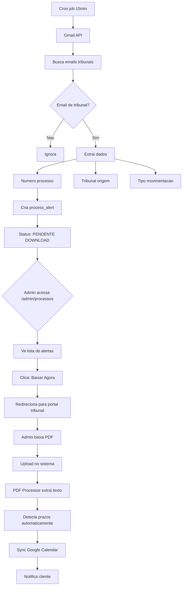

---

## 16. FLUXO DE CRIACAO DE CAMPANHA DE MARKETING (NOVO)

```mermaid
flowchart TD
    A[Admin acessa /admin/marketing] --> B[Lista de Campanhas]
    B --> C[Clicar: Nova Campanha]

    C --> D[Campaign Builder]
    D --> E[Preencher Informacoes Basicas]
    E --> F[Nome, Tipo, Objetivo]

    F --> G{Tipo de Campanha?}
    G -->|Email| H[Email Sequence Builder]
    G -->|WhatsApp| I[WhatsApp Template Builder]
    G -->|Multi-canal| J[Multi-channel Builder]

    H --> K[Adicionar Emails a Sequencia]
    I --> K
    J --> K

    K --> L[Configurar Email]
    L --> M[Subject Line]
    M --> N[Body Content]
    N --> O[Delay/Trigger]

    O --> P{Adicionar A/B Test?}
    P -->|Sim| Q[Criar Variante B]
    Q --> R[Subject Line B]
    R --> S[Body B]
    S --> T[Split % A/B]

    P -->|Nao| U[Selecionar Segmento]
    T --> U

    U --> V[Filtros de Lead]
    V --> W[Tags, Score, Status]

    W --> X{Envio Imediato ou Agendado?}
    X -->|Imediato| Y[Salvar e Enviar]
    X -->|Agendado| Z[Definir Data/Hora]
    Z --> Y

    Y --> AA[Criar campaign no DB]
    AA --> AB[Criar campaign_emails]
    AB --> AC[Criar ab_tests se necessario]
    AC --> AD[Status: draft/scheduled/active]

    AD --> AE{Status?}
    AE -->|Scheduled| AF[Aguardar horario]
    AE -->|Active| AG[Iniciar Envios]

    AG --> AH{A/B Test?}
    AH -->|Sim| AI[Enviar variante A para 50%]
    AI --> AJ[Enviar variante B para 50%]
    AJ --> AK[Aguardar periodo teste]
    AK --> AL[Analisar metricas]
    AL --> AM[Selecionar vencedor]
    AM --> AN[Enviar vencedor para restante]

    AH -->|Nao| AO[Enviar para todos do segmento]
    AN --> AO

    AO --> AP[Registrar campaign_analytics]
    AP --> AQ[Dashboard de Performance]
```

---

## 17. FLUXO DE ANALYTICS DE CAMPANHA (NOVO)

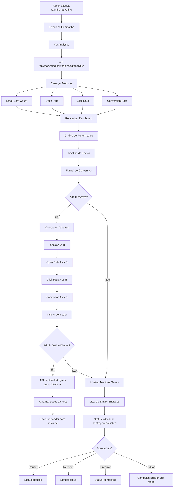

---

## 18. FLUXO DE STRIPE CHECKOUT (SUBSCRIPTION) (NOVO)

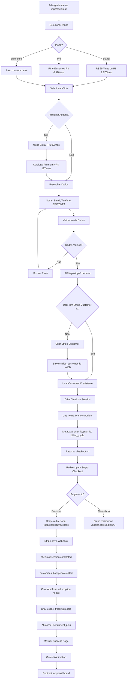

---

## 19. FLUXO DE SUBSCRIPTION MANAGEMENT (NOVO)

```mermaid
flowchart TD
    A[Advogado logado] --> B[/app/dashboard/assinatura]
    B --> C[API /api/subscriptions/current]

    C --> D{Subscription Existe?}
    D -->|Nao| E[Mostrar CTA: Assinar Agora]
    E --> F[Redirect /app/checkout]

    D -->|Sim| G[Carregar Dados]
    G --> H[subscription, usage, limits]

    H --> I[Renderizar Plano Atual]
    I --> J[Nome do Plano]
    J --> K[Preco Mensal/Anual]
    K --> L[Status: active/past_due/canceled]

    L --> M[Periodo de Cobranca]
    M --> N[current_period_start]
    N --> O[current_period_end]

    O --> P[Usage Tracking]
    P --> Q[Produtos: X / limite]
    Q --> R[Leads: X / limite]
    R --> S[Conversas: X / limite]
    S --> T[Emails: X / limite]

    T --> U{Usage >= 90% do Limite?}
    U -->|Sim| V[Mostrar Warning Badge]
    V --> W[Sugerir Upgrade de Plano]

    U -->|Nao| X{Usage >= 70%?}
    X -->|Sim| Y[Mostrar Info Badge]
    X -->|Nao| Z[Progress Bar Normal]

    W --> AA[Secao de Acoes]
    Y --> AA
    Z --> AA

    AA --> AB{Acao do Usuario?}
    AB -->|Gerenciar Metodo| AC[API /api/stripe/portal POST]
    AC --> AD[Criar Billing Portal Session]
    AD --> AE[Redirect para Stripe Portal]
    AE --> AF[Usuario atualiza cartao/endereco]
    AF --> AG[Retorna para /app/dashboard/assinatura]

    AB -->|Cancelar Assinatura| AH[Confirmacao Modal]
    AH --> AI{Confirma?}
    AI -->|Sim| AJ[API /api/subscriptions/cancel POST]
    AJ --> AK[Stripe: cancel_at_period_end = true]
    AK --> AL[Atualizar DB]
    AL --> AM[Mostrar: Cancelado em dd/mm/yyyy]

    AI -->|Nao| AN[Fechar Modal]

    AB -->|Reativar| AO[API /api/subscriptions/cancel DELETE]
    AO --> AP[Stripe: cancel_at_period_end = false]
    AP --> AQ[Atualizar DB]
    AQ --> AR[Status: active novamente]

    AB -->|Ver Faturas| AS[API /api/subscriptions/invoices]
    AS --> AT[Listar Invoices]
    AT --> AU[Tabela: Data, Valor, Status, PDF]
    AU --> AV{Download PDF?}
    AV -->|Sim| AW[invoice.invoice_pdf URL]
    AW --> AX[Abrir PDF Stripe]
```

---

## 20. FLUXO DE STRIPE WEBHOOKS (SUBSCRIPTION LIFECYCLE) (NOVO)

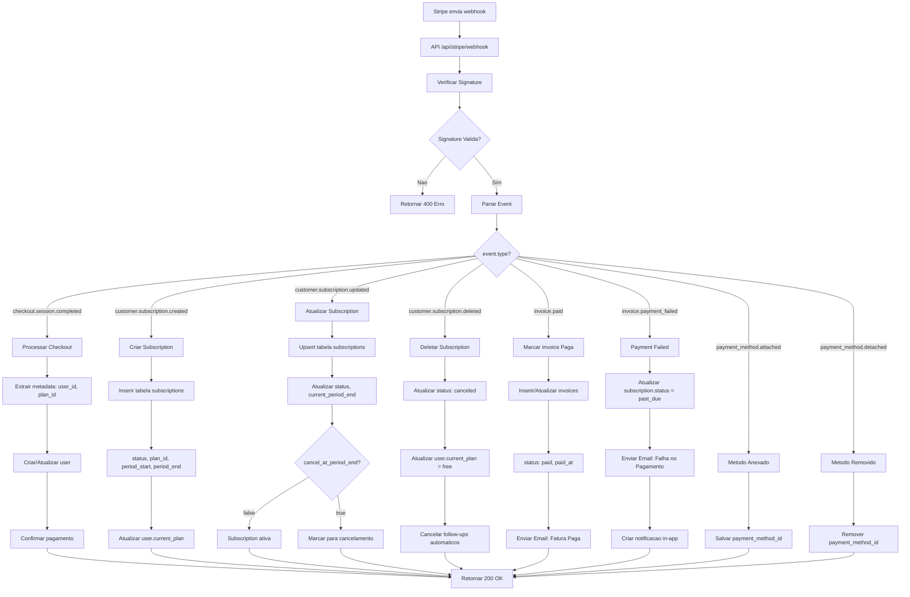

---

## 21. FLUXO DE USAGE TRACKING (SUBSCRIPTION LIMITS) (NOVO)

```mermaid
flowchart TD
    A[Usuario realiza acao] --> B{Tipo de Acao?}

    B -->|Criar Produto| C[API /api/products]
    B -->|Criar Lead| D[API /api/leads]
    B -->|Enviar Email| E[API /api/marketing/send]
    B -->|Nova Conversa| F[API /api/chat]

    C --> G[Verificar Limite]
    D --> G
    E --> G
    F --> G

    G --> H[API /api/subscriptions/current]
    H --> I[Carregar limits do plano]

    I --> J{plan_limits?}
    J -->|Nao encontrado| K[Usar Free Plan Limits]
    J -->|Encontrado| L[Usar limits do plano]

    K --> M[Calcular Usage Atual]
    L --> M

    M --> N[Query usage_tracking]
    N --> O[Filtrar por current_period]
    O --> P[SUM(quantity) GROUP BY metric]

    P --> Q{metric: products}
    Q --> R[usage.products vs limits.max_products]

    R --> S{usage < limit?}
    S -->|Nao| T[Mostrar Modal: Limite Atingido]
    T --> U[CTA: Fazer Upgrade de Plano]
    U --> V[Redirect /app/checkout]

    S -->|Sim| W[Permitir Acao]
    W --> X[Executar Acao: Criar Produto]
    X --> Y[Inserir em products]

    Y --> Z[Registrar Usage]
    Z --> AA[INSERT usage_tracking]
    AA --> AB[user_id, metric: products, quantity: +1]
    AB --> AC[period_start, period_end]

    AC --> AD{usage >= 90% do limite?}
    AD -->|Sim| AE[Enviar Warning Email]
    AE --> AF[Notificacao in-app]
    AF --> AG[Badge vermelho no dashboard]

    AD -->|Nao| AH{usage >= 70%?}
    AH -->|Sim| AI[Badge amarelo]
    AH -->|Nao| AJ[Badge verde]

    AG --> AK[Retornar Sucesso]
    AI --> AK
    AJ --> AK
```

---

## LEGENDA

| Simbolo | Significado |
|---------|-------------|
| Retangulo | Acao/Pagina |
| Losango | Decisao |
| Circulo | Inicio/Fim |
| Seta | Fluxo |

---

## METRICAS DE FLUXO

| Fluxo | Taxa de Conversao Esperada |
|-------|---------------------------|
| Chat -> Lead | 30-40% |
| Lead -> Qualificado | 50-60% |
| Qualificado HOT -> Consulta | 70-80% |
| Qualificado WARM -> Consulta | 40-50% |
| Consulta -> Cliente | 60-70% |
| Checkout iniciado -> Pago | 70-80% |
| Documento gerado -> Aprovado | 90-95% |
| Campanha Enviada -> Email Aberto | 20-30% |
| Email Aberto -> Click | 10-15% |
| Email Click -> Conversao | 5-10% |
| Subscription Checkout -> Pagamento | 65-75% |
| Free Trial -> Assinatura Paga | 40-50% |
| Usage 90% -> Upgrade | 30-40% |

---

## CHANGELOG

| Versao | Data | Mudancas |
|--------|------|----------|
| 3.0 | 2024-12-31 | Adicao de 6 novos fluxos: Marketing Campaigns, Analytics, Stripe Checkout, Subscription Management, Webhooks, Usage Tracking |
| 2.0 | 2024-12-23 | Adicao de fluxos: Qualificacao, Documentos, Follow-up, Urgencia, Dashboard Executivo |
| 1.0 | 2024-11-19 | Versao inicial |
