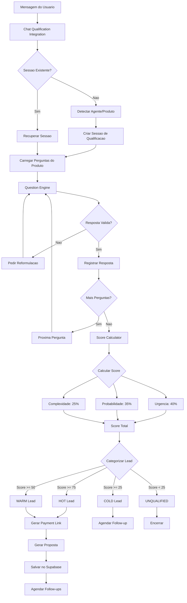
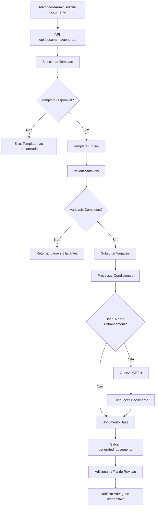
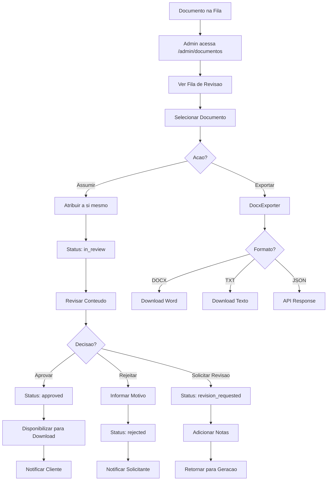
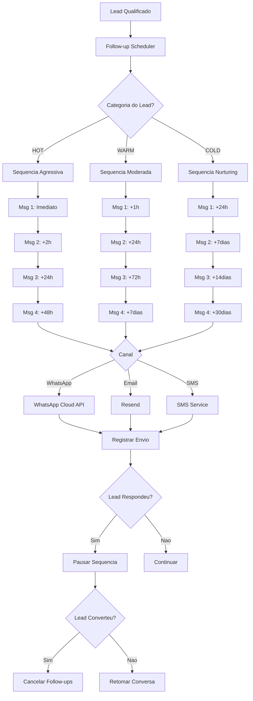
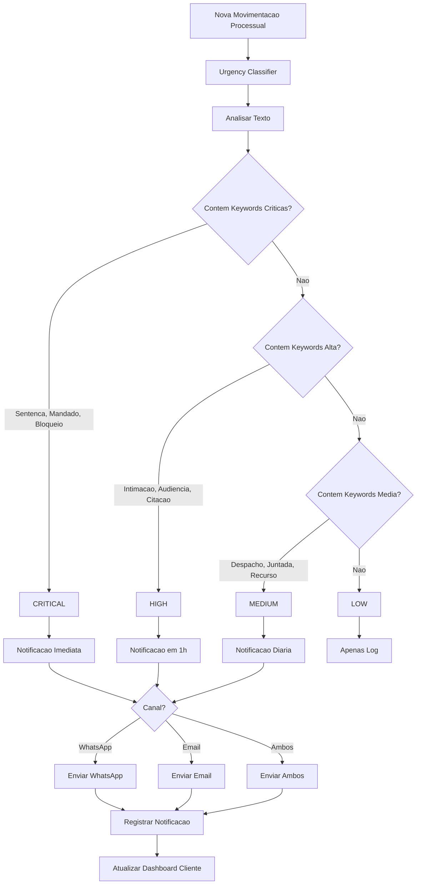
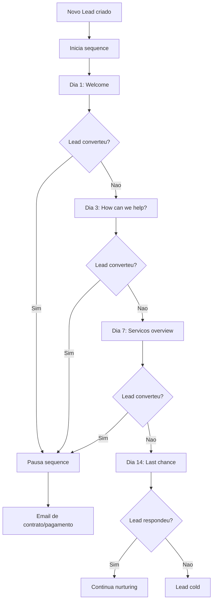
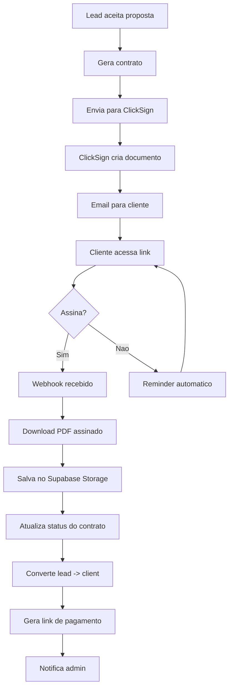
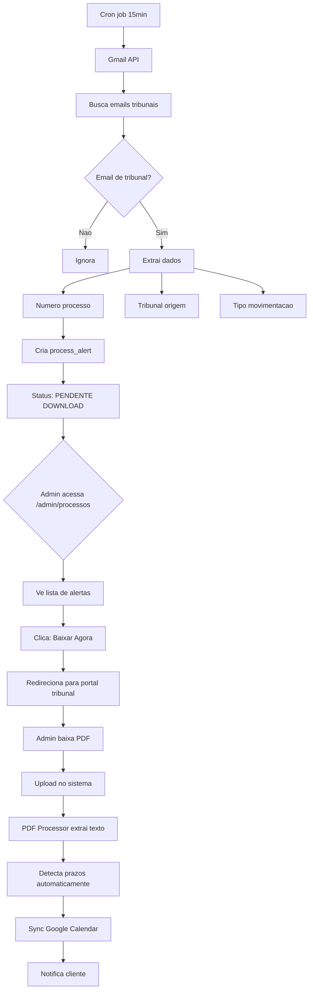

# USER FLOWS - FLUXOS DE USUARIO

Este documento descreve todos os fluxos de usuario da plataforma Garcez Palha.

**Versao**: 2.0
**Data**: 2024-12-23

---

## 1. FLUXO DO CHATBOT (PRINCIPAL)

```mermaid
flowchart TD
    A[Usuario acessa site] --> B{Canal de entrada}
    B -->|Website| C[Widget de Chat]
    B -->|WhatsApp| D[WhatsApp Cloud API]
    B -->|Telegram| E[@garcezpalha_bot]

    C --> F[API /api/chat]
    D --> F
    E --> F

    F --> G{AI Configurada?}
    G -->|Nao| H[Modo Demo]
    H --> I[Respostas Pre-definidas]

    G -->|Sim| J[AgentOrchestrator]
    J --> K{Analisa Keywords}

    K -->|Imovel| L[RealEstateAgent]
    K -->|Assinatura| M[ForensicsAgent]
    K -->|Valor| N[ValuationAgent]
    K -->|Medico| O[MedicalAgent]
    K -->|Criminal| P[CriminalAgent]
    K -->|Outros| Q[GeneralAgent]

    L --> R[OpenRouter GPT-4]
    M --> R
    N --> R
    O --> R
    P --> R
    Q --> R

    R --> S[Resposta + Disclaimer OAB]
    S --> T[Salva no Supabase]
    T --> U[Lead Qualification]
    U --> V[Retorna ao Usuario]
```

---

## 2. FLUXO DE QUALIFICACAO AUTOMATICA (NOVO)



---

## 3. FLUXO DE GERACAO DE DOCUMENTOS (NOVO)



---

## 4. FLUXO DE REVISAO DE DOCUMENTOS (NOVO)



---

## 5. FLUXO DE FOLLOW-UP AUTOMATICO (NOVO)



---

## 6. FLUXO DE CLASSIFICACAO DE URGENCIA (NOVO)



---

## 7. FLUXO DO DASHBOARD EXECUTIVO (NOVO)

```mermaid
flowchart TD
    A[Admin acessa /admin] --> B[Dashboard Executivo]
    B --> C[Carregar Dados]

    C --> D[API /api/admin/leads/stats]
    D --> E{Dados Disponiveis?}

    E -->|Sim| F[Calcular Metricas]
    E -->|Nao| G[Valores Default]

    F --> H[MRR: Soma contratos ativos]
    F --> I[CAC: Marketing / Leads convertidos]
    F --> J[LTV: Ticket medio x Tempo retencao]
    F --> K[Conversao: Convertidos / Total]

    H --> L[Renderizar Cards]
    I --> L
    J --> L
    K --> L

    L --> M[Exibir Leads por Categoria]
    M --> N[Hot / Warm / Cold]

    N --> O[Feed de Atividade]
    O --> P[Ultimas interacoes]

    P --> Q{Acao Rapida?}
    Q -->|Ver Leads| R[/admin/leads]
    Q -->|Ver Documentos| S[/admin/documentos]
    Q -->|Ver Analytics| T[/admin/analytics]
    Q -->|Ver Agenda| U[/admin/agendamentos]
```

---

## 8. FLUXO DE CHECKOUT/PAGAMENTO

```mermaid
flowchart TD
    A[Usuario inicia checkout] --> B[Seleciona Servico]

    B --> C{Servico disponivel}
    C -->|Consultoria Imobiliaria| D[R$ 1.500]
    C -->|Pericia Documental| E[R$ 2.000]
    C -->|Avaliacao Imovel| F[R$ 1.200]
    C -->|Pericia Medica| G[R$ 2.500]
    C -->|Secretaria Remota| H[R$ 800/mes]
    C -->|Consultoria Criminal| I[R$ 1.800]

    D --> J[Formulario de Dados]
    E --> J
    F --> J
    G --> J
    H --> J
    I --> J

    J --> K[Validacao]
    K -->|Erro| L[Mostra erros]
    L --> J

    K -->|OK| M{Metodo de Pagamento}
    M -->|Cartao| N[Stripe Checkout]
    M -->|PIX| O[MercadoPago]

    N --> P[Processamento]
    O --> P

    P -->|Sucesso| Q[/checkout/success]
    P -->|Erro| R[/checkout/cancel]

    Q --> S[Webhook atualiza DB]
    S --> T[Email de confirmacao]
    T --> U[Cria invoice]
```

---

## 9. FLUXO DE AUTENTICACAO

```mermaid
flowchart TD
    A[Usuario] --> B{Autenticado?}

    B -->|Nao| C[/login]
    C --> D[Formulario Login]
    D --> E{Credenciais validas?}

    E -->|Nao| F[Erro: credenciais invalidas]
    F --> D

    E -->|Sim| G[NextAuth Session]
    G --> H{Role do usuario?}

    H -->|Admin| I[/admin]
    H -->|Lawyer| J[/admin acesso parcial]
    H -->|Partner| K[/portal-parceiro]
    H -->|Client| L[/dashboard]

    B -->|Sim| M[Middleware verifica]
    M --> N{Rota permitida?}

    N -->|Sim| O[Acessa pagina]
    N -->|Nao| P[Redirect /unauthorized]
```

---

## 10. FLUXO DO DASHBOARD CLIENTE

```mermaid
flowchart TD
    A[Cliente logado] --> B[/dashboard]

    B --> C{Acao desejada}

    C -->|Ver Processos| D[/dashboard/processos]
    D --> E[Lista de processos]
    E --> F[Clique em processo]
    F --> G[/dashboard/processos/[id]]
    G --> H[Detalhes + Timeline]

    C -->|Ver Documentos| I[/dashboard/documentos]
    I --> J[Lista de documentos]
    J --> K{Acao}
    K -->|Upload| L[Upload arquivo]
    K -->|Download| M[Download PDF]
    K -->|Visualizar| N[Preview inline]

    C -->|Ver Prazos| O[/dashboard/prazos]
    O --> P[Calendario de prazos]
    P --> Q[Filtros por status]

    C -->|Ver Pagamentos| R[/dashboard/pagamentos]
    R --> S[Historico financeiro]
    S --> T[Download comprovantes]

    C -->|Configuracoes| U[/dashboard/configuracoes]
    U --> V[Editar perfil]
    U --> W[Notificacoes]
```

---

## 11. FLUXO DO PORTAL PARCEIRO

```mermaid
flowchart TD
    A[Parceiro logado] --> B[/portal-parceiro]

    B --> C[Dashboard com KPIs]
    C --> D{Acao}

    D -->|Ver Indicacoes| E[/portal-parceiro/indicacoes]
    E --> F[Lista de referrals]
    F --> G[Status de cada indicacao]

    D -->|Ver Comissoes| H[/portal-parceiro/comissoes]
    H --> I[Historico de comissoes]
    I --> J{Status}
    J -->|Pendente| K[Aguardando pagamento]
    J -->|Paga| L[Comissao creditada]

    D -->|Solicitar Saque| M[Formulario de saque]
    M --> N{Validacao OAB/CNPJ}
    N -->|OK| O[Processa saque]
    N -->|Falha| P[Requer verificacao]

    D -->|Material Marketing| Q[Downloads]
    Q --> R[Banners, PDFs, etc]

    D -->|Configuracoes| S[Perfil e dados bancarios]
```

---

## 12. FLUXO DE AGENDAMENTO

```mermaid
flowchart TD
    A[Lead qualificado] --> B{Via}
    B -->|Chatbot| C[Sugere horario]
    B -->|Formulario| D[/contato]
    B -->|Admin| E[/admin/agendamentos]

    C --> F[Seleciona data/hora]
    D --> F
    E --> F

    F --> G[Cria appointment]
    G --> H[Sync Google Calendar]
    H --> I[Email confirmacao]

    I --> J[Lembretes automaticos]
    J -->|24h antes| K[Email]
    J -->|2h antes| L[WhatsApp]

    L --> M{Consulta realizada?}
    M -->|Sim| N[Follow-up pos-consulta]
    M -->|Nao| O[Remarcar]

    N --> P[+3 dias: Como foi?]
    P --> Q[+7 dias: NPS]
    Q --> R[+30 dias: Upsell]
```

---

## 13. FLUXO DE EMAIL SEQUENCE (NURTURING)



---

## 14. FLUXO DE ASSINATURA DIGITAL (CLICKSIGN)



---

## 15. FLUXO DE MONITORAMENTO DE EMAILS (TRIBUNAIS)



---

## LEGENDA

| Simbolo | Significado |
|---------|-------------|
| Retangulo | Acao/Pagina |
| Losango | Decisao |
| Circulo | Inicio/Fim |
| Seta | Fluxo |

---

## METRICAS DE FLUXO

| Fluxo | Taxa de Conversao Esperada |
|-------|---------------------------|
| Chat -> Lead | 30-40% |
| Lead -> Qualificado | 50-60% |
| Qualificado HOT -> Consulta | 70-80% |
| Qualificado WARM -> Consulta | 40-50% |
| Consulta -> Cliente | 60-70% |
| Checkout iniciado -> Pago | 70-80% |
| Documento gerado -> Aprovado | 90-95% |

---

## CHANGELOG

| Versao | Data | Mudancas |
|--------|------|----------|
| 2.0 | 2024-12-23 | Adicao de fluxos: Qualificacao, Documentos, Follow-up, Urgencia, Dashboard Executivo |
| 1.0 | 2024-11-19 | Versao inicial |
