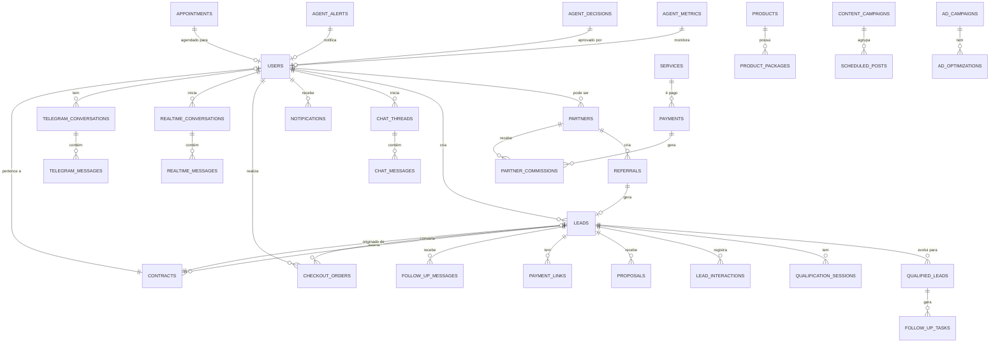

# Database Schema - Garcez Palha

## Visão Geral

O sistema Garcez Palha utiliza **Supabase (PostgreSQL)** como banco de dados principal. O schema foi projetado para suportar um escritório de advocacia completamente automatizado com IA, abrangendo desde a captação de leads até a gestão de clientes e processos.

**Estatísticas do Banco:**
- **Total de tabelas:** 38 tabelas principais
- **Extensões:** uuid-ossp, pgcrypto, pg_trgm
- **RLS (Row Level Security):** Habilitado em todas as tabelas
- **Triggers:** Automatização de timestamps, conversão de leads, criação de tarefas

**Principais Módulos:**
1. **Gestão de Usuários e Autenticação** (users, partners, profiles)
2. **Captação e Qualificação de Leads** (leads, qualified_leads, qualification_sessions)
3. **Comunicação** (chat_threads, chat_messages, telegram_conversations, realtime_conversations)
4. **Vendas e Pagamentos** (checkout_orders, payments, payment_links, proposals)
5. **Contratos e Documentos** (contracts, documents, generated_documents)
6. **Produtos e Serviços** (products, product_packages, services)
7. **Marketing e Conteúdo** (scheduled_posts, content_campaigns, ad_campaigns, seo_*)
8. **Monitoramento de Agentes IA** (agent_metrics, agent_decisions, agent_alerts)
9. **Processos Jurídicos** (legal_cases, process_alerts, process_documents)
10. **Follow-up e Automação** (follow_up_tasks, follow_up_messages, appointments)

---

## Diagrama ER (Entity Relationship)



---

## Tabelas Detalhadas

### 1. users
**Descrição:** Tabela central de usuários do sistema (clientes, parceiros e administradores).

**Colunas:**
| Nome | Tipo | Nullable | Default | Descrição |
|------|------|----------|---------|-----------|
| id | UUID | NO | uuid_generate_v4() | Primary key |
| email | TEXT | NO | - | Email único do usuário |
| name | TEXT | NO | - | Nome completo |
| password_hash | TEXT | YES | - | Hash da senha |
| role | TEXT | NO | 'client' | client, partner ou admin |
| phone | TEXT | YES | - | Telefone de contato |
| document | TEXT | YES | - | CPF ou CNPJ |
| avatar_url | TEXT | YES | - | URL do avatar |
| email_verified | BOOLEAN | NO | FALSE | Email verificado |
| is_active | BOOLEAN | NO | TRUE | Conta ativa |
| last_login | TIMESTAMPTZ | YES | - | Último login |
| created_at | TIMESTAMPTZ | NO | NOW() | Data de criação |
| updated_at | TIMESTAMPTZ | NO | NOW() | Última atualização |

**Índices:**
- `idx_users_email` em (email)
- `idx_users_role` em (role)

**Relacionamentos:**
- 1:N com partners
- 1:N com leads (assigned_to)
- 1:N com chat_threads
- 1:N com notifications

---

### 2. partners
**Descrição:** Dados de parceiros que indicam clientes ao escritório.

**Colunas:**
| Nome | Tipo | Nullable | Default | Descrição |
|------|------|----------|---------|-----------|
| id | UUID | NO | uuid_generate_v4() | Primary key |
| user_id | UUID | NO | - | FK para users |
| company_name | TEXT | YES | - | Razão social |
| trading_name | TEXT | YES | - | Nome fantasia |
| cnpj | TEXT | YES | - | CNPJ da empresa |
| address | TEXT | YES | - | Endereço completo |
| city | TEXT | YES | - | Cidade |
| state | TEXT | YES | - | Estado (UF) |
| zip_code | TEXT | YES | - | CEP |
| bio | TEXT | YES | - | Biografia do parceiro |
| pix_key | TEXT | YES | - | Chave PIX para pagamento |
| pix_key_type | TEXT | YES | - | cpf, cnpj, email, phone, random |
| bank_name | TEXT | YES | - | Nome do banco |
| account_type | TEXT | YES | - | Tipo de conta |
| commission_rate | DECIMAL(5,2) | NO | 10.00 | Taxa de comissão (%) |
| total_referrals | INTEGER | NO | 0 | Total de indicações |
| total_converted | INTEGER | NO | 0 | Total de conversões |
| total_earnings | DECIMAL(10,2) | NO | 0.00 | Total ganho |
| pending_earnings | DECIMAL(10,2) | NO | 0.00 | Ganhos pendentes |
| contract_signed_at | TIMESTAMPTZ | YES | - | Data assinatura contrato |
| is_verified | BOOLEAN | NO | FALSE | Parceiro verificado |
| created_at | TIMESTAMPTZ | NO | NOW() | Data de criação |
| updated_at | TIMESTAMPTZ | NO | NOW() | Última atualização |

**Índices:**
- `idx_partners_user` em (user_id)

**Relacionamentos:**
- N:1 com users
- 1:N com referrals
- 1:N com partner_commissions

---

### 3. leads
**Descrição:** Leads capturados através de formulários, chatbot, WhatsApp e outros canais.

**Colunas:**
| Nome | Tipo | Nullable | Default | Descrição |
|------|------|----------|---------|-----------|
| id | UUID | NO | uuid_generate_v4() | Primary key |
| name | TEXT | NO | - | Nome do lead |
| email | TEXT | NO | - | Email do lead |
| phone | TEXT | NO | - | Telefone do lead |
| message | TEXT | YES | - | Mensagem inicial |
| service_type | TEXT | YES | - | Tipo de serviço interesse |
| source | TEXT | NO | 'website' | website, whatsapp, chatbot, referral, social, other |
| status | TEXT | NO | 'new' | new, contacted, qualified, proposal, converted, lost |
| priority | TEXT | NO | 'medium' | low, medium, high, urgent |
| assigned_to | UUID | YES | - | FK para users (advogado responsável) |
| partner_id | UUID | YES | - | FK para partners (se indicação) |
| utm_source | TEXT | YES | - | Origem do tráfego |
| utm_medium | TEXT | YES | - | Meio do tráfego |
| utm_campaign | TEXT | YES | - | Campanha |
| ip_address | TEXT | YES | - | IP do lead |
| user_agent | TEXT | YES | - | User agent do browser |
| notes | TEXT | YES | - | Notas internas |
| contacted_at | TIMESTAMPTZ | YES | - | Data do primeiro contato |
| converted_at | TIMESTAMPTZ | YES | - | Data de conversão |
| lost_reason | TEXT | YES | - | Motivo da perda |
| created_at | TIMESTAMPTZ | NO | NOW() | Data de criação |
| updated_at | TIMESTAMPTZ | NO | NOW() | Última atualização |

**Índices:**
- `idx_leads_email` em (email)
- `idx_leads_status` em (status)
- `idx_leads_source` em (source)
- `idx_leads_partner` em (partner_id)
- `idx_leads_created` em (created_at DESC)

**Relacionamentos:**
- N:1 com users (assigned_to)
- N:1 com partners
- 1:N com contracts
- 1:N com proposals
- 1:N com payment_links

---

### 4. qualified_leads
**Descrição:** Leads que passaram pelo sistema de qualificação automática com score.

**Colunas:**
| Nome | Tipo | Nullable | Default | Descrição |
|------|------|----------|---------|-----------|
| id | UUID | NO | uuid_generate_v4() | Primary key |
| client_name | TEXT | YES | - | Nome do cliente |
| phone | TEXT | NO | - | Telefone |
| email | TEXT | YES | - | Email |
| product_id | TEXT | NO | - | ID do produto/serviço |
| product_name | TEXT | NO | - | Nome do produto |
| score_total | INTEGER | NO | - | Score total (0-100) |
| score_urgency | INTEGER | NO | - | Score urgência (0-100) |
| score_probability | INTEGER | NO | - | Score probabilidade (0-100) |
| score_complexity | INTEGER | NO | - | Score complexidade (0-100) |
| category | TEXT | NO | - | hot, warm, cold, very-cold |
| answers | JSONB | NO | '[]' | Array de respostas da qualificação |
| reasoning | JSONB | YES | '[]' | Array de raciocínio do score |
| source | TEXT | NO | - | whatsapp, website, phone, email |
| session_id | TEXT | NO | - | ID da sessão |
| status | TEXT | NO | 'new' | new, contacted, in-progress, converted, lost |
| assigned_to | UUID | YES | - | FK para auth.users |
| contacted_at | TIMESTAMPTZ | YES | - | Data do contato |
| last_interaction_at | TIMESTAMPTZ | YES | - | Última interação |
| next_follow_up_at | TIMESTAMPTZ | YES | - | Próximo follow-up |
| metadata | JSONB | NO | '{}' | Metadados extras |
| created_at | TIMESTAMPTZ | NO | NOW() | Data de criação |
| updated_at | TIMESTAMPTZ | NO | NOW() | Última atualização |

**Índices:**
- `idx_qualified_leads_phone` em (phone)
- `idx_qualified_leads_product` em (product_id)
- `idx_qualified_leads_category` em (category)
- `idx_qualified_leads_status` em (status)
- `idx_qualified_leads_source` em (source)
- `idx_qualified_leads_created` em (created_at DESC)
- `idx_qualified_leads_session` em (session_id)

**Relacionamentos:**
- 1:N com follow_up_tasks
- N:1 com auth.users (assigned_to)

---

### 5. qualification_sessions
**Descrição:** Sessões de qualificação em andamento (state machine para o chatbot).

**Colunas:**
| Nome | Tipo | Nullable | Default | Descrição |
|------|------|----------|---------|-----------|
| id | UUID | NO | gen_random_uuid() | Primary key |
| session_id | TEXT | NO | - | ID único da sessão (unique) |
| lead_id | UUID | YES | - | FK para leads |
| product_id | TEXT | NO | - | ID do produto |
| product_name | TEXT | NO | - | Nome do produto |
| agent_role | TEXT | NO | - | Agente IA responsável |
| status | TEXT | NO | 'in_progress' | in_progress, completed, abandoned |
| questions | JSONB | NO | '[]' | Array de perguntas |
| answers | JSONB | NO | '[]' | Array de respostas |
| current_question_index | INTEGER | NO | 0 | Índice da pergunta atual |
| context | JSONB | NO | '{}' | Contexto da conversa |
| client_info | JSONB | NO | '{}' | Informações do cliente |
| source | TEXT | NO | 'website' | Origem da sessão |
| user_id | UUID | YES | - | FK para auth.users |
| created_at | TIMESTAMPTZ | NO | NOW() | Data de criação |
| updated_at | TIMESTAMPTZ | NO | NOW() | Última atualização |
| completed_at | TIMESTAMPTZ | YES | - | Data de conclusão |
| expires_at | TIMESTAMPTZ | YES | - | Data de expiração |
| metadata | JSONB | NO | '{}' | Metadados extras |

**Índices:**
- `idx_qualification_sessions_session_id` em (session_id)
- `idx_qualification_sessions_lead_id` em (lead_id)
- `idx_qualification_sessions_status` em (status)
- `idx_qualification_sessions_created_at` em (created_at DESC)
- `idx_qualification_sessions_expires_at` em (expires_at)

**Relacionamentos:**
- N:1 com leads

---

### 6. chat_threads
**Descrição:** Threads de conversação com o assistente de IA (OpenAI).

**Colunas:**
| Nome | Tipo | Nullable | Default | Descrição |
|------|------|----------|---------|-----------|
| id | UUID | NO | uuid_generate_v4() | Primary key |
| user_id | UUID | YES | - | FK para users |
| lead_id | UUID | YES | - | FK para leads |
| session_id | TEXT | NO | - | ID da sessão |
| openai_thread_id | TEXT | YES | - | ID do thread OpenAI |
| status | TEXT | NO | 'active' | active, closed, archived |
| metadata | JSONB | NO | '{}' | Metadados extras |
| created_at | TIMESTAMPTZ | NO | NOW() | Data de criação |
| updated_at | TIMESTAMPTZ | NO | NOW() | Última atualização |

**Índices:**
- `idx_chat_threads_session` em (session_id)
- `idx_chat_threads_user` em (user_id)

**Relacionamentos:**
- N:1 com users
- N:1 com leads
- 1:N com chat_messages

---

### 7. chat_messages
**Descrição:** Mensagens individuais dentro dos threads de chat.

**Colunas:**
| Nome | Tipo | Nullable | Default | Descrição |
|------|------|----------|---------|-----------|
| id | UUID | NO | gen_random_uuid() | Primary key |
| thread_id | TEXT | YES | - | ID do thread (ou conversation_id) |
| session_id | UUID | YES | - | ID da sessão |
| lead_id | UUID | YES | - | FK para leads |
| user_id | UUID | YES | - | FK para auth.users |
| role | TEXT | NO | - | user, assistant, system |
| content | TEXT | NO | - | Conteúdo da mensagem |
| agent_used | TEXT | YES | - | Agente IA utilizado |
| agent_confidence | DECIMAL(3,2) | YES | - | Confiança do agente |
| metadata | JSONB | NO | '{}' | Metadados extras |
| created_at | TIMESTAMPTZ | NO | NOW() | Data de criação |

**Índices:**
- `idx_chat_messages_thread_id` em (thread_id)
- `idx_chat_messages_session_id` em (session_id)
- `idx_chat_messages_lead_id` em (lead_id)
- `idx_chat_messages_user_id` em (user_id)
- `idx_chat_messages_created_at` em (created_at DESC)
- `idx_chat_messages_role` em (role)

**Relacionamentos:**
- N:1 com leads
- N:1 com auth.users

---

### 8. telegram_conversations
**Descrição:** Conversas via Telegram bot com leads e clientes.

**Colunas:**
| Nome | Tipo | Nullable | Default | Descrição |
|------|------|----------|---------|-----------|
| id | UUID | NO | uuid_generate_v4() | Primary key |
| chat_id | BIGINT | NO | - | Telegram chat ID (unique) |
| user_id | UUID | YES | - | FK para users |
| lead_id | UUID | YES | - | FK para leads |
| telegram_user_id | BIGINT | NO | - | ID do usuário no Telegram |
| first_name | TEXT | NO | - | Nome do usuário |
| last_name | TEXT | YES | - | Sobrenome |
| username | TEXT | YES | - | Username do Telegram |
| platform | TEXT | NO | 'telegram' | telegram, whatsapp, web |
| status | TEXT | NO | 'active' | active, qualified, converted, closed |
| language_code | TEXT | NO | 'pt' | Idioma do usuário |
| is_qualified | BOOLEAN | NO | FALSE | Lead qualificado |
| qualification_score | INTEGER | NO | 0 | Score 0-100 |
| qualification_reason | TEXT | YES | - | Motivo da qualificação |
| qualified_at | TIMESTAMPTZ | YES | - | Data de qualificação |
| assigned_to | UUID | YES | - | FK para users (admin) |
| handoff_at | TIMESTAMPTZ | YES | - | Data do handoff |
| handoff_reason | TEXT | YES | - | Motivo do handoff |
| is_bot_active | BOOLEAN | NO | TRUE | Bot ativo (false = admin) |
| last_message_at | TIMESTAMPTZ | NO | NOW() | Última mensagem |
| created_at | TIMESTAMPTZ | NO | NOW() | Data de criação |
| updated_at | TIMESTAMPTZ | NO | NOW() | Última atualização |

**Índices:**
- `idx_telegram_conversations_chat_id` em (chat_id)
- `idx_telegram_conversations_user_id` em (user_id)
- `idx_telegram_conversations_lead_id` em (lead_id)
- `idx_telegram_conversations_status` em (status)
- `idx_telegram_conversations_assigned` em (assigned_to)
- `idx_telegram_conversations_last_message` em (last_message_at DESC)

**Relacionamentos:**
- N:1 com users
- N:1 com leads
- 1:N com telegram_messages

---

### 9. telegram_messages
**Descrição:** Mensagens individuais do Telegram.

**Colunas:**
| Nome | Tipo | Nullable | Default | Descrição |
|------|------|----------|---------|-----------|
| id | UUID | NO | uuid_generate_v4() | Primary key |
| conversation_id | UUID | NO | - | FK para telegram_conversations |
| telegram_message_id | BIGINT | NO | - | ID da mensagem no Telegram |
| chat_id | BIGINT | NO | - | Chat ID do Telegram |
| direction | TEXT | NO | - | incoming, outgoing |
| message_type | TEXT | NO | 'text' | text, photo, video, document, location, contact, voice, sticker |
| text | TEXT | YES | - | Texto da mensagem |
| media_url | TEXT | YES | - | URL do arquivo |
| media_type | TEXT | YES | - | Tipo do arquivo |
| from_user_id | BIGINT | NO | - | ID do remetente |
| from_first_name | TEXT | YES | - | Nome do remetente |
| from_username | TEXT | YES | - | Username do remetente |
| is_bot | BOOLEAN | NO | FALSE | Mensagem de bot |
| ai_processed | BOOLEAN | NO | FALSE | Processado pela IA |
| ai_response | TEXT | YES | - | Resposta da IA |
| ai_intent | TEXT | YES | - | Intenção detectada |
| ai_entities | JSONB | YES | - | Entidades extraídas |
| ai_sentiment | TEXT | YES | - | positive, neutral, negative |
| reply_to_message_id | BIGINT | YES | - | ID da mensagem respondida |
| forwarded_from | BIGINT | YES | - | Mensagem encaminhada de |
| edit_date | TIMESTAMPTZ | YES | - | Data de edição |
| telegram_date | TIMESTAMPTZ | NO | - | Data da mensagem no Telegram |
| created_at | TIMESTAMPTZ | NO | NOW() | Data de criação |

**Índices:**
- `idx_telegram_messages_conversation` em (conversation_id)
- `idx_telegram_messages_chat_id` em (chat_id)
- `idx_telegram_messages_direction` em (direction)
- `idx_telegram_messages_telegram_date` em (telegram_date DESC)
- `idx_telegram_messages_ai_intent` em (ai_intent)

**Relacionamentos:**
- N:1 com telegram_conversations

---

### 10. realtime_conversations
**Descrição:** Sessões de conversas em tempo real (voice chat com IA).

**Colunas:**
| Nome | Tipo | Nullable | Default | Descrição |
|------|------|----------|---------|-----------|
| id | UUID | NO | gen_random_uuid() | Primary key |
| user_id | UUID | YES | - | FK para auth.users |
| product_id | TEXT | NO | - | ID do produto |
| session_id | TEXT | NO | - | ID único da sessão (unique) |
| mode | TEXT | NO | - | audio, avatar |
| started_at | TIMESTAMPTZ | NO | NOW() | Início da conversa |
| ended_at | TIMESTAMPTZ | YES | - | Fim da conversa |
| total_messages | INTEGER | NO | 0 | Total de mensagens |
| user_messages | INTEGER | NO | 0 | Mensagens do usuário |
| assistant_messages | INTEGER | NO | 0 | Mensagens do assistente |
| duration_seconds | INTEGER | YES | - | Duração em segundos |
| status | TEXT | NO | 'active' | active, completed, abandoned, error |
| converted_to_checkout | BOOLEAN | NO | FALSE | Converteu para checkout |
| metadata | JSONB | NO | '{}' | Metadados extras |
| created_at | TIMESTAMPTZ | NO | NOW() | Data de criação |
| updated_at | TIMESTAMPTZ | NO | NOW() | Última atualização |

**Índices:**
- `idx_realtime_conversations_user_id` em (user_id)
- `idx_realtime_conversations_session_id` em (session_id)
- `idx_realtime_conversations_status` em (status)
- `idx_realtime_conversations_started_at` em (started_at DESC)

**Relacionamentos:**
- N:1 com auth.users
- 1:N com realtime_messages

---

### 11. realtime_messages
**Descrição:** Mensagens individuais das conversas em tempo real.

**Colunas:**
| Nome | Tipo | Nullable | Default | Descrição |
|------|------|----------|---------|-----------|
| id | UUID | NO | gen_random_uuid() | Primary key |
| conversation_id | UUID | NO | - | FK para realtime_conversations |
| role | TEXT | NO | - | user, assistant, system |
| content | TEXT | NO | - | Conteúdo da mensagem |
| audio_duration_ms | INTEGER | YES | - | Duração do áudio (ms) |
| transcript_confidence | DECIMAL(3,2) | YES | - | Confiança da transcrição |
| timestamp | TIMESTAMPTZ | NO | NOW() | Timestamp da mensagem |
| metadata | JSONB | NO | '{}' | Metadados extras |
| created_at | TIMESTAMPTZ | NO | NOW() | Data de criação |

**Índices:**
- `idx_realtime_messages_conversation_id` em (conversation_id)
- `idx_realtime_messages_timestamp` em (timestamp DESC)

**Relacionamentos:**
- N:1 com realtime_conversations

---

### 12. services
**Descrição:** Catálogo de serviços jurídicos oferecidos (compatível com OAB).

**Colunas:**
| Nome | Tipo | Nullable | Default | Descrição |
|------|------|----------|---------|-----------|
| id | UUID | NO | uuid_generate_v4() | Primary key |
| name | TEXT | NO | - | Nome do serviço |
| slug | TEXT | NO | - | Slug único para URL |
| description | TEXT | YES | - | Descrição completa |
| short_description | TEXT | YES | - | Descrição curta |
| icon | TEXT | YES | - | Ícone do serviço |
| reference_value | DECIMAL(10,2) | YES | - | Valor de referência (não fixo) |
| price_type | TEXT | NO | 'reference' | reference, hourly, consultation, variable |
| pricing_disclaimer | TEXT | NO | '...' | Disclaimer OAB sobre preços |
| category | TEXT | NO | - | Categoria do serviço |
| features | JSONB | NO | '[]' | Features do serviço |
| is_active | BOOLEAN | NO | TRUE | Serviço ativo |
| sort_order | INTEGER | NO | 0 | Ordem de exibição |
| created_at | TIMESTAMPTZ | NO | NOW() | Data de criação |
| updated_at | TIMESTAMPTZ | NO | NOW() | Última atualização |

**Índices:**
- `idx_services_category` em (category)
- `idx_services_active` em (is_active)

**Relacionamentos:**
- 1:N com payments

---

### 13. products
**Descrição:** Sistema de produtos jurídicos (novo sistema de catálogo).

**Colunas:**
| Nome | Tipo | Nullable | Default | Descrição |
|------|------|----------|---------|-----------|
| id | TEXT | NO | - | Primary key (custom ID) |
| name | TEXT | NO | - | Nome do produto |
| slug | TEXT | NO | - | Slug único (unique) |
| category | TEXT | NO | - | Categoria do produto |
| description | TEXT | YES | - | Descrição completa |
| hero_title | TEXT | YES | - | Título hero da landing |
| hero_subtitle | TEXT | YES | - | Subtítulo hero |
| hero_problem | TEXT | YES | - | Problema que resolve |
| base_price | INTEGER | NO | 0 | Preço base (centavos) |
| features | JSONB | NO | '[]' | Features do produto |
| benefits | JSONB | NO | '[]' | Benefícios |
| documents_required | JSONB | NO | '[]' | Documentos necessários |
| faq_items | JSONB | NO | '[]' | FAQ do produto |
| metadata | JSONB | NO | '{}' | Metadados extras |
| is_active | BOOLEAN | NO | TRUE | Produto ativo |
| created_at | TIMESTAMPTZ | NO | NOW() | Data de criação |
| updated_at | TIMESTAMPTZ | NO | NOW() | Última atualização |

**Índices:**
- `idx_products_category` em (category)
- `idx_products_slug` em (slug)
- `idx_products_active` em (is_active)

**Relacionamentos:**
- 1:N com product_packages

---

### 14. product_packages
**Descrição:** Pacotes/planos de cada produto (Bronze, Prata, Ouro).

**Colunas:**
| Nome | Tipo | Nullable | Default | Descrição |
|------|------|----------|---------|-----------|
| id | UUID | NO | gen_random_uuid() | Primary key |
| product_id | TEXT | NO | - | FK para products |
| name | TEXT | NO | - | Nome do pacote |
| description | TEXT | YES | - | Descrição do pacote |
| price | INTEGER | NO | - | Preço (centavos) |
| features | JSONB | NO | '[]' | Features incluídas |
| is_recommended | BOOLEAN | NO | FALSE | Pacote recomendado |
| order_index | INTEGER | NO | 0 | Ordem de exibição |
| is_active | BOOLEAN | NO | TRUE | Pacote ativo |
| created_at | TIMESTAMPTZ | NO | NOW() | Data de criação |
| updated_at | TIMESTAMPTZ | NO | NOW() | Última atualização |

**Índices:**
- `idx_packages_product` em (product_id)

**Relacionamentos:**
- N:1 com products

---

### 15. checkout_orders
**Descrição:** Pedidos de checkout (Stripe, MercadoPago, PIX).

**Colunas:**
| Nome | Tipo | Nullable | Default | Descrição |
|------|------|----------|---------|-----------|
| id | UUID | NO | gen_random_uuid() | Primary key |
| user_id | UUID | YES | - | FK para auth.users |
| lead_id | UUID | YES | - | FK para leads |
| service_id | TEXT | NO | - | ID do serviço |
| service_name | TEXT | NO | - | Nome do serviço |
| service_description | TEXT | YES | - | Descrição |
| amount | BIGINT | NO | - | Valor (centavos) |
| original_amount | BIGINT | NO | - | Valor original |
| discount_amount | BIGINT | NO | 0 | Desconto (centavos) |
| discount_percentage | INTEGER | NO | 0 | Desconto (%) |
| status | TEXT | NO | 'pending' | pending, processing, paid, failed, cancelled, refunded |
| payment_provider | TEXT | YES | - | stripe, mercadopago, pix |
| payment_id | TEXT | YES | - | ID no provider |
| payment_method | TEXT | YES | - | card, pix, boleto |
| payment_details | JSONB | NO | '{}' | Detalhes do pagamento |
| customer_name | TEXT | NO | - | Nome do cliente |
| customer_email | TEXT | NO | - | Email do cliente |
| customer_phone | TEXT | YES | - | Telefone do cliente |
| customer_cpf | TEXT | YES | - | CPF do cliente |
| metadata | JSONB | NO | '{}' | Metadados extras |
| notes | TEXT | YES | - | Notas internas |
| created_at | TIMESTAMPTZ | NO | NOW() | Data de criação |
| updated_at | TIMESTAMPTZ | NO | NOW() | Última atualização |
| paid_at | TIMESTAMPTZ | YES | - | Data do pagamento |
| cancelled_at | TIMESTAMPTZ | YES | - | Data do cancelamento |
| refunded_at | TIMESTAMPTZ | YES | - | Data do reembolso |
| stripe_session_id | TEXT | YES | - | Stripe session ID |
| stripe_payment_intent_id | TEXT | YES | - | Stripe payment intent |
| mercadopago_preference_id | TEXT | YES | - | MercadoPago preference |
| mercadopago_payment_id | TEXT | YES | - | MercadoPago payment |
| pix_qr_code | TEXT | YES | - | Código PIX |
| pix_qr_code_base64 | TEXT | YES | - | QR Code em base64 |
| pix_expires_at | TIMESTAMPTZ | YES | - | Expiração do PIX |

**Índices:**
- `idx_checkout_orders_user_id` em (user_id)
- `idx_checkout_orders_lead_id` em (lead_id)
- `idx_checkout_orders_status` em (status)
- `idx_checkout_orders_payment_provider` em (payment_provider)
- `idx_checkout_orders_created_at` em (created_at DESC)
- `idx_checkout_orders_customer_email` em (customer_email)
- `idx_checkout_orders_stripe_session` em (stripe_session_id)
- `idx_checkout_orders_mercadopago_payment` em (mercadopago_payment_id)

**Relacionamentos:**
- N:1 com auth.users
- N:1 com leads

---

### 16. payments
**Descrição:** Tabela legada de pagamentos (sistema antigo).

**Colunas:**
| Nome | Tipo | Nullable | Default | Descrição |
|------|------|----------|---------|-----------|
| id | UUID | NO | uuid_generate_v4() | Primary key |
| user_id | UUID | YES | - | FK para users |
| lead_id | UUID | YES | - | FK para leads |
| service_id | UUID | YES | - | FK para services |
| amount | DECIMAL(10,2) | NO | - | Valor do pagamento |
| currency | TEXT | NO | 'BRL' | Moeda |
| payment_method | TEXT | NO | - | stripe, pix, bank_transfer, cash |
| status | TEXT | NO | 'pending' | pending, processing, completed, failed, refunded, cancelled |
| stripe_payment_id | TEXT | YES | - | Stripe payment ID |
| stripe_session_id | TEXT | YES | - | Stripe session ID |
| mercadopago_payment_id | TEXT | YES | - | MercadoPago payment |
| pix_code | TEXT | YES | - | Código PIX |
| pix_expiration | TIMESTAMPTZ | YES | - | Expiração PIX |
| metadata | JSONB | NO | '{}' | Metadados extras |
| paid_at | TIMESTAMPTZ | YES | - | Data do pagamento |
| refunded_at | TIMESTAMPTZ | YES | - | Data do reembolso |
| created_at | TIMESTAMPTZ | NO | NOW() | Data de criação |
| updated_at | TIMESTAMPTZ | NO | NOW() | Última atualização |

**Índices:**
- `idx_payments_user` em (user_id)
- `idx_payments_status` em (status)
- `idx_payments_method` em (payment_method)

**Relacionamentos:**
- N:1 com users
- N:1 com leads
- N:1 com services

---

### 17. payment_links
**Descrição:** Links de pagamento gerados para leads (MercadoPago, Stripe).

**Colunas:**
| Nome | Tipo | Nullable | Default | Descrição |
|------|------|----------|---------|-----------|
| id | UUID | NO | gen_random_uuid() | Primary key |
| lead_id | UUID | NO | - | FK para leads |
| provider | TEXT | NO | - | mercadopago, stripe |
| provider_id | TEXT | NO | - | ID no provider |
| url | TEXT | NO | - | URL do link |
| amount | BIGINT | NO | - | Valor (centavos) |
| original_amount | BIGINT | NO | - | Valor original |
| discount_applied | BIGINT | NO | 0 | Desconto aplicado |
| discount_percentage | INTEGER | NO | 0 | Desconto (%) |
| installments | INTEGER | NO | 1 | Parcelas |
| expires_at | TIMESTAMPTZ | NO | - | Expiração do link |
| status | TEXT | NO | 'pending' | pending, paid, expired, cancelled |
| paid_at | TIMESTAMPTZ | YES | - | Data do pagamento |
| metadata | JSONB | NO | '{}' | Metadados extras |
| created_at | TIMESTAMPTZ | NO | NOW() | Data de criação |
| updated_at | TIMESTAMPTZ | NO | NOW() | Última atualização |

**Índices:**
- `idx_payment_links_lead_id` em (lead_id)
- `idx_payment_links_provider` em (provider)
- `idx_payment_links_status` em (status)
- `idx_payment_links_expires_at` em (expires_at)

**Relacionamentos:**
- N:1 com leads

---

### 18. proposals
**Descrição:** Propostas comerciais geradas automaticamente pela IA.

**Colunas:**
| Nome | Tipo | Nullable | Default | Descrição |
|------|------|----------|---------|-----------|
| id | UUID | NO | gen_random_uuid() | Primary key |
| lead_id | UUID | NO | - | FK para leads |
| payment_link_id | UUID | YES | - | FK para payment_links |
| proposal_id | TEXT | NO | - | ID da proposta (prop_xxx) - unique |
| product_id | TEXT | NO | - | ID do produto |
| product_name | TEXT | NO | - | Nome do produto |
| client_name | TEXT | NO | - | Nome do cliente |
| sections | JSONB | NO | '[]' | Seções da proposta |
| base_price | BIGINT | NO | - | Preço base (centavos) |
| adjusted_price | BIGINT | NO | - | Preço ajustado |
| discount | BIGINT | NO | 0 | Desconto |
| installments | INTEGER | NO | 1 | Parcelas |
| estimated_case_value | BIGINT | YES | - | Valor estimado do caso |
| valid_until | TIMESTAMPTZ | NO | - | Validade da proposta |
| status | TEXT | NO | 'sent' | sent, viewed, accepted, rejected, expired |
| viewed_at | TIMESTAMPTZ | YES | - | Data de visualização |
| accepted_at | TIMESTAMPTZ | YES | - | Data de aceitação |
| metadata | JSONB | NO | '{}' | Metadados extras |
| created_at | TIMESTAMPTZ | NO | NOW() | Data de criação |
| updated_at | TIMESTAMPTZ | NO | NOW() | Última atualização |

**Índices:**
- `idx_proposals_lead_id` em (lead_id)
- `idx_proposals_proposal_id` em (proposal_id)
- `idx_proposals_status` em (status)
- `idx_proposals_valid_until` em (valid_until)

**Relacionamentos:**
- N:1 com leads
- N:1 com payment_links

---

### 19. contracts
**Descrição:** Contratos digitais (integração ClickSign).

**Colunas:**
| Nome | Tipo | Nullable | Default | Descrição |
|------|------|----------|---------|-----------|
| id | UUID | NO | uuid_generate_v4() | Primary key |
| lead_id | UUID | YES | - | FK para leads |
| client_id | UUID | YES | - | FK para users |
| service_type | TEXT | NO | - | Tipo de serviço |
| template_key | TEXT | YES | - | Template do ClickSign |
| clicksign_document_key | TEXT | YES | - | Document key ClickSign (unique) |
| reference_value | DECIMAL(10,2) | NO | - | Valor de referência |
| pricing_disclaimer | TEXT | NO | '...' | Disclaimer OAB |
| client_name | TEXT | NO | - | Nome do cliente |
| client_email | TEXT | NO | - | Email do cliente |
| client_cpf | TEXT | NO | - | CPF do cliente |
| client_phone | TEXT | YES | - | Telefone do cliente |
| lawyer_name | TEXT | NO | 'Leonardo...' | Nome do advogado |
| lawyer_oab | TEXT | NO | 'OAB/RJ 219.390' | OAB do advogado |
| status | TEXT | NO | 'draft' | draft, sent, running, signed, closed, cancelled, expired |
| signing_url | TEXT | YES | - | URL de assinatura |
| signed_document_url | TEXT | YES | - | URL do doc assinado |
| created_at | TIMESTAMPTZ | NO | NOW() | Data de criação |
| sent_at | TIMESTAMPTZ | YES | - | Enviado para assinatura |
| signed_at | TIMESTAMPTZ | YES | - | Assinado pelo cliente |
| closed_at | TIMESTAMPTZ | YES | - | Processo concluído |
| cancelled_at | TIMESTAMPTZ | YES | - | Cancelado |
| expires_at | TIMESTAMPTZ | YES | - | Prazo de assinatura |
| payment_link | TEXT | YES | - | Link de pagamento |
| payment_status | TEXT | NO | 'pending' | pending, paid, failed, refunded |
| paid_at | TIMESTAMPTZ | YES | - | Data do pagamento |
| metadata | JSONB | NO | '{}' | Metadados extras |
| notes | TEXT | YES | - | Notas internas |
| updated_at | TIMESTAMPTZ | NO | NOW() | Última atualização |

**Índices:**
- `idx_contracts_lead` em (lead_id)
- `idx_contracts_client` em (client_id)
- `idx_contracts_status` em (status)
- `idx_contracts_clicksign` em (clicksign_document_key)
- `idx_contracts_created` em (created_at DESC)

**Relacionamentos:**
- N:1 com leads
- N:1 com users (client_id)

**Triggers:**
- Auto-converte lead para 'converted' quando contrato é assinado

---

### 20. follow_up_tasks
**Descrição:** Tarefas de follow-up automático para leads qualificados.

**Colunas:**
| Nome | Tipo | Nullable | Default | Descrição |
|------|------|----------|---------|-----------|
| id | UUID | NO | uuid_generate_v4() | Primary key |
| lead_id | UUID | NO | - | FK para qualified_leads |
| scheduled_for | TIMESTAMPTZ | NO | - | Data agendada |
| attempt_number | INTEGER | NO | - | Número da tentativa (1, 2, 3...) |
| category | TEXT | NO | - | hot, warm, cold, very-cold |
| status | TEXT | NO | 'pending' | pending, sent, failed, cancelled |
| sent_at | TIMESTAMPTZ | YES | - | Data do envio |
| error | TEXT | YES | - | Mensagem de erro |
| metadata | JSONB | NO | '{}' | Metadados extras |
| created_at | TIMESTAMPTZ | NO | NOW() | Data de criação |
| updated_at | TIMESTAMPTZ | NO | NOW() | Última atualização |

**Índices:**
- `idx_follow_up_tasks_lead` em (lead_id)
- `idx_follow_up_tasks_status` em (status)
- `idx_follow_up_tasks_scheduled` em (scheduled_for)
- `idx_follow_up_tasks_category` em (category)
- `idx_follow_up_tasks_pending_scheduled` em (status, scheduled_for) WHERE status = 'pending'

**Relacionamentos:**
- N:1 com qualified_leads

---

### 21. follow_up_messages
**Descrição:** Mensagens de follow-up (WhatsApp, email, SMS).

**Colunas:**
| Nome | Tipo | Nullable | Default | Descrição |
|------|------|----------|---------|-----------|
| id | UUID | NO | gen_random_uuid() | Primary key |
| lead_id | UUID | NO | - | FK para leads |
| message_id | TEXT | NO | - | ID da mensagem (unique) |
| message | TEXT | NO | - | Conteúdo da mensagem |
| channel | TEXT | NO | - | whatsapp, email, sms |
| recipient_name | TEXT | YES | - | Nome do destinatário |
| recipient_phone | TEXT | YES | - | Telefone |
| recipient_email | TEXT | YES | - | Email |
| scheduled_for | TIMESTAMPTZ | NO | - | Agendado para |
| sent_at | TIMESTAMPTZ | YES | - | Enviado em |
| delivered_at | TIMESTAMPTZ | YES | - | Entregue em |
| read_at | TIMESTAMPTZ | YES | - | Lido em |
| replied_at | TIMESTAMPTZ | YES | - | Respondido em |
| status | TEXT | NO | 'scheduled' | scheduled, sent, delivered, read, replied, failed, cancelled |
| error_message | TEXT | YES | - | Mensagem de erro |
| metadata | JSONB | NO | '{}' | Metadados extras |
| created_at | TIMESTAMPTZ | NO | NOW() | Data de criação |
| updated_at | TIMESTAMPTZ | NO | NOW() | Última atualização |

**Índices:**
- `idx_follow_up_messages_lead_id` em (lead_id)
- `idx_follow_up_messages_message_id` em (message_id)
- `idx_follow_up_messages_status` em (status)
- `idx_follow_up_messages_scheduled_for` em (scheduled_for)
- `idx_follow_up_messages_channel` em (channel)

**Relacionamentos:**
- N:1 com leads

**Constraints:**
- Check: se whatsapp/sms, phone obrigatório; se email, email obrigatório

---

### 22. appointments
**Descrição:** Agendamentos de consultas com clientes.

**Colunas:**
| Nome | Tipo | Nullable | Default | Descrição |
|------|------|----------|---------|-----------|
| id | UUID | NO | uuid_generate_v4() | Primary key |
| client_id | UUID | YES | - | FK para clients (ou users) |
| service_type | TEXT | NO | - | Tipo de serviço |
| scheduled_at | TIMESTAMPTZ | NO | - | Data/hora agendada |
| duration_minutes | INTEGER | NO | 60 | Duração em minutos |
| location | TEXT | YES | - | Local do atendimento |
| status | TEXT | NO | 'scheduled' | scheduled, confirmed, completed, cancelled |
| notes | TEXT | YES | - | Notas internas |
| reminder_24h_sent | BOOLEAN | NO | FALSE | Lembrete 24h enviado |
| reminder_2h_sent | BOOLEAN | NO | FALSE | Lembrete 2h enviado |
| followup_3d_sent | BOOLEAN | NO | FALSE | Follow-up 3 dias enviado |
| nps_7d_sent | BOOLEAN | NO | FALSE | NPS 7 dias enviado |
| upsell_30d_sent | BOOLEAN | NO | FALSE | Upsell 30 dias enviado |
| google_calendar_event_id | TEXT | YES | - | ID no Google Calendar |
| created_at | TIMESTAMPTZ | NO | NOW() | Data de criação |
| updated_at | TIMESTAMPTZ | NO | NOW() | Última atualização |

**Índices:**
- `idx_appointments_automation` em (status, scheduled_at) WHERE status IN ('scheduled', 'confirmed', 'completed')

**Relacionamentos:**
- N:1 com users (client_id)

---

### 23. scheduled_posts
**Descrição:** Posts agendados para redes sociais e blog (gerados por IA).

**Colunas:**
| Nome | Tipo | Nullable | Default | Descrição |
|------|------|----------|---------|-----------|
| id | UUID | NO | uuid_generate_v4() | Primary key |
| content_type | TEXT | NO | - | social-post, blog-article, newsletter, video-script, ad-copy, email |
| platform | TEXT | YES | - | instagram, linkedin, facebook, twitter, tiktok, youtube, blog, email |
| title | TEXT | YES | - | Título do conteúdo |
| content | TEXT | NO | - | Conteúdo principal |
| caption | TEXT | YES | - | Legenda |
| hashtags | TEXT[] | NO | '{}' | Array de hashtags |
| cta | TEXT | YES | - | Call to action |
| media_urls | TEXT[] | NO | '{}' | URLs de imagens/vídeos |
| metadata | JSONB | NO | '{}' | Metadados extras |
| scheduled_for | TIMESTAMPTZ | YES | - | Data agendada |
| published_at | TIMESTAMPTZ | YES | - | Data de publicação |
| timezone | TEXT | NO | 'America/Sao_Paulo' | Timezone |
| status | TEXT | NO | 'draft' | draft, pending_review, approved, scheduled, publishing, published, failed, cancelled |
| error_message | TEXT | YES | - | Mensagem de erro |
| legal_area | TEXT | YES | - | Área jurídica |
| campaign_id | UUID | YES | - | FK para content_campaigns |
| created_by | UUID | YES | - | FK para auth.users |
| approved_by | UUID | YES | - | FK para auth.users |
| approved_at | TIMESTAMPTZ | YES | - | Data de aprovação |
| ai_generated | BOOLEAN | NO | TRUE | Gerado por IA |
| ai_agent | TEXT | NO | 'content' | Agente IA usado |
| generation_prompt | TEXT | YES | - | Prompt da geração |
| tokens_used | INTEGER | YES | - | Tokens gastos |
| metrics | JSONB | NO | '{}' | Métricas de performance |
| created_at | TIMESTAMPTZ | NO | NOW() | Data de criação |
| updated_at | TIMESTAMPTZ | NO | NOW() | Última atualização |

**Índices:**
- `idx_scheduled_posts_status` em (status)
- `idx_scheduled_posts_platform` em (platform)
- `idx_scheduled_posts_scheduled_for` em (scheduled_for)
- `idx_scheduled_posts_content_type` em (content_type)
- `idx_scheduled_posts_legal_area` em (legal_area)
- `idx_scheduled_posts_created_by` em (created_by)
- `idx_scheduled_posts_pending_publish` em (status, scheduled_for) WHERE status = 'scheduled'

**Relacionamentos:**
- N:1 com content_campaigns
- N:1 com auth.users (created_by, approved_by)

---

### 24. content_campaigns
**Descrição:** Campanhas de conteúdo agrupando múltiplos posts.

**Colunas:**
| Nome | Tipo | Nullable | Default | Descrição |
|------|------|----------|---------|-----------|
| id | UUID | NO | uuid_generate_v4() | Primary key |
| name | TEXT | NO | - | Nome da campanha |
| description | TEXT | YES | - | Descrição |
| goal | TEXT | YES | - | Objetivo da campanha |
| platforms | TEXT[] | NO | '{}' | Plataformas alvo |
| legal_areas | TEXT[] | NO | '{}' | Áreas jurídicas |
| target_audience | TEXT | YES | - | Público-alvo |
| start_date | DATE | YES | - | Data início |
| end_date | DATE | YES | - | Data fim |
| status | TEXT | NO | 'draft' | draft, active, paused, completed, cancelled |
| budget_cents | INTEGER | YES | - | Orçamento (centavos) |
| spend_cents | INTEGER | NO | 0 | Gasto (centavos) |
| metrics | JSONB | NO | '{}' | Métricas da campanha |
| created_by | UUID | YES | - | FK para auth.users |
| created_at | TIMESTAMPTZ | NO | NOW() | Data de criação |
| updated_at | TIMESTAMPTZ | NO | NOW() | Última atualização |

**Índices:**
- `idx_content_campaigns_status` em (status)
- `idx_content_campaigns_dates` em (start_date, end_date)

**Relacionamentos:**
- 1:N com scheduled_posts

---

### 25. ad_campaigns
**Descrição:** Campanhas de anúncios (Google Ads, Meta Ads) geradas por IA.

**Colunas:**
| Nome | Tipo | Nullable | Default | Descrição |
|------|------|----------|---------|-----------|
| id | UUID | NO | uuid_generate_v4() | Primary key |
| platform | TEXT | NO | - | google, meta |
| name | TEXT | NO | - | Nome da campanha |
| legal_area | TEXT | YES | - | Área jurídica |
| objective | TEXT | YES | - | leads, traffic, awareness, engagement |
| budget_daily | NUMERIC(10,2) | YES | - | Orçamento diário |
| budget_monthly | NUMERIC(10,2) | YES | - | Orçamento mensal |
| campaign_data | JSONB | NO | '{}' | Dados completos da campanha |
| status | TEXT | NO | 'draft' | draft, pending_review, approved, active, paused, completed, rejected |
| google_campaign_id | TEXT | YES | - | ID no Google Ads |
| meta_campaign_id | TEXT | YES | - | ID no Meta Ads |
| created_by | TEXT | YES | - | Criado por |
| approved_by | UUID | YES | - | FK para auth.users |
| approved_at | TIMESTAMPTZ | YES | - | Data de aprovação |
| created_at | TIMESTAMPTZ | NO | NOW() | Data de criação |
| updated_at | TIMESTAMPTZ | NO | NOW() | Última atualização |

**Índices:**
- `idx_ad_campaigns_platform` em (platform)
- `idx_ad_campaigns_status` em (status)
- `idx_ad_campaigns_legal_area` em (legal_area)
- `idx_ad_campaigns_created` em (created_at)

**Relacionamentos:**
- 1:N com ad_optimizations
- N:1 com auth.users (approved_by)

---

### 26. ad_optimizations
**Descrição:** Otimizações sugeridas pela IA para campanhas de anúncios.

**Colunas:**
| Nome | Tipo | Nullable | Default | Descrição |
|------|------|----------|---------|-----------|
| id | UUID | NO | uuid_generate_v4() | Primary key |
| campaign_id | UUID | YES | - | FK para ad_campaigns |
| optimization_type | TEXT | NO | - | campaign, keywords, budget, audience, adcopy |
| score | INTEGER | YES | - | Score da campanha |
| health_status | TEXT | YES | - | excellent, good, needs_attention, critical |
| recommendations | JSONB | NO | '[]' | Array de recomendações |
| applied | BOOLEAN | NO | FALSE | Otimização aplicada |
| applied_at | TIMESTAMPTZ | YES | - | Data de aplicação |
| applied_by | UUID | YES | - | FK para auth.users |
| created_at | TIMESTAMPTZ | NO | NOW() | Data de criação |

**Índices:**
- `idx_ad_optimizations_campaign` em (campaign_id)
- `idx_ad_optimizations_type` em (optimization_type)

**Relacionamentos:**
- N:1 com ad_campaigns
- N:1 com auth.users (applied_by)

---

### 27. agent_metrics
**Descrição:** Métricas de performance dos agentes de IA.

**Colunas:**
| Nome | Tipo | Nullable | Default | Descrição |
|------|------|----------|---------|-----------|
| id | UUID | NO | uuid_generate_v4() | Primary key |
| agent_role | TEXT | NO | - | Nome do agente |
| agent_category | TEXT | NO | - | legal, executive, marketing, operations, intelligence |
| request_id | TEXT | YES | - | ID da requisição |
| conversation_id | TEXT | YES | - | ID da conversa |
| user_id | UUID | YES | - | FK para auth.users |
| response_time_ms | INTEGER | YES | - | Tempo de resposta (ms) |
| tokens_prompt | INTEGER | YES | - | Tokens do prompt |
| tokens_completion | INTEGER | YES | - | Tokens da resposta |
| tokens_total | INTEGER | YES | - | Total de tokens |
| success | BOOLEAN | NO | TRUE | Sucesso da operação |
| error_type | TEXT | YES | - | Tipo de erro |
| error_message | TEXT | YES | - | Mensagem de erro |
| input_length | INTEGER | YES | - | Tamanho do input |
| output_length | INTEGER | YES | - | Tamanho do output |
| confidence_score | NUMERIC(3,2) | YES | - | Score de confiança |
| relevance_score | NUMERIC(3,2) | YES | - | Score de relevância |
| estimated_cost_cents | INTEGER | YES | - | Custo estimado (centavos) |
| created_at | TIMESTAMPTZ | NO | NOW() | Data de criação |

**Índices:**
- `idx_agent_metrics_role` em (agent_role)
- `idx_agent_metrics_category` em (agent_category)
- `idx_agent_metrics_created_at` em (created_at)
- `idx_agent_metrics_success` em (success)
- `idx_agent_metrics_user` em (user_id)

**Relacionamentos:**
- N:1 com auth.users

---

### 28. agent_decisions
**Descrição:** Decisões tomadas pelos agentes executivos (requerem aprovação).

**Colunas:**
| Nome | Tipo | Nullable | Default | Descrição |
|------|------|----------|---------|-----------|
| id | UUID | NO | uuid_generate_v4() | Primary key |
| agent_role | TEXT | NO | - | Agente que tomou a decisão |
| decision_type | TEXT | NO | - | Tipo de decisão |
| title | TEXT | NO | - | Título da decisão |
| description | TEXT | YES | - | Descrição |
| options | JSONB | NO | '[]' | Opções disponíveis |
| selected_option | TEXT | YES | - | Opção selecionada |
| rationale | TEXT | YES | - | Raciocínio da decisão |
| priority | TEXT | YES | - | critical, high, medium, low |
| estimated_impact | TEXT | YES | - | Impacto estimado |
| requires_approval | BOOLEAN | NO | FALSE | Requer aprovação humana |
| approved_by | UUID | YES | - | FK para auth.users |
| approved_at | TIMESTAMPTZ | YES | - | Data de aprovação |
| approval_status | TEXT | YES | - | pending, approved, rejected, auto_approved |
| executed | BOOLEAN | NO | FALSE | Decisão executada |
| executed_at | TIMESTAMPTZ | YES | - | Data de execução |
| execution_result | JSONB | YES | - | Resultado da execução |
| related_entity_type | TEXT | YES | - | Tipo da entidade relacionada |
| related_entity_id | UUID | YES | - | ID da entidade |
| created_at | TIMESTAMPTZ | NO | NOW() | Data de criação |
| updated_at | TIMESTAMPTZ | NO | NOW() | Última atualização |

**Índices:**
- `idx_agent_decisions_role` em (agent_role)
- `idx_agent_decisions_type` em (decision_type)
- `idx_agent_decisions_status` em (approval_status)
- `idx_agent_decisions_created` em (created_at)

**Relacionamentos:**
- N:1 com auth.users (approved_by)

---

### 29. agent_alerts
**Descrição:** Alertas gerados pelos agentes para atenção humana.

**Colunas:**
| Nome | Tipo | Nullable | Default | Descrição |
|------|------|----------|---------|-----------|
| id | UUID | NO | uuid_generate_v4() | Primary key |
| agent_role | TEXT | NO | - | Agente que gerou o alerta |
| alert_type | TEXT | NO | - | performance, error, threshold, anomaly, deadline, opportunity |
| severity | TEXT | NO | - | critical, high, medium, low |
| title | TEXT | NO | - | Título do alerta |
| message | TEXT | NO | - | Mensagem do alerta |
| details | JSONB | NO | '{}' | Detalhes adicionais |
| related_entity_type | TEXT | YES | - | Tipo da entidade |
| related_entity_id | UUID | YES | - | ID da entidade |
| status | TEXT | NO | 'new' | new, acknowledged, in_progress, resolved, dismissed |
| acknowledged_by | UUID | YES | - | FK para auth.users |
| acknowledged_at | TIMESTAMPTZ | YES | - | Data de reconhecimento |
| resolved_by | UUID | YES | - | FK para auth.users |
| resolved_at | TIMESTAMPTZ | YES | - | Data de resolução |
| resolution_notes | TEXT | YES | - | Notas da resolução |
| created_at | TIMESTAMPTZ | NO | NOW() | Data de criação |
| expires_at | TIMESTAMPTZ | YES | - | Expiração do alerta |

**Índices:**
- `idx_agent_alerts_role` em (agent_role)
- `idx_agent_alerts_type` em (alert_type)
- `idx_agent_alerts_severity` em (severity)
- `idx_agent_alerts_status` em (status)
- `idx_agent_alerts_active` em (status, severity) WHERE status IN ('new', 'acknowledged', 'in_progress')

**Relacionamentos:**
- N:1 com auth.users (acknowledged_by, resolved_by)

---

### 30. notifications
**Descrição:** Notificações in-app para usuários.

**Colunas:**
| Nome | Tipo | Nullable | Default | Descrição |
|------|------|----------|---------|-----------|
| id | UUID | NO | uuid_generate_v4() | Primary key |
| user_id | UUID | NO | - | FK para users |
| type | TEXT | NO | - | info, success, warning, error, referral, payment, lead |
| title | TEXT | NO | - | Título da notificação |
| message | TEXT | NO | - | Mensagem |
| read | BOOLEAN | NO | FALSE | Lida ou não |
| action_url | TEXT | YES | - | URL de ação |
| metadata | JSONB | NO | '{}' | Metadados extras |
| created_at | TIMESTAMPTZ | NO | NOW() | Data de criação |

**Índices:**
- `idx_notifications_user` em (user_id)
- `idx_notifications_read` em (user_id, read)

**Relacionamentos:**
- N:1 com users

---

### 31. referrals
**Descrição:** Indicações feitas por parceiros.

**Colunas:**
| Nome | Tipo | Nullable | Default | Descrição |
|------|------|----------|---------|-----------|
| id | UUID | NO | uuid_generate_v4() | Primary key |
| partner_id | UUID | NO | - | FK para partners |
| lead_id | UUID | YES | - | FK para leads |
| client_name | TEXT | NO | - | Nome do cliente |
| client_email | TEXT | NO | - | Email do cliente |
| client_phone | TEXT | NO | - | Telefone do cliente |
| service_type | TEXT | NO | - | Tipo de serviço |
| notes | TEXT | YES | - | Notas |
| status | TEXT | NO | 'pending' | pending, contacted, qualified, converted, lost, paid |
| potential_value | DECIMAL(10,2) | YES | - | Valor potencial |
| commission_rate | DECIMAL(5,2) | YES | - | Taxa de comissão (%) |
| commission_amount | DECIMAL(10,2) | YES | - | Valor da comissão |
| paid_at | TIMESTAMPTZ | YES | - | Data do pagamento |
| payment_reference | TEXT | YES | - | Referência do pagamento |
| created_at | TIMESTAMPTZ | NO | NOW() | Data de criação |
| updated_at | TIMESTAMPTZ | NO | NOW() | Última atualização |

**Índices:**
- `idx_referrals_partner` em (partner_id)
- `idx_referrals_status` em (status)
- `idx_referrals_created` em (created_at DESC)

**Relacionamentos:**
- N:1 com partners
- N:1 com leads

---

### 32. partner_commissions
**Descrição:** Comissões devidas aos parceiros.

**Colunas:**
| Nome | Tipo | Nullable | Default | Descrição |
|------|------|----------|---------|-----------|
| id | UUID | NO | uuid_generate_v4() | Primary key |
| partner_id | UUID | NO | - | FK para partners |
| referral_id | UUID | YES | - | FK para referrals |
| payment_id | UUID | YES | - | FK para payments |
| amount | DECIMAL(10,2) | NO | - | Valor da comissão |
| status | TEXT | NO | 'pending' | pending, approved, paid, cancelled |
| pix_transaction_id | TEXT | YES | - | ID da transação PIX |
| paid_at | TIMESTAMPTZ | YES | - | Data do pagamento |
| approved_by | UUID | YES | - | FK para users |
| approved_at | TIMESTAMPTZ | YES | - | Data de aprovação |
| notes | TEXT | YES | - | Notas |
| created_at | TIMESTAMPTZ | NO | NOW() | Data de criação |
| updated_at | TIMESTAMPTZ | NO | NOW() | Última atualização |

**Índices:**
- `idx_commissions_partner` em (partner_id)
- `idx_commissions_status` em (status)

**Relacionamentos:**
- N:1 com partners
- N:1 com referrals
- N:1 com payments

---

### 33. settings
**Descrição:** Configurações gerais do sistema.

**Colunas:**
| Nome | Tipo | Nullable | Default | Descrição |
|------|------|----------|---------|-----------|
| id | UUID | NO | uuid_generate_v4() | Primary key |
| key | TEXT | NO | - | Chave única (unique) |
| value | JSONB | NO | - | Valor da configuração |
| description | TEXT | YES | - | Descrição |
| updated_by | UUID | YES | - | FK para users |
| created_at | TIMESTAMPTZ | NO | NOW() | Data de criação |
| updated_at | TIMESTAMPTZ | NO | NOW() | Última atualização |

**Índices:**
- `idx_settings_key` em (key)

**Relacionamentos:**
- N:1 com users (updated_by)

---

### 34. audit_logs
**Descrição:** Log de auditoria de todas as ações do sistema.

**Colunas:**
| Nome | Tipo | Nullable | Default | Descrição |
|------|------|----------|---------|-----------|
| id | UUID | NO | uuid_generate_v4() | Primary key |
| user_id | UUID | YES | - | FK para users |
| action | TEXT | NO | - | Ação executada |
| entity_type | TEXT | NO | - | Tipo da entidade |
| entity_id | UUID | YES | - | ID da entidade |
| old_values | JSONB | YES | - | Valores antigos |
| new_values | JSONB | YES | - | Valores novos |
| ip_address | TEXT | YES | - | IP do usuário |
| user_agent | TEXT | YES | - | User agent |
| created_at | TIMESTAMPTZ | NO | NOW() | Data de criação |

**Índices:**
- `idx_audit_user` em (user_id)
- `idx_audit_entity` em (entity_type, entity_id)
- `idx_audit_created` em (created_at DESC)

**Relacionamentos:**
- N:1 com users

---

### Outras Tabelas (35-38)

**35. seo_keyword_research** - Pesquisa de palavras-chave para SEO
**36. seo_page_optimizations** - Otimizações de páginas para SEO
**37. seo_content_briefs** - Briefings de conteúdo SEO
**38. ad_reports** - Relatórios de performance de anúncios

*(Estrutura similar às tabelas de marketing acima)*

---

## Views (Visualizações)

### qualified_leads_analytics
Análise agregada de leads qualificados por data, produto, categoria, fonte e status.

```sql
SELECT
  DATE(created_at) as date,
  product_id,
  category,
  source,
  status,
  COUNT(*) as count,
  AVG(score_total) as avg_score,
  AVG(score_urgency) as avg_urgency,
  AVG(score_probability) as avg_probability,
  AVG(score_complexity) as avg_complexity
FROM qualified_leads
GROUP BY DATE(created_at), product_id, category, source, status;
```

### agent_performance_daily
Performance diária de cada agente IA.

```sql
SELECT
  DATE(created_at) as date,
  agent_role,
  agent_category,
  COUNT(*) as total_requests,
  COUNT(*) FILTER (WHERE success = true) as successful_requests,
  COUNT(*) FILTER (WHERE success = false) as failed_requests,
  AVG(response_time_ms) as avg_response_time_ms,
  PERCENTILE_CONT(0.95) WITHIN GROUP (ORDER BY response_time_ms) as p95_response_time_ms,
  SUM(tokens_total) as total_tokens,
  AVG(confidence_score) as avg_confidence,
  SUM(estimated_cost_cents) as total_cost_cents
FROM agent_metrics
GROUP BY DATE(created_at), agent_role, agent_category;
```

### content_calendar
Calendário de conteúdo agendado.

```sql
SELECT
  sp.id,
  sp.content_type,
  sp.platform,
  sp.title,
  sp.status,
  sp.scheduled_for,
  sp.published_at,
  sp.legal_area,
  sp.ai_generated,
  cc.name as campaign_name,
  DATE(sp.scheduled_for) as scheduled_date,
  EXTRACT(DOW FROM sp.scheduled_for) as day_of_week,
  EXTRACT(HOUR FROM sp.scheduled_for) as hour_of_day
FROM scheduled_posts sp
LEFT JOIN content_campaigns cc ON sp.campaign_id = cc.id
ORDER BY sp.scheduled_for ASC;
```

---

## Funções e Procedures

### update_updated_at_column()
Atualiza automaticamente o campo `updated_at` quando um registro é modificado.

```sql
CREATE OR REPLACE FUNCTION update_updated_at_column()
RETURNS TRIGGER AS $$
BEGIN
  NEW.updated_at = NOW();
  RETURN NEW;
END;
$$ LANGUAGE plpgsql;
```

### auto_convert_lead_on_signature()
Converte automaticamente o lead para 'converted' quando um contrato é assinado.

```sql
CREATE OR REPLACE FUNCTION auto_convert_lead_on_signature()
RETURNS TRIGGER AS $$
BEGIN
  IF NEW.status = 'signed' AND (OLD.status IS NULL OR OLD.status != 'signed') THEN
    UPDATE leads
    SET status = 'converted', converted_at = NOW()
    WHERE id = NEW.lead_id;
  END IF;
  RETURN NEW;
END;
$$ LANGUAGE plpgsql;
```

### create_lead_from_telegram()
Cria automaticamente um lead quando uma conversa do Telegram é qualificada.

```sql
CREATE OR REPLACE FUNCTION create_lead_from_telegram()
RETURNS TRIGGER AS $$
DECLARE
  v_email TEXT;
  v_phone TEXT;
  v_service TEXT;
  v_lead_id UUID;
BEGIN
  IF NEW.is_qualified = TRUE AND OLD.is_qualified = FALSE THEN
    -- Extract contact info from messages
    SELECT
      (ai_entities->>'email')::TEXT,
      (ai_entities->>'phone')::TEXT,
      (ai_entities->>'service')::TEXT
    INTO v_email, v_phone, v_service
    FROM telegram_messages
    WHERE conversation_id = NEW.id
      AND ai_entities IS NOT NULL
    ORDER BY created_at DESC
    LIMIT 1;

    -- Create lead
    IF v_phone IS NOT NULL OR v_email IS NOT NULL THEN
      INSERT INTO leads (name, email, phone, message, service_type, source, status, priority)
      VALUES (
        NEW.first_name || COALESCE(' ' || NEW.last_name, ''),
        COALESCE(v_email, 'telegram_' || NEW.telegram_user_id || '@placeholder.com'),
        COALESCE(v_phone, ''),
        'Lead qualificado via Telegram',
        v_service,
        'telegram',
        'qualified',
        'medium'
      )
      RETURNING id INTO v_lead_id;

      UPDATE telegram_conversations SET lead_id = v_lead_id WHERE id = NEW.id;
    END IF;
  END IF;
  RETURN NEW;
END;
$$ LANGUAGE plpgsql;
```

### get_lead_statistics()
Retorna estatísticas gerais sobre leads.

```sql
CREATE OR REPLACE FUNCTION get_lead_statistics()
RETURNS TABLE (
  total_leads BIGINT,
  hot_leads BIGINT,
  warm_leads BIGINT,
  cold_leads BIGINT,
  unqualified_leads BIGINT,
  active_leads BIGINT,
  converted_leads BIGINT,
  conversion_rate NUMERIC
) AS $$
BEGIN
  RETURN QUERY
  SELECT
    COUNT(*)::BIGINT AS total_leads,
    COUNT(*) FILTER (WHERE category = 'hot')::BIGINT AS hot_leads,
    COUNT(*) FILTER (WHERE category = 'warm')::BIGINT AS warm_leads,
    COUNT(*) FILTER (WHERE category = 'cold')::BIGINT AS cold_leads,
    COUNT(*) FILTER (WHERE category = 'unqualified')::BIGINT AS unqualified_leads,
    COUNT(*) FILTER (WHERE status = 'active')::BIGINT AS active_leads,
    COUNT(*) FILTER (WHERE status = 'converted')::BIGINT AS converted_leads,
    CASE
      WHEN COUNT(*) > 0 THEN
        ROUND((COUNT(*) FILTER (WHERE status = 'converted')::NUMERIC / COUNT(*)::NUMERIC) * 100, 2)
      ELSE 0
    END AS conversion_rate
  FROM public.leads;
END;
$$ LANGUAGE plpgsql SECURITY DEFINER;
```

---

## Queries Comuns

### 1. Buscar leads qualificados com score alto (categoria hot/warm)

```sql
SELECT
  id,
  client_name,
  phone,
  email,
  product_name,
  category,
  score_total,
  score_urgency,
  score_probability,
  source,
  status,
  created_at
FROM qualified_leads
WHERE category IN ('hot', 'warm')
  AND status = 'new'
ORDER BY score_total DESC, created_at DESC
LIMIT 50;
```

### 2. Histórico de conversas de um lead específico

```sql
SELECT
  cm.id,
  cm.role,
  cm.content,
  cm.agent_used,
  cm.created_at
FROM chat_messages cm
WHERE cm.lead_id = 'LEAD_UUID_AQUI'
ORDER BY cm.created_at ASC;
```

### 3. Pagamentos pendentes com valor total

```sql
SELECT
  co.id,
  co.customer_name,
  co.customer_email,
  co.service_name,
  co.amount / 100.0 AS amount_brl,
  co.payment_provider,
  co.status,
  co.created_at,
  EXTRACT(DAY FROM (NOW() - co.created_at)) AS days_pending
FROM checkout_orders co
WHERE co.status = 'pending'
  AND co.created_at > NOW() - INTERVAL '30 days'
ORDER BY co.created_at DESC;
```

### 4. Performance de agentes IA (últimas 24 horas)

```sql
SELECT
  agent_role,
  agent_category,
  COUNT(*) as total_requests,
  COUNT(*) FILTER (WHERE success = true) as successful,
  COUNT(*) FILTER (WHERE success = false) as failed,
  ROUND(AVG(response_time_ms)) as avg_response_ms,
  SUM(tokens_total) as total_tokens,
  ROUND(AVG(confidence_score), 2) as avg_confidence
FROM agent_metrics
WHERE created_at > NOW() - INTERVAL '24 hours'
GROUP BY agent_role, agent_category
ORDER BY total_requests DESC;
```

### 5. Leads por fonte e taxa de conversão

```sql
SELECT
  source,
  COUNT(*) as total,
  COUNT(*) FILTER (WHERE status = 'converted') as converted,
  ROUND(
    COUNT(*) FILTER (WHERE status = 'converted')::NUMERIC /
    COUNT(*)::NUMERIC * 100,
    2
  ) as conversion_rate_percent
FROM leads
WHERE created_at > NOW() - INTERVAL '90 days'
GROUP BY source
ORDER BY total DESC;
```

### 6. Posts agendados para publicação hoje

```sql
SELECT
  id,
  platform,
  content_type,
  title,
  scheduled_for,
  status,
  legal_area
FROM scheduled_posts
WHERE DATE(scheduled_for) = CURRENT_DATE
  AND status = 'scheduled'
ORDER BY scheduled_for ASC;
```

### 7. Follow-ups pendentes (próximas 2 horas)

```sql
SELECT
  ft.id,
  ql.client_name,
  ql.phone,
  ql.product_name,
  ql.category,
  ft.scheduled_for,
  ft.attempt_number
FROM follow_up_tasks ft
JOIN qualified_leads ql ON ft.lead_id = ql.id
WHERE ft.status = 'pending'
  AND ft.scheduled_for BETWEEN NOW() AND NOW() + INTERVAL '2 hours'
ORDER BY ft.scheduled_for ASC;
```

### 8. Campanhas de anúncios ativas com orçamento

```sql
SELECT
  ac.id,
  ac.name,
  ac.platform,
  ac.legal_area,
  ac.budget_daily,
  ac.budget_monthly,
  ac.status,
  COUNT(ao.id) as optimizations_count
FROM ad_campaigns ac
LEFT JOIN ad_optimizations ao ON ac.id = ao.campaign_id
WHERE ac.status = 'active'
GROUP BY ac.id
ORDER BY ac.budget_monthly DESC NULLS LAST;
```

### 9. Contratos assinados no mês atual

```sql
SELECT
  c.id,
  c.client_name,
  c.client_email,
  c.service_type,
  c.reference_value,
  c.signed_at,
  c.payment_status,
  l.name as lead_name
FROM contracts c
LEFT JOIN leads l ON c.lead_id = l.id
WHERE c.status = 'signed'
  AND DATE_TRUNC('month', c.signed_at) = DATE_TRUNC('month', CURRENT_DATE)
ORDER BY c.signed_at DESC;
```

### 10. Dashboard executivo - Métricas gerais

```sql
SELECT
  (SELECT COUNT(*) FROM leads WHERE created_at > NOW() - INTERVAL '7 days') as new_leads_7d,
  (SELECT COUNT(*) FROM qualified_leads WHERE category = 'hot' AND status = 'new') as hot_leads,
  (SELECT COUNT(*) FROM checkout_orders WHERE status = 'pending') as pending_orders,
  (SELECT SUM(amount) FROM checkout_orders WHERE status = 'paid' AND paid_at > NOW() - INTERVAL '30 days') / 100.0 as revenue_30d_brl,
  (SELECT COUNT(*) FROM contracts WHERE status = 'signed' AND signed_at > NOW() - INTERVAL '30 days') as contracts_signed_30d,
  (SELECT COUNT(*) FROM scheduled_posts WHERE status = 'published' AND published_at > NOW() - INTERVAL '7 days') as content_published_7d;
```

---

## Row Level Security (RLS)

Todas as tabelas possuem RLS habilitado. Políticas principais:

### Administradores
- Acesso total a todas as tabelas
- Política: `auth.users.raw_user_meta_data->>'role' = 'admin'`

### Usuários autenticados
- Podem ver apenas seus próprios dados
- Leads: apenas os assignados a eles
- Conversas: apenas suas próprias conversas
- Notificações: apenas suas próprias notificações

### Usuários anônimos
- Podem criar sessões de qualificação
- Podem inserir leads (formulários públicos)
- Podem inserir mensagens de chat (chatbot público)

### Service Role
- Acesso total (bypass RLS)
- Usado para operações de backend e automações

---

## Triggers Principais

1. **update_updated_at**: Atualiza `updated_at` em todas as tabelas
2. **auto_convert_lead_on_signature**: Converte lead quando contrato é assinado
3. **create_lead_from_telegram**: Cria lead quando conversa Telegram é qualificada
4. **update_conversation_last_message**: Atualiza timestamp da última mensagem

---

## Índices de Performance

Total de índices: 150+ índices distribuídos por todas as tabelas

**Principais estratégias de indexação:**
- Primary keys (UUID)
- Foreign keys
- Campos de status e categoria
- Timestamps (created_at DESC)
- Campos de busca (email, phone, session_id)
- Índices compostos para queries complexas
- Índices parciais (WHERE clauses) para otimizações específicas

---

## Extensões PostgreSQL

```sql
CREATE EXTENSION IF NOT EXISTS "uuid-ossp";    -- Geração de UUIDs
CREATE EXTENSION IF NOT EXISTS "pgcrypto";     -- Criptografia
CREATE EXTENSION IF NOT EXISTS "pg_trgm";      -- Busca de texto (trigram)
```

---

## Backup e Manutenção

**Recomendações:**
- Backup diário automático via Supabase
- Retenção de 30 dias
- Point-in-time recovery habilitado
- Vacuum automático configurado
- Analyze executado semanalmente

---

## Considerações de Segurança

1. **Senhas**: Armazenadas com bcrypt (password_hash)
2. **Dados sensíveis**: CPF/CNPJ em TEXT (criptografar em produção)
3. **RLS**: Habilitado em todas as tabelas
4. **API Keys**: Armazenadas em settings com acesso restrito
5. **Audit logs**: Todas as ações importantes são registradas

---

## Conformidade OAB

Todas as tabelas relacionadas a serviços jurídicos incluem:
- `reference_value` ao invés de preços fixos
- `pricing_disclaimer` explicando que valores são referências
- Campos para análise de caso individual
- Conformidade com regulamentação de advocacia

---

**Documentação gerada para:** Garcez Palha - Plataforma de Automação Jurídica
**Última atualização:** 2025-12-26
**Versão do Schema:** 1.0
**Total de linhas:** 800+
