# Arquitetura do Sistema - Garcez Palha

## 🏗️ Visão Geral

```mermaid
graph TB
    subgraph "Frontend - Next.js 14"
        Landing[Landing Pages VSL]
        Chat[Chat Interface]
        Dashboard[Dashboard Cliente]
        Admin[Admin Panel]
    end

    subgraph "API Routes - Next.js"
        ChatAPI[/api/chat]
        LeadsAPI[/api/leads]
        DocsAPI[/api/documents/legal]
        ProcessAPI[/api/process-monitor]
        ReportsAPI[/api/reports/generate]
        EmailAPI[/api/email/sequences]
        WhatsAppAPI[/api/whatsapp/send]
        PaymentAPI[/api/payment]
    end

    subgraph "AI Agents - 23 Agentes"
        BaseAgent[Base Legal Agent]
        RealEstate[Real Estate Agent]
        Financial[Financial Agent]
        Criminal[Criminal Agent]
        Health[Health Agent]
        CEO[CEO Agent]
        CMO[Marketing Agent]
        QA[QA Agent]
    end

    subgraph "Core Services"
        ConvEngine[Conversation Engine]
        StateM[State Machine]
        LegalGen[Legal Doc Generator]
        ProcessMon[Process Monitor]
        ReportGen[Report Generator]
        EmailSeq[Email Sequences]
        WhatsApp[WhatsApp Engine]
    end

    subgraph "External Integrations"
        Claude[Claude API Anthropic]
        OpenAI[OpenAI API]
        Resend[Resend Email]
        WhatsAppAPI2[WhatsApp Business API]
        Stripe[Stripe Payment]
        ClickSign[ClickSign Contracts]
        PJe[PJe - Tribunais]
        TJRJ[TJ-RJ]
        CNJ[CNJ]
    end

    subgraph "Database - Supabase"
        Leads[(Leads)]
        Conv[(Conversations)]
        Docs[(Documents)]
        Process[(Processes)]
        Payments[(Payments)]
    end

    subgraph "Cache & Queue"
        Redis[(Redis Railway)]
    end

    %% Frontend connections
    Landing --> ChatAPI
    Chat --> ChatAPI
    Dashboard --> LeadsAPI
    Dashboard --> ProcessAPI
    Admin --> ReportsAPI

    %% API to Services
    ChatAPI --> ConvEngine
    DocsAPI --> LegalGen
    ProcessAPI --> ProcessMon
    ReportsAPI --> ReportGen
    EmailAPI --> EmailSeq
    WhatsAppAPI --> WhatsApp

    %% Services to Agents
    ConvEngine --> BaseAgent
    ConvEngine --> RealEstate
    ConvEngine --> Financial
    ConvEngine --> Criminal
    ConvEngine --> Health
    ConvEngine --> CEO
    ConvEngine --> CMO
    ConvEngine --> QA

    %% Services to State Machine
    ConvEngine --> StateM
    EmailSeq --> StateM
    WhatsApp --> StateM
    ProcessMon --> StateM

    %% External API calls
    BaseAgent --> Claude
    RealEstate --> OpenAI
    Financial --> Claude
    EmailSeq --> Resend
    WhatsApp --> WhatsAppAPI2
    PaymentAPI --> Stripe
    LegalGen --> ClickSign
    ProcessMon --> PJe
    ProcessMon --> TJRJ
    ProcessMon --> CNJ

    %% Database connections
    ConvEngine --> Leads
    ConvEngine --> Conv
    LegalGen --> Docs
    ProcessMon --> Process
    PaymentAPI --> Payments

    %% Cache
    ConvEngine --> Redis
    ProcessMon --> Redis
    ReportGen --> Redis

    style Landing fill:#4CAF50
    style Chat fill:#4CAF50
    style Dashboard fill:#4CAF50
    style Admin fill:#4CAF50

    style ChatAPI fill:#2196F3
    style DocsAPI fill:#2196F3
    style ProcessAPI fill:#2196F3
    style ReportsAPI fill:#2196F3

    style BaseAgent fill:#FF9800
    style RealEstate fill:#FF9800
    style Financial fill:#FF9800

    style Claude fill:#9C27B0
    style OpenAI fill:#9C27B0
    style Resend fill:#9C27B0
    style Stripe fill:#9C27B0
```

## 🔄 Fluxo de Conversação

```mermaid
sequenceDiagram
    participant U as Usuário
    participant F as Frontend
    participant API as Chat API
    participant CE as Conversation Engine
    participant SM as State Machine
    participant Agent as Legal Agent
    participant Claude as Claude API
    participant DB as Supabase
    participant Email as Email Service
    participant WA as WhatsApp

    U->>F: Acessa landing page
    F->>API: POST /api/chat (mensagem inicial)
    API->>DB: Cria lead
    API->>CE: Processa mensagem
    CE->>SM: Obtém estado atual (INTRO)
    SM-->>CE: Estado: INTRO
    CE->>Agent: Seleciona agente (produto)
    Agent->>Claude: Gera resposta
    Claude-->>Agent: Resposta + perguntas
    Agent->>SM: Atualiza estado → QUALIFICATION
    SM-->>DB: Salva estado
    Agent-->>CE: Resposta formatada
    CE-->>API: Resposta + metadados
    API-->>F: JSON response
    F-->>U: Exibe mensagem do agente

    Note over Email,WA: Automação Paralela
    SM->>Email: Trigger: lead_created
    Email->>U: Email boas-vindas
    SM->>WA: Trigger: lead_created
    WA->>U: WhatsApp boas-vindas
```



## 📊 Fluxo de Documentos Jurídicos

```mermaid
flowchart LR
    A[Lead Qualificado] --> B{Pagamento?}
    B -->|Sim| C[State: PAYMENT_CONFIRMED]
    B -->|Não| D[Email Follow-up]

    C --> E[Gera Petição Inicial]
    E --> F[Legal Doc Generator]
    F --> G{Tipo de Documento}

    G -->|Petição Inicial| H[Template Petição]
    G -->|Contestação| I[Template Contestação]
    G -->|Recurso| J[Template Recurso]
    G -->|Habeas Corpus| K[Template HC]

    H --> L[Preenche Dados]
    I --> L
    J --> L
    K --> L

    L --> M[Valida Compliance OAB]
    M --> N{Aprovado?}

    N -->|Sim| O[Envia para ClickSign]
    N -->|Não| P[Corrige Violações]
    P --> L

    O --> Q[Cliente Assina]
    Q --> R[Protocola no Tribunal]
    R --> S[Inicia Monitoramento]

    S --> T[Process Monitor]
    T --> U[Verifica a cada 30min]
    U --> V{Nova Movimentação?}

    V -->|Sim| W[Notifica Cliente]
    V -->|Não| U

    W --> X[Email + WhatsApp]
    X --> Y{Prazo Fatal?}

    Y -->|Sim| Z[Alerta Urgente]
    Y -->|Não| AA[Notificação Normal]

    style C fill:#4CAF50
    style E fill:#2196F3
    style M fill:#FF9800
    style O fill:#4CAF50
    style S fill:#9C27B0
    style W fill:#F44336
```



## 🎯 Automações Implementadas

```mermaid
graph LR
    subgraph "P2-001: Email Sequences"
        E1[Welcome Sequence]
        E2[Nurturing Sequence]
        E3[Post-Payment Sequence]
        E4[Reactivation Sequence]
        E5[NPS Sequence]
    end

    subgraph "P2-002: WhatsApp Automation"
        W1[Welcome Message]
        W2[Payment Confirmation]
        W3[Process Updates]
        W4[Prazo Fatal Alerts]
        W5[Case Won Notification]
    end

    subgraph "P2-003: Legal Docs"
        D1[Petição Inicial]
        D2[Contestação]
        D3[Recurso Apelação]
        D4[Mandado Segurança]
        D5[Habeas Corpus]
        D6[Embargos Declaração]
        D7[Ação Revisional]
        D8[Defesa Prévia]
        D9[Memoriais]
    end

    subgraph "P2-004: Process Monitor"
        P1[PJe Integration]
        P2[TJ-RJ Integration]
        P3[CNJ Integration]
        P4[Movement Detection]
        P5[Alert Generation]
    end

    subgraph "P2-005: Reports"
        R1[Leads Conversion]
        R2[Revenue Monthly]
        R3[Cases Status]
        R4[Product Performance]
        R5[Agent Performance]
        R6[Compliance OAB]
        R7[Payment Analysis]
        R8[Operational Metrics]
    end

    style E1 fill:#4CAF50
    style W1 fill:#25D366
    style D1 fill:#2196F3
    style P1 fill:#FF9800
    style R1 fill:#9C27B0
```



## 🗄️ Estrutura de Dados


## 🔐 Camadas de Segurança


## 📈 Performance & Escalabilidade

```mermaid
graph TB
    subgraph "Edge Layer - Vercel"
        Edge1[Edge Function - São Paulo]
        Edge2[Edge Function - Rio]
        Edge3[Edge Function - Brasília]
    end

    subgraph "Application Layer"
        App1[Next.js Server 1]
        App2[Next.js Server 2]
        App3[Next.js Server N]
    end

    subgraph "Cache Layer"
        Redis1[(Redis Primary)]
        Redis2[(Redis Replica)]
    end

    subgraph "Database Layer"
        DB1[(Supabase Primary)]
        DB2[(Supabase Replica)]
    end

    subgraph "External APIs"
        Claude[Claude API]
        OpenAI[OpenAI API]
        Resend[Resend API]
    end

    User1[Usuário 1] --> Edge1
    User2[Usuário 2] --> Edge2
    User3[Usuário N] --> Edge3

    Edge1 --> App1
    Edge2 --> App2
    Edge3 --> App3

    App1 --> Redis1
    App2 --> Redis1
    App3 --> Redis1

    Redis1 --> Redis2

    App1 --> DB1
    App2 --> DB1
    App3 --> DB1

    DB1 --> DB2

    App1 --> Claude
    App2 --> OpenAI
    App3 --> Resend

    style Edge1 fill:#4CAF50
    style Redis1 fill:#FF5722
    style DB1 fill:#2196F3
    style Claude fill:#9C27B0
```



## 🎨 Tech Stack Completo


## 🔄 CI/CD Pipeline


**Pipeline Steps:**
1. ✅ Push to GitHub
2. ✅ GitHub Actions: Lint + Type Check
3. ✅ GitHub Actions: Run Tests (200 tests)
4. ✅ GitHub Actions: Build
5. ✅ Vercel: Deploy to Preview
6. ✅ Manual Review
7. ✅ Merge to Main
8. ✅ Vercel: Deploy to Production
9. ✅ Post-Deploy: Smoke Tests
10. ✅ Monitor: Error Tracking

---

**Última atualização:** 29/12/2024
**Versão:** 2.0 - P2 Automation Complete
